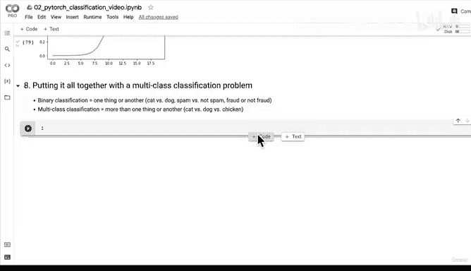
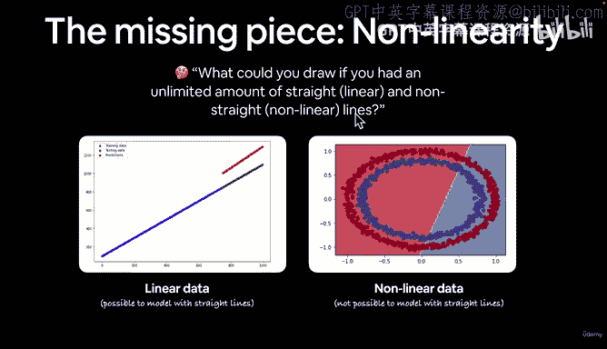
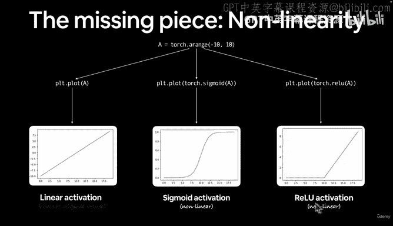
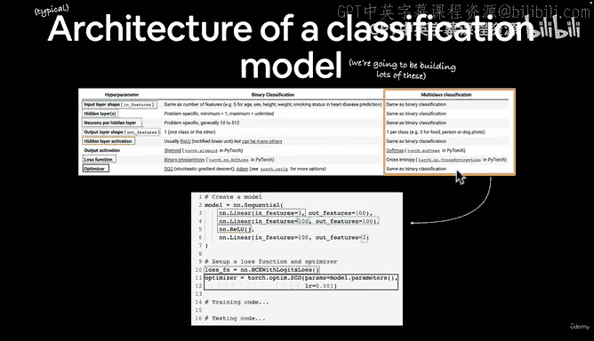
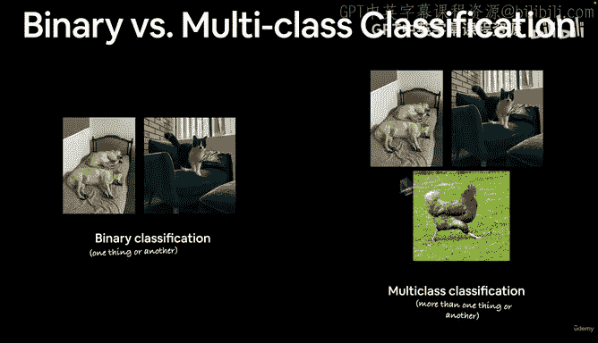
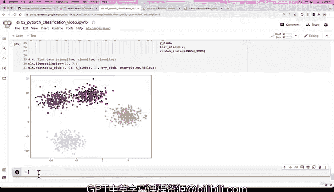

# 89：构建多分类数据集 🎯


在本节课中，我们将学习如何为多分类问题创建和准备数据集。我们将从二分类问题过渡到多分类问题，并了解两者之间的关键区别。

## 概述

在之前的课程中，我们利用非线性函数的力量，学习了神经网络如何结合线性和非线性函数来发现数据中的模式。我们成功分离了红点和蓝点。现在，我们将向前推进，从多分类问题的角度来回顾我们所做的一切。



多分类问题与二分类问题的主要区别在于，前者涉及两个以上的类别。例如，二分类可能是猫 vs 狗，而多分类可能是猫 vs 狗 vs 鸡。我们将看到，在处理多分类问题时，我们的模型架构和损失函数会有所不同。





## 创建多分类数据集


以下是创建多分类数据集的步骤。





首先，我们需要导入必要的依赖库。

```python
import torch
import matplotlib.pyplot as plt
from sklearn.datasets import make_blobs
from sklearn.model_selection import train_test_split
```

接下来，我们设置数据创建的超参数。通常，我们会用大写字母来表示这些可调整的设置。

```python
# 设置数据创建的超参数
NUM_CLASSES = 4
NUM_FEATURES = 2
RANDOM_SEED = 42
```

现在，让我们使用 `make_blobs` 函数来创建数据。这个函数可以生成我们需要的“斑点”状数据。

```python
# 创建多分类数据
X_blob, y_blob = make_blobs(n_samples=1000,
                             n_features=NUM_FEATURES,
                             centers=NUM_CLASSES,
                             cluster_std=1.5,
                             random_state=RANDOM_SEED)
```

由于我们使用的是 Scikit-learn，而 PyTorch 使用张量，所以需要将数据转换为张量格式。

```python
# 将数据转换为张量
X_blob = torch.from_numpy(X_blob).type(torch.float)
y_blob = torch.from_numpy(y_blob).type(torch.float)
```

然后，我们将数据集分割为训练集和测试集。

```python
# 分割为训练集和测试集
X_blob_train, X_blob_test, y_blob_train, y_blob_test = train_test_split(X_blob,
                                                                        y_blob,
                                                                        test_size=0.2,
                                                                        random_state=RANDOM_SEED)
```

最后，让我们将数据可视化，以便更好地理解我们创建的数据集。

```python
# 可视化数据
plt.figure(figsize=(10, 7))
plt.scatter(X_blob[:, 0], X_blob[:, 1], c=y_blob, cmap=plt.cm.RdYlBu)
plt.show()
```

## 总结

在本节课中，我们一起学习了如何为多分类问题构建数据集。我们导入了必要的库，设置了超参数，使用 `make_blobs` 函数生成了具有四个类别的数据，将数据转换为 PyTorch 张量，并将其分割为训练集和测试集。最后，我们通过可视化来观察数据的分布情况。



现在我们已经准备好了数据，在下一节中，我们将构建我们的第一个多分类模型。