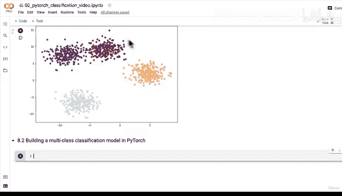
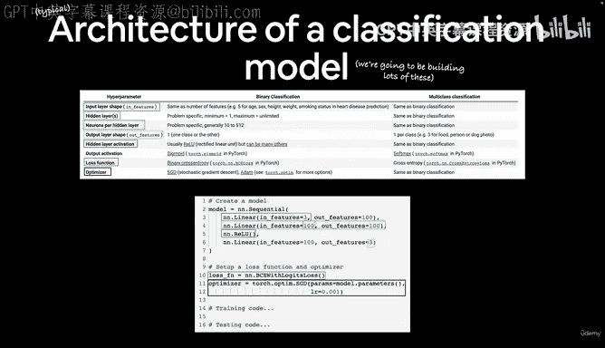
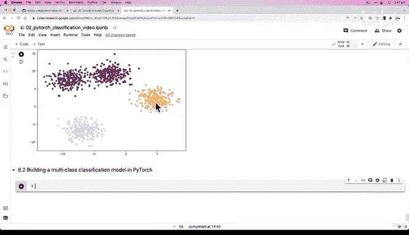
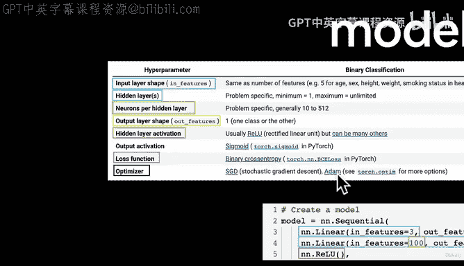
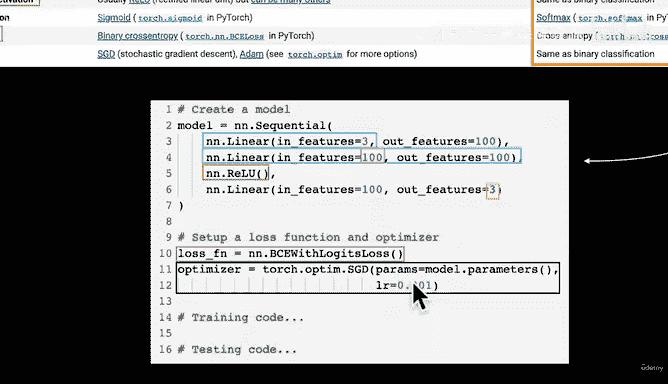
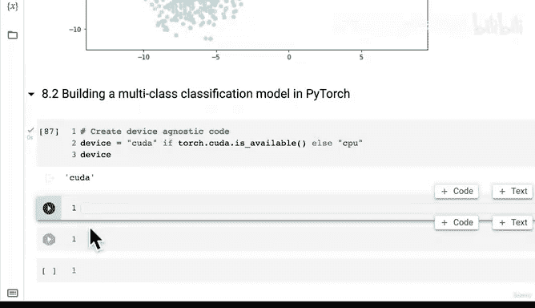
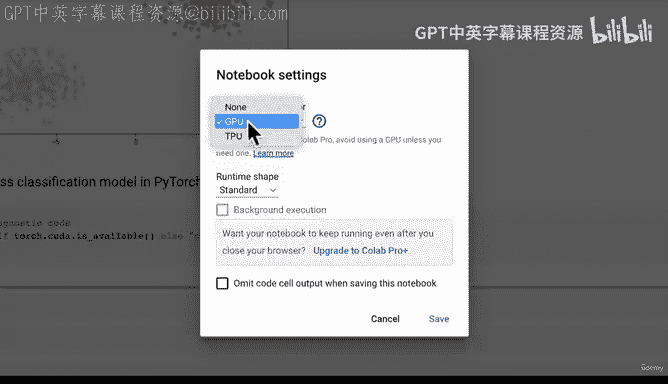
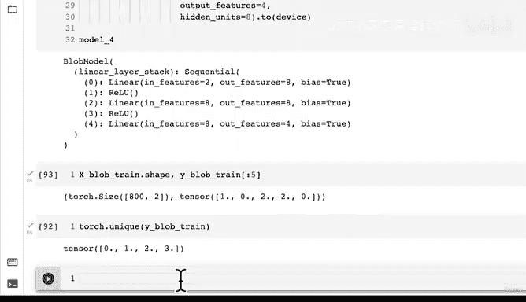

# 90：创建PyTorch多分类模型 🧠


## 概述





在本节课中，我们将学习如何构建一个用于多分类任务的PyTorch模型。我们将整合之前学过的所有知识，但这次将应用于多分类数据，而非二分类数据。

## 回顾与准备



上一节我们使用Scikit-Learn的`make_blobs`函数创建了多分类数据集。现在，我们将着手构建一个能够拟合此数据的模型。





在开始编码之前，我们需要思考一个重要问题：这个数据集是否需要非线性激活函数？换句话说，我们能否用纯粹的直线来分隔这些数据点，还是需要一些非直线的边界？如果你不确定也没关系，我们将在构建模型的过程中探索这个问题。





## 多分类模型的关键概念

对于多分类模型，我们需要定义几个核心部分：

*   **输入层形状 (`in_features`)**：这取决于我们的数据有多少个特征。
*   **隐藏层**：我们可以自由设置隐藏层的数量和每层的神经元数量。为了保持简单，我们将使用一个隐藏层。
*   **输出层形状 (`out_features`)**：我们需要为每个类别设置一个输出神经元。我们的数据有4个类别，因此需要4个输出特征。
*   **输出激活函数**：我们将使用**Softmax**函数，这是我们尚未接触过的新概念。
*   **损失函数**：我们将使用**交叉熵损失**，而不是二分类中使用的二元交叉熵损失。
*   **优化器**：与二分类相同，常见的选择是SGD（随机梯度下降）或Adam。

## 构建多分类模型

现在，让我们开始构建我们的第一个多分类模型。

首先，我们将养成编写设备无关代码的习惯，这样我们的模型可以在CPU或GPU上运行。

```python
# 设置设备
device = "cuda" if torch.cuda.is_available() else "cpu"
print(f"Using device: {device}")
```

接下来，我们定义模型类。我们将使用`nn.Sequential`来按顺序堆叠层，这是一种更简洁的构建模型的方式。

```python
import torch
from torch import nn

class BlobModel(nn.Module):
    """
    初始化一个多分类模型。

    参数:
        input_features (int): 模型的输入特征数量。
        output_features (int): 模型的输出特征数量（即类别数）。
        hidden_units (int): 隐藏层的神经元数量，默认为8。
    """
    def __init__(self, input_features, output_features, hidden_units=8):
        super().__init__()
        # 使用 nn.Sequential 按顺序堆叠层
        self.linear_layer_stack = nn.Sequential(
            nn.Linear(in_features=input_features, out_features=hidden_units),
            nn.ReLU(), # 添加非线性激活函数
            nn.Linear(in_features=hidden_units, out_features=hidden_units),
            nn.ReLU(), # 添加非线性激活函数
            nn.Linear(in_features=hidden_units, out_features=output_features),
        )

    def forward(self, x):
        # 数据将按顺序通过 linear_layer_stack 中的每一层
        return self.linear_layer_stack(x)
```

请注意，我们在隐藏层之间添加了`nn.ReLU()`作为非线性激活函数。你可以尝试在后续练习中，对比使用和不使用非线性激活函数时模型的性能差异。

现在，让我们根据数据形状来实例化模型。我们的训练数据`X_train`的形状显示有2个输入特征，而`Y_train`的独特值显示我们有4个类别。

```python
# 实例化模型并发送到目标设备
model_4 = BlobModel(input_features=2, output_features=4, hidden_units=8).to(device)
print(model_4)
```

至此，我们已经创建了一个与数据形状匹配的多分类模型。接下来，我们需要定义损失函数、优化器并编写训练循环，这些内容我们将在后续课程中完成。

## 总结



本节课中，我们一起学习了如何构建一个PyTorch多分类模型。我们回顾了模型的关键组成部分，包括输入层、隐藏层、输出层以及Softmax激活函数和交叉熵损失函数。我们使用`nn.Sequential`模块创建了一个包含非线性激活函数的模型，并确保了模型结构与我们的数据形状相匹配。在下一节课中，我们将为这个模型添加训练循环，使其能够从数据中学习。