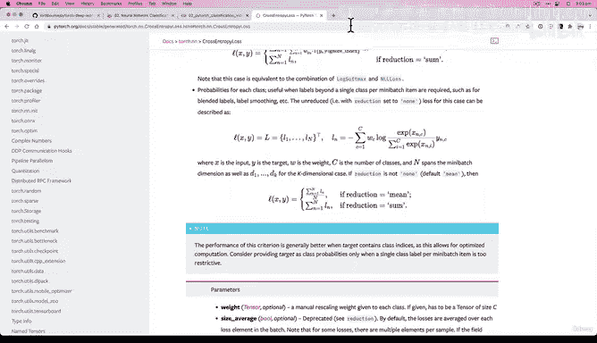
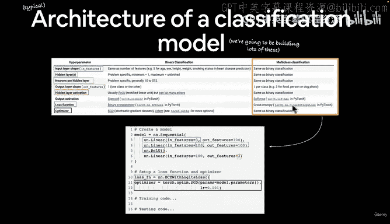
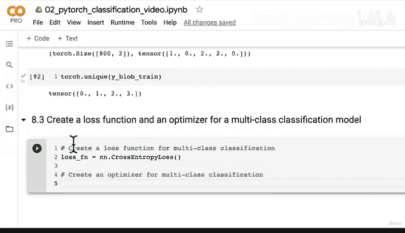
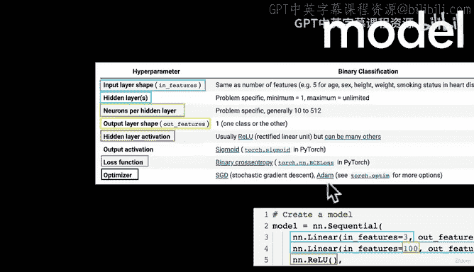
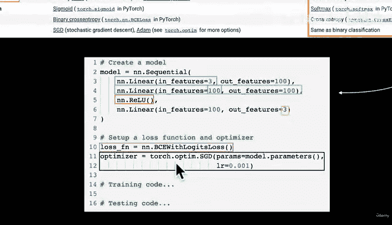
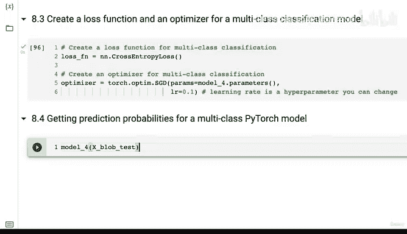

# 91：配置多分类模型的损失函数与优化器 🧠


在本节课中，我们将学习如何为多分类模型配置损失函数与优化器。这是构建和训练神经网络的关键步骤。

上一节我们通过子类化 `nn.Module` 创建了一个多分类模型。本节中，我们来看看如何为该模型选择合适的损失函数和优化器。

## 选择多分类损失函数

在PyTorch中，损失函数位于 `torch.nn` 模块中。对于回归问题，我们可能使用L1损失或MSE损失。对于分类问题，情况则不同。

对于多分类问题，我们将使用**交叉熵损失**。对于二分类问题，通常使用二元交叉熵损失。交叉熵损失适用于训练具有C个类别的分类问题。

以下是创建交叉熵损失函数的代码：

```python
loss_fn = nn.CrossEntropyLoss()
```

`CrossEntropyLoss` 函数有一个可选的 `weight` 参数，它是一个一维张量，用于为每个类别分配权重。这在处理类别样本数量不平衡的训练集时特别有用。例如，如果你的数据集中某些类别的样本远多于其他类别，可以使用此参数进行调整。目前我们的数据集是平衡的，因此暂时不需要使用它。

## 创建优化器

接下来，我们需要创建一个优化器。优化器负责根据损失函数的梯度来更新模型的参数。



在 `torch.optim` 模块中有多种优化器。其中两种最常见且在许多问题上表现良好的优化器是SGD（随机梯度下降）和Adam。



以下是使用SGD优化器的代码：

```python
optimizer = torch.optim.SGD(params=model_4.parameters(), lr=0.1)
```



在这段代码中：
*   `params`：指定优化器需要优化的参数，这里是我们模型 `model_4` 的所有参数。
*   `lr`：代表**学习率**，它是一个**超参数**。你可以尝试改变这个值，观察它对训练过程的影响。





## 下一步：检查模型输出与构建训练循环

现在，我们已经为多分类问题准备好了损失函数和优化器。

在进入下一节构建训练循环之前，建议你先尝试将测试数据 `X_blob_test` 传入模型，观察模型的原始输出。思考一下，模型的原始输出被称为什么？



本节课中我们一起学习了如何为多分类模型配置交叉熵损失函数和SGD优化器，并了解了学习率作为超参数的作用。下一节，我们将开始构建训练循环来训练我们的模型。