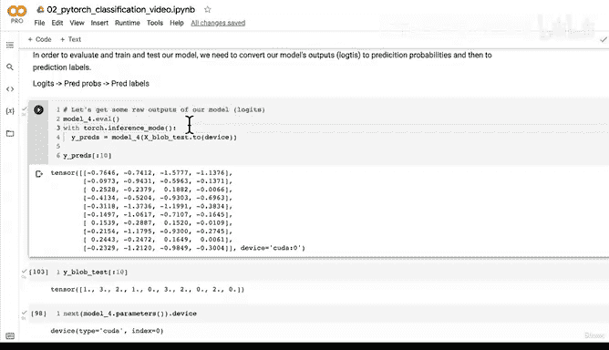
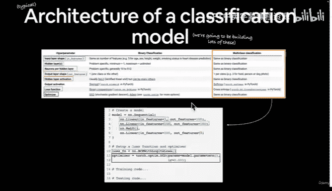
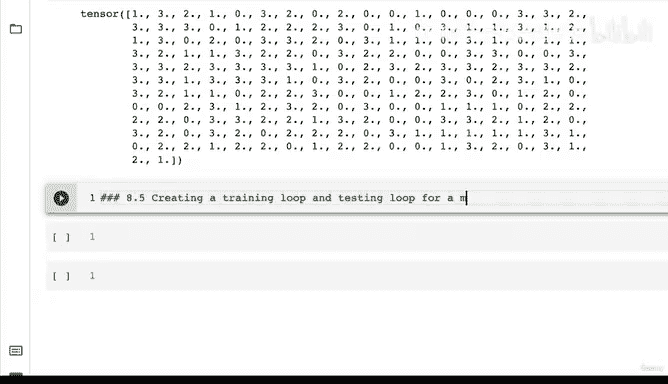

# 92：多分类模型预测流程详解 🎯


在本节课中，我们将学习如何将多分类模型的原始输出（逻辑值）转换为预测概率，并最终得到预测标签。这是评估和测试模型的关键步骤。

上一节我们为多分类模型创建了损失函数和优化器。本节中我们来看看如何利用模型进行前向传播并解读其输出。

## 模型输出与设备问题

首先，我们尝试对最新创建的模型（Model 4）进行一次前向传播。然而，运行代码时遇到了一个运行时错误，提示“期望所有张量位于同一设备上”。

这是因为我们的模型参数位于CUDA设备（GPU）上，而我们的输入数据`X`仍然在CPU上。我们可以通过以下代码检查设备和数据的所在位置：

```python
# 检查模型参数所在的设备
next(model_4.parameters()).device
# 检查输入数据所在的设备
X.device
```

为了解决这个问题，我们需要确保模型和数据位于同一设备上。这是一个常见的错误，在后续操作中需要特别注意。

## 从逻辑值到预测概率



在进行前向传播并得到模型的原始输出（称为逻辑值或logits）后，我们需要将其转换为预测概率。

对于多分类问题，我们使用 **Softmax** 激活函数来完成这个转换。这与二分类问题中使用的Sigmoid函数不同。以下是转换的核心公式：

**Softmax公式**：
\[
\text{Softmax}(x_i) = \frac{e^{x_i}}{\sum_{j} e^{x_j}}
\]



在PyTorch中，我们可以直接使用`torch.softmax()`函数。关键是指定要计算Softmax的维度（通常是第一个维度，即每个样本的各个类别分数）。

以下是转换步骤的代码：

```python
# 1. 进行前向传播得到逻辑值（使用推理模式是良好习惯）
with torch.inference_mode():
    y_logits = model_4(X)

# 2. 使用Softmax将逻辑值转换为预测概率
y_pred_probs = torch.softmax(y_logits, dim=1)
```

经过Softmax函数处理后，每个样本的各个类别概率值之和为1，且所有值均为非负数。这符合概率的定义。

## 从预测概率到预测标签

得到预测概率后，我们需要确定模型认为每个样本最可能属于哪个类别。这通过获取每个样本概率向量中最大值的索引来实现。

在PyTorch中，我们使用`torch.argmax()`函数。该函数返回指定维度上最大值的索引。

以下是获取预测标签的代码：

```python
# 3. 获取预测标签（即概率最大的类别索引）
y_preds = torch.argmax(y_pred_probs, dim=1)
```

现在，`y_preds`的形状与我们的测试标签`y_test`相同，可以直接进行比较。不过，由于模型尚未训练，此时的预测基本上是随机的，所以预测标签与真实标签匹配度很低。

## 核心流程总结

综上所述，评估和测试多分类模型的完整流程可以概括为以下三步：

1.  **逻辑值**：模型的原始输出。
2.  **预测概率**：使用Softmax函数将逻辑值转换为概率分布。
3.  **预测标签**：对预测概率取argmax，得到最终的类别预测。

## 过渡到下一阶段

现在我们已经掌握了将模型输出转换为可解释预测的方法。接下来，我们就可以着手构建模型的**训练循环和测试循环**了。

这非常令人兴奋！在下一节课中，我们将一起构建多分类PyTorch模型的第一个训练和测试循环。给你一个小提示：它与我们之前构建过的训练测试循环非常相似。你可以先尝试自己动手，如果遇到困难，我们将在下个视频中共同完成。



---

本节课中我们一起学习了多分类模型预测的核心流程：如何将模型的原始逻辑值输出，通过Softmax函数转换为预测概率，再通过argmax操作得到最终的预测标签。这是连接模型内部计算与外部评估的关键桥梁，为后续训练模型打下了坚实基础。