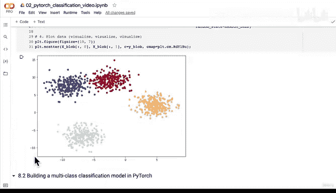

# 93：多分类模型训练与实时代码调试 🚀


在本节课中，我们将学习如何为多分类PyTorch模型构建一个完整的训练和测试循环。我们将从模型的原始输出（logits）开始，逐步将其转换为预测概率和预测标签，并在此过程中解决常见的代码错误。

---

## 从Logits到预测标签

上一节我们介绍了多分类模型的基础。本节中我们来看看如何将模型的原始输出转换为可理解的预测结果。

模型的原始输出称为logits。对于多分类问题，如果模型处理4个类别，它将输出4个值。处理10个类别则输出10个值，但转换步骤的原理相同。

以下是转换过程的核心步骤：

1.  **使用Softmax函数将logits转换为预测概率**：
    ```python
    prediction_probs = torch.softmax(logits, dim=1)
    ```
    此操作确保所有类别的概率之和为1。

2.  **通过Argmax函数获取预测标签**：
    ```python
    prediction_labels = prediction_probs.argmax(dim=1)
    ```
    此操作返回预测概率中最大值所在的索引，该索引即对应预测的类别标签。

对于一个样本，如果其logits经过Softmax后得到的概率向量中，索引1处的值最大，那么该样本的预测标签就是1。

---

## 构建训练与测试循环

现在，我们将构建一个训练循环来改进模型。以下是训练循环的主要步骤：

我们将设置手动随机种子以确保结果的可复现性，并定义训练轮数（epochs）。接着，将数据移动到目标设备（CPU或GPU），这是设备无关代码的一部分。

以下是训练循环的核心代码结构：

```python
# 设置随机种子和训练轮数
torch.manual_seed(42)
epochs = 100

# 将数据移动到设备
X_train, y_train = X_train.to(device), y_train.to(device)
X_test, y_test = X_test.to(device), y_test.to(device)

# 训练循环
for epoch in range(epochs):
    model.train()
    # 前向传播
    train_logits = model(X_train)
    train_pred_probs = torch.softmax(train_logits, dim=1)
    train_pred_labels = train_pred_probs.argmax(dim=1)

    # 计算损失和准确率
    loss = loss_fn(train_logits, y_train)
    acc = accuracy_fn(y_true=y_train, y_pred=train_pred_labels)

    # 反向传播与优化
    optimizer.zero_grad()
    loss.backward()
    optimizer.step()
```

在测试阶段，我们需要关闭梯度跟踪以加速推理过程：

```python
    model.eval()
    with torch.inference_mode():
        test_logits = model(X_test)
        test_pred_probs = torch.softmax(test_logits, dim=1)
        test_pred_labels = test_pred_probs.argmax(dim=1)

        test_loss = loss_fn(test_logits, y_test)
        test_acc = accuracy_fn(y_true=y_test, y_pred=test_pred_labels)
```

最后，我们可以定期打印训练和测试的指标，以观察模型的学习进展。

---

## 常见错误与调试

在编写和运行上述代码时，初学者常会遇到两类主要错误：**数据类型错误**和**张量形状错误**。以下是排查这些错误的思路。

**1. 数据类型错误**
错误信息可能类似 `RuntimeError: ... not implemented for 'Float'`。这通常意味着传递给损失函数的张量（如标签 `y_train`）数据类型不正确。对于分类任务，标签应为整数类型（`torch.long`），而非浮点数（`torch.float`）。解决方法是确保标签张量的数据类型正确：
```python
y_train = y_train.type(torch.LongTensor).to(device)
```

**2. 张量形状错误**
错误信息可能类似 `ValueError: ... size A to match target size B`。这表示模型的输出张量与目标标签张量的形状不匹配。常见原因是在测试循环中错误地使用了训练数据，或者前向传播的输出维度与损失函数期望的维度不一致。解决方法是仔细检查每一步输入输出张量的 `.shape` 属性，确保它们对齐。

调试是深度学习开发中不可或缺的一部分。遇到错误时，耐心地检查数据流、数据类型和张量形状是解决问题的关键。

---

## 模型评估与可视化

训练完成后，我们需要评估模型的性能。一个直观的方法是使用我们之前定义的 `plot_decision_boundary` 函数来可视化模型在测试数据上的分类边界。

这个过程与我们在二分类任务中所做的类似，但这次我们使用的是处理多分类问题的模型和数据集。通过可视化，我们可以清晰地看到模型如何划分不同的类别区域。

---



本节课中我们一起学习了如何为多分类PyTorch模型构建训练和测试循环，掌握了将logits转换为预测结果的完整流程，并实践了调试数据类型与张量形状错误的常用方法。最后，我们了解到可视化是评估模型性能的强大工具。