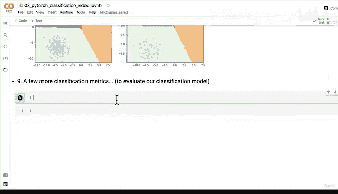

# 94：多分类模型预测与评估 📊


在本节课中，我们将学习如何使用 PyTorch 多分类模型进行预测，并评估其性能。我们将涵盖从原始模型输出到最终预测标签的转换过程，并通过可视化决策边界来直观理解模型的表现。此外，我们还将探讨线性与非线性模型在处理不同类型数据时的差异。

## 回顾与问题解决

上一节我们介绍了多分类模型的训练与测试步骤，并解决了机器学习中常见的两种问题：**数据类型问题**和**形状问题**。通过实验、查阅文档和反复调试，我们成功克服了这些挑战。现在，我们的多分类模型已经能够学习：损失在下降，准确率在上升。

## 进行预测

本节中，我们来看看如何用训练好的模型进行预测。以下是进行预测的步骤：

首先，将模型设置为评估模式，并开启推理上下文管理器，因为我们希望进行推断而非训练。

```python
model.eval()
with torch.inference_mode():
    y_logits = model(X_blob_test)
```

`y_logits` 是模型的原始输出。查看前10个预测的原始 logits：

```python
y_logits[:10]
```

这些是未经处理的数值。接下来，我们需要将这些 logits 转换为预测概率。对于多分类模型，我们使用 softmax 函数，并沿第一个维度操作：

```python
y_pred_probs = torch.softmax(y_logits, dim=1)
y_pred_probs[:10]
```

现在，我们得到了每个样本属于各个类别的概率。概率值最接近 1 的类别，即为模型的预测类别。

## 获取预测标签

为了将预测概率转换为具体的类别标签，我们取每个样本中概率最大的索引：

```python
y_preds = torch.argmax(y_pred_probs, dim=1)
y_preds[:10]
```

现在，我们可以将预测标签 `y_preds` 与真实标签 `y_blob_test` 进行比较，评估模型的准确性。

## 可视化决策边界

为了更直观地评估模型，我们可以绘制决策边界。以下是可视化步骤：

```python
plt.figure(figsize=(12, 6))
plt.subplot(1, 2, 1)
plt.title("Train")
plot_decision_boundary(model, X_blob_train, y_blob_train)
plt.subplot(1, 2, 2)
plt.title("Test")
plot_decision_boundary(model, X_blob_test, y_blob_test)
plt.show()
```

通过可视化，我们可以看到模型是否成功地将不同类别的数据分开。如果数据是线性可分的，即使不使用非线性激活函数，模型也可能表现良好。

## 线性与非线性模型

我们之前提出的问题是：能否在不使用非线性函数的情况下分离多分类数据？为了验证这一点，我们可以从模型中移除非线性激活函数（如 ReLU），然后重新训练和评估。

实验表明，对于线性可分的数据，即使没有非线性函数，模型也能有效工作，决策边界会呈现为直线。然而，实际应用中许多数据（如之前涉及的圆形数据）需要结合线性和非线性函数才能有效分离。

PyTorch 使得在模型中添加非线性函数变得非常简单。即使数据可能不需要非线性，包含它们也能让模型在必要时利用这些函数，从而构建更强大的模型。

## 模型评估的重要性

评估模型与训练模型同等重要。在接下来的课程中，我们将介绍更多分类评估指标，以全面衡量模型性能。



本节课中我们一起学习了如何使用 PyTorch 多分类模型进行预测和评估。我们掌握了从原始 logits 到预测概率，再到最终类别标签的转换过程，并通过可视化决策边界直观理解了模型的表现。同时，我们探讨了线性与非线性模型在处理不同数据时的适用性，为后续更复杂的模型评估奠定了基础。