# 95：其他分类指标探讨 📊


在本节课中，我们将学习除了准确率之外，其他用于评估分类模型性能的重要指标。我们将了解它们的定义、适用场景，并学习如何在PyTorch中实现它们。

---

## 概述

上一节我们通过可视化方法评估了我们的多分类模型，并发现它在处理线性可分数据时表现近乎完美。然而，准确率并非评估分类模型的唯一标准，尤其是在处理类别不平衡的数据集时。

本节中，我们将探讨几种关键的分类评估指标，包括精确率、召回率、F1分数和混淆矩阵。我们将了解它们的计算公式、使用场景，并学习如何利用`torchmetrics`库等工具进行计算。

---

## 主要分类评估指标

以下是几种核心的分类模型评估方法。

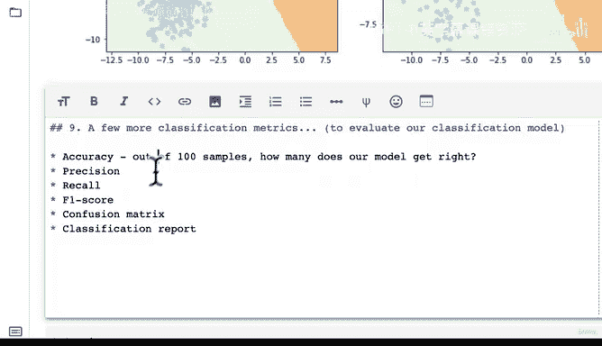

### 1. 准确率

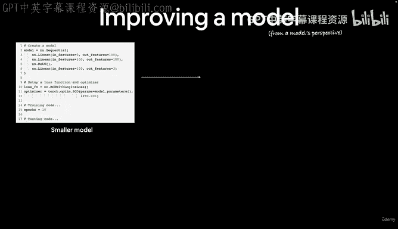

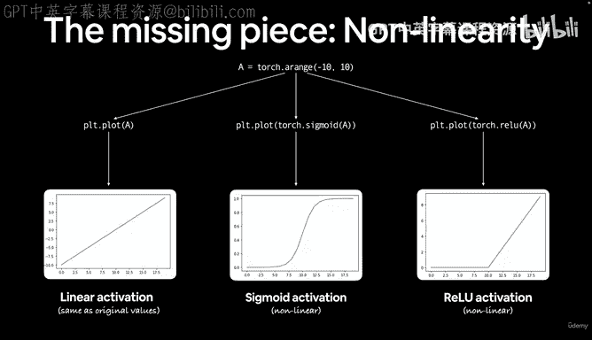

准确率是评估分类模型最直观的指标，它表示模型预测正确的样本数占总样本数的比例。其公式为：

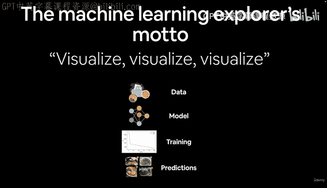

**准确率 = (TP + TN) / (TP + TN + FP + FN)**

其中：
*   **TP**：真正例
*   **TN**：真反例
*   **FP**：假正例
*   **FN**：假反例

在代码中，我们之前已经实现了一个自定义的准确率计算函数。准确率是分类问题的默认评估指标，但**不适用于类别不平衡的数据集**。例如，如果一个类别有1000个样本，而另一个类别只有10个样本，仅依赖准确率可能会产生误导。

### 2. 精确率与召回率

对于不平衡数据集，精确率和召回率是更合适的评估指标。


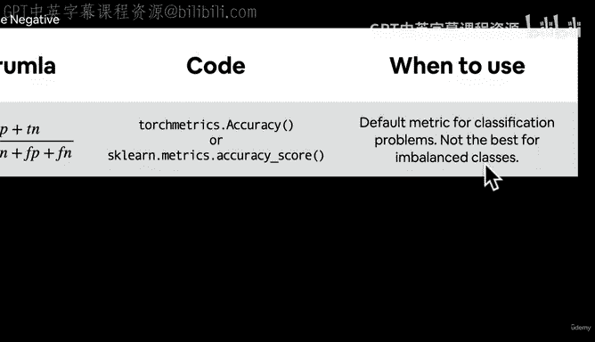

*   **精确率**：衡量模型预测为正例的样本中，有多少是真正的正例。其公式为：

    **精确率 = TP / (TP + FP)**

    高精确率意味着模型产生的假正例较少。如果你的应用场景中假正例代价高昂（例如垃圾邮件误判为正常邮件），则应追求高精确率。

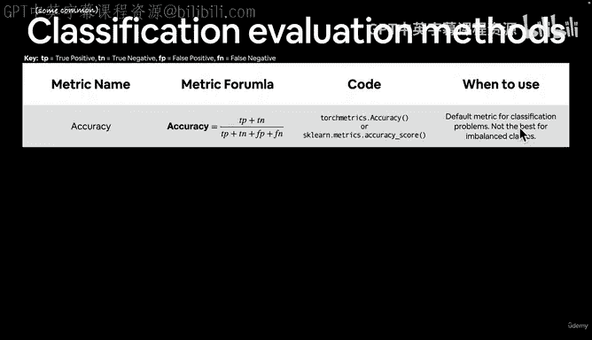

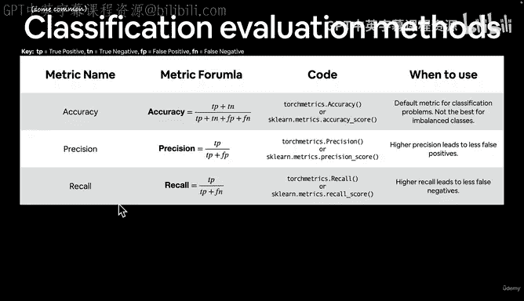

*   **召回率**：衡量所有真正的正例中，有多少被模型正确地预测出来。其公式为：

    **召回率 = TP / (TP + FN)**

    高召回率意味着模型漏报的正例（假反例）较少。如果你的应用场景中假反例代价高昂（例如疾病检测中漏诊），则应追求高召回率。

需要注意的是，精确率和召回率之间存在**权衡关系**。通常，提高精确率会降低召回率，反之亦然。你可以通过Will Koehrsen的文章《Beyond Accuracy: Precision and Recall》深入了解这两个指标。

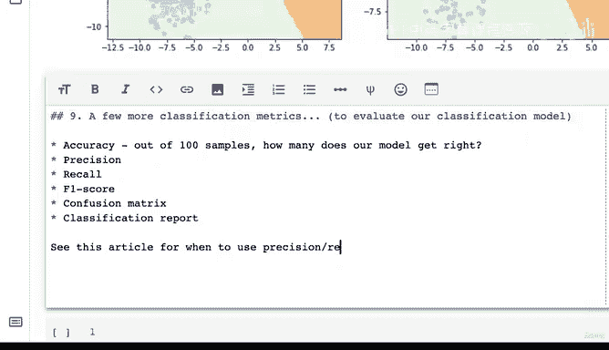

在代码实现上，你可以使用`torchmetrics`库或`scikit-learn`库中的相关函数：
```python
# 使用 torchmetrics
from torchmetrics import Precision, Recall
# 使用 scikit-learn
from sklearn.metrics import precision_score, recall_score
```

### 3. F1分数

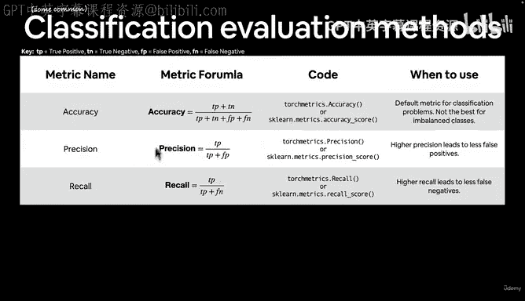

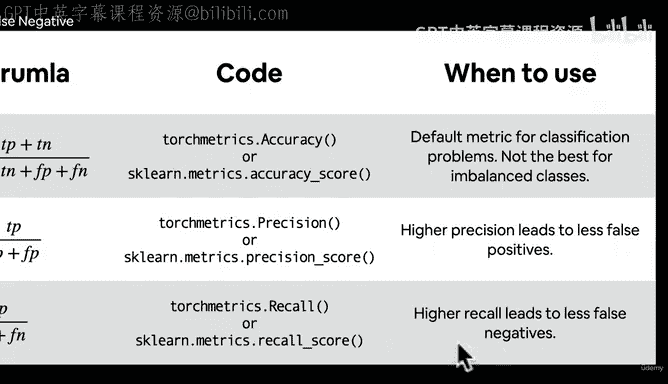

F1分数是精确率和召回率的调和平均数，它试图在两者之间找到一个平衡点。其公式为：

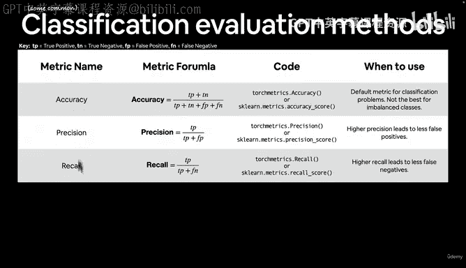

**F1分数 = 2 * (精确率 * 召回率) / (精确率 + 召回率)**

当你想用一个单一的指标来综合反映模型的精确率和召回率表现时，F1分数是一个很好的选择。

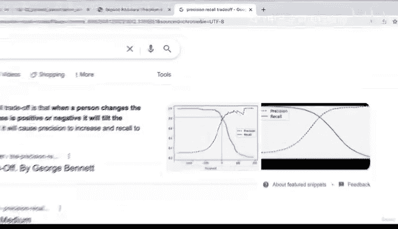

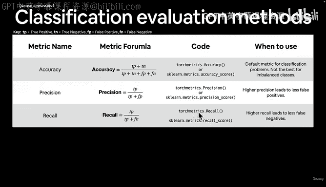

### 4. 混淆矩阵与分类报告

*   **混淆矩阵**：一个N x N的表格（N为类别数），用于详细展示模型预测结果与真实标签的对比情况。它能直观地显示模型在哪些类别上容易混淆。
*   **分类报告**：`scikit-learn`中的`classification_report`函数可以生成一个报告，汇总了精确率、召回率、F1分数和支持度等所有上述指标。

---

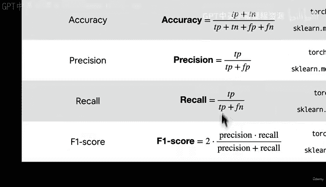

## 在PyTorch中使用Torchmetrics

`torchmetrics`是一个专为PyTorch设计的评估指标库，其API设计与PyTorch风格一致。

首先，你需要安装该库（在Google Colab等环境中可能需要）：
```bash
!pip install torchmetrics
```

然后，你可以像下面这样使用它来计算准确率：
```python
from torchmetrics import Accuracy

# 初始化指标计算器
metric = Accuracy()

# 确保预测值和目标值在同一设备上（CPU或GPU）
y_preds = y_preds.to(device)
y_test = y_test.to(device)

# 计算准确率
acc = metric(y_preds, y_test)
print(f"Accuracy using torchmetrics: {acc:.1%}")
```

**重要提示**：使用`torchmetrics`时，必须确保输入的张量（预测值和目标值）位于相同的计算设备上，否则会报错。这要求你编写设备无关的代码。

`torchmetrics`库提供了丰富的评估指标，你可以探索其`torchmetrics.classification`模块来发现更多用于分类任务的指标。

---

## 总结

本节课我们一起学习了多种分类模型的评估指标：
1.  **准确率**适用于类别平衡的数据集，计算简单直观。
2.  **精确率**关注预测为正例的准确性，适用于减少假正例的场景。
3.  **召回率**关注找出所有正例的能力，适用于减少假反例的场景。
4.  **F1分数**是精确率和召回率的综合指标。
5.  **混淆矩阵**和**分类报告**提供了模型性能的详细视图。

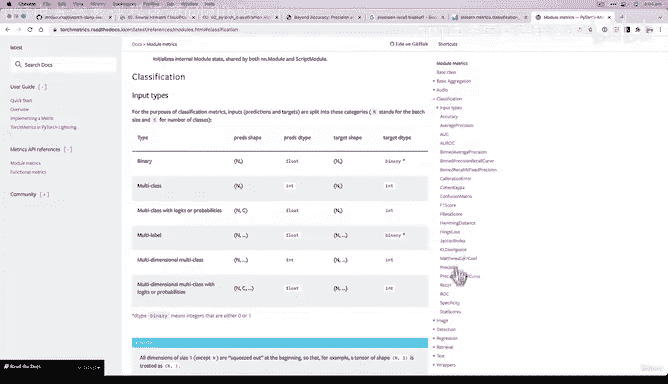

记住，没有“最好”的指标，选择取决于你的具体问题和数据特点。机器学习实践者的座右铭是：实验、实验、再实验。鼓励你课后探索`torchmetrics`库，并尝试在你自己的模型上计算这些指标。

在下一节中，我们将通过一些练习来巩固你所学的知识。