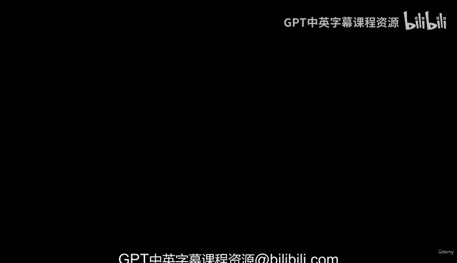
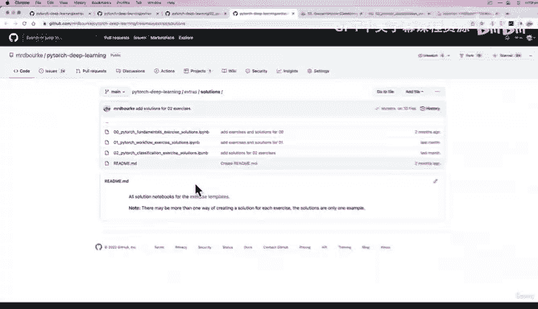

# 96：PyTorch 分类练习与拓展 📚

在本节课中，我们将回顾分类模型的评估指标，并重点介绍如何通过实践练习来巩固所学知识。我们将提供练习指引和拓展资源，帮助你独立应用和深化对 PyTorch 分类模型的理解。

## 回顾与练习介绍 🔄

上一节我们介绍了几种额外的分类评估指标，从更高层面概述了评估分类模型的更多方法。同时，我也链接了一些额外的课程资源供你深入探索。

我们已经一起编写了大量的代码。现在，是时候让你自己练习这些内容了。为此，我准备了一些练习。

## 练习资源位置 📂

那么，练习在哪里呢？请记住，在 **Learn PyTorch** 这本书中，每一章都有一个专门的练习部分。看看我们已经涵盖了多少内容，我们在这个模块中已经学习了相当多的知识。

在每个章节的底部，都有一个“练习”部分。所有练习都专注于实践前面章节中的代码。本节共有 7 个练习，需要编写大量代码。当然，还有额外的拓展挑战。

这些挑战贯穿了整个第 02 节的内容。我会在这里链接到练习和拓展部分。当然，你也可以直接在 **Learn PyTorch** 书中找到它们。

以下是练习和拓展资源的指引。

## 获取练习模板与解决方案 💻

如果你想获得练习代码的模板，可以访问 **PyTorch Deep Learning** 代码仓库。在 `extras` 文件夹中，有 `exercises` 和 `solutions` 子文件夹，顾名思义，分别存放练习骨架代码和解决方案。

例如，在练习文件夹中，有 `02_pytorch_classification_exercises.ipynb` 文件，这提供了一些骨架代码。解决方案文件夹中则是对应的答案。

这仅是一种形式的解决方案。我建议你先尝试自己完成练习，再看答案。练习内容包括设置设备无关代码、创建数据集、将数据转换为 DataFrame 等我们本节学过的内容。

请尝试独立完成。如果遇到困难，可以参考我们一起编写的笔记本文档，当然也可以查阅官方文档。将查阅解决方案笔记本作为最后的手段。

## 总结与下一步 🎯

恭喜你完成第 02 节“PyTorch 分类”的学习！如果你还在坚持，请继续跟随我进入下一个章节。我们将继续深入探讨使用 PyTorch 进行深度学习的更多内容。