# 97：计算机视觉问题定义与内容规划 📚

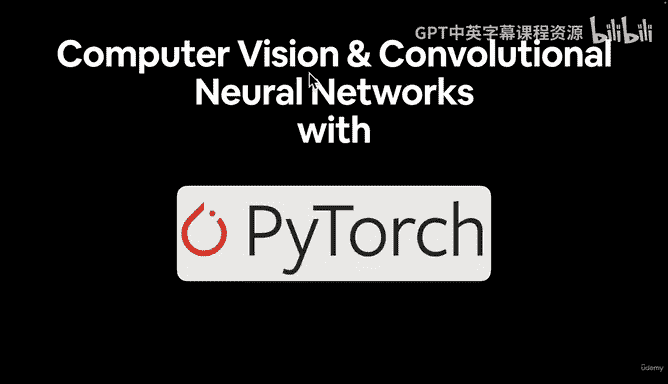

在本节课中，我们将要学习计算机视觉的基本概念，了解其涵盖的广泛问题类型，并规划后续使用 PyTorch 进行计算机视觉学习的路线图。

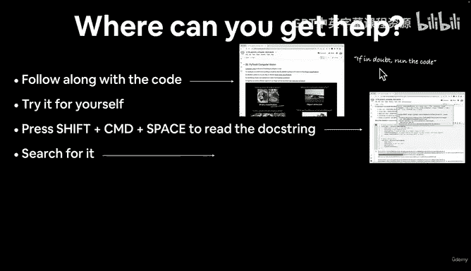

## 概述

计算机视觉是深度学习中一个非常受欢迎的主题。在深入学习具体材料之前，我们需要明确一个重要问题：在学习过程中遇到困难时，可以从哪些渠道获取帮助。

## 如何获取帮助 🆘

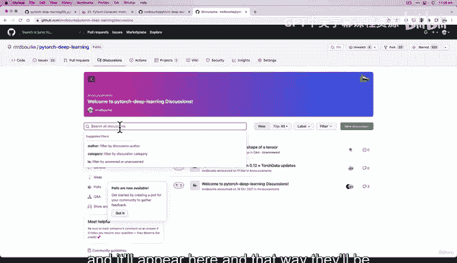

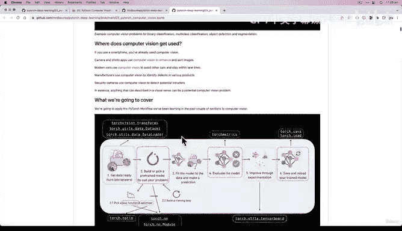

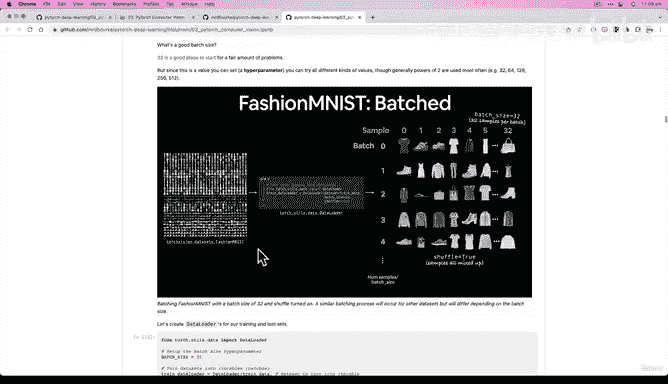

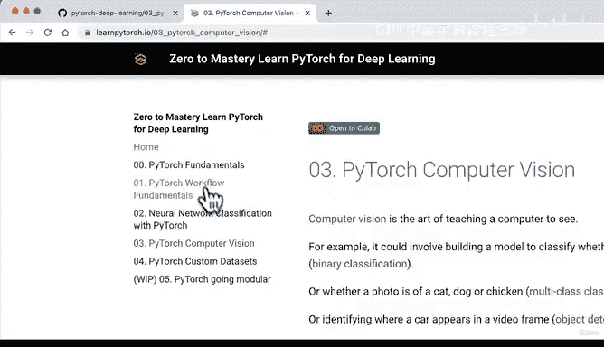

以下是当你遇到代码问题时可以遵循的步骤：

1.  **首先，尽最大努力跟随代码实践。** 我们将编写大量 PyTorch 计算机视觉代码。请记住我们的座右铭：如有疑问，运行代码。查看代码的输入和输出，并亲自尝试。
2.  **如果需要了解所用函数的功能，可以查阅文档字符串。** 在 Google Colab 中，可以按 `Shift + Command + Space`（Windows 系统可能是 `Control` 键）来查看。
3.  **如果仍然卡住，可以搜索你正在运行的代码。** 你可能会找到 Stack Overflow 或 PyTorch 官方文档。我们已经在 PyTorch 文档上花费了不少时间，并且在接下来的第 3 节模块中会大量引用它。
4.  **如果完成了以上四步，下一步是再试一次。** 如有疑问，运行代码。
5.  **当然，如果仍然无法解决，你可以在 PyTorch 深度学习仓库的讨论区提问。** 你可以新建一个讨论，标题注明“Section 03”，然后描述你的问题。在正文中，请尽可能格式化你的代码，将其放在反引号中，这样在 GitHub 讨论区显示时会更容易阅读。你可以选择类别，例如“Q&A”，然后点击“开始讨论”。这样你的问题就会被发布，并且可以被搜索到，我们也能帮助你。

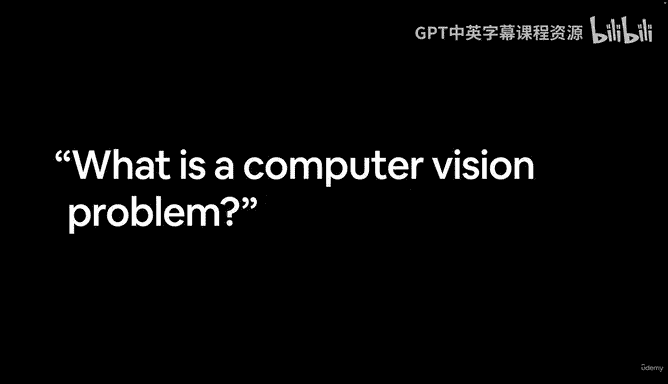

## 学习资源 📖

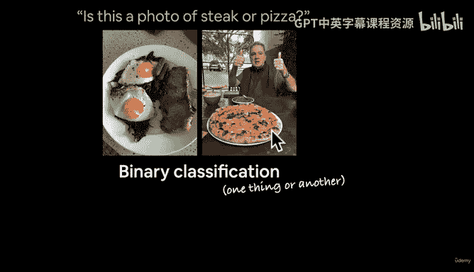

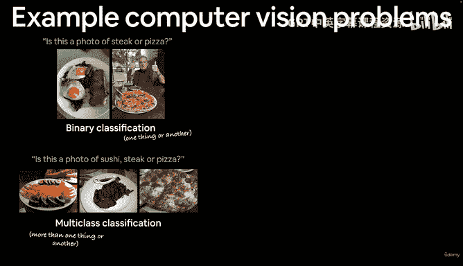

除了讨论区，我们还有以下重要资源：

*   **PyTorch 深度学习代码仓库：** 所有需要的链接都会在相应位置提供。
*   **第 3 节笔记本：** 本节我们将要编写的所有代码都包含在名为“PyTorch Computer Vision”的笔记本中。这个笔记本注释详尽，包含大量文本和图片。如果你在视频学习中对任何代码感到困惑，可以随时查阅这个笔记本作为参考。
*   **课程书籍版本：** 网站 `learnpytorch.io` 上有本课程的书籍版本。其中“Section 03: PyTorch Computer Vision”以书籍格式涵盖了我们将要学习的所有内容，包括所有链接和额外资源。

## 什么是计算机视觉问题？👁️

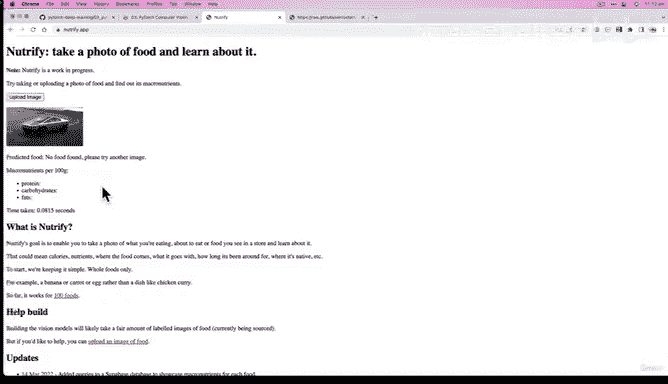

现在，让我们来探讨计算机视觉的核心问题。计算机视觉的范围非常广泛，一个简单的定义是：**凡是你能看见的东西，几乎都可以被表述为某种计算机视觉问题。**

以下是几个具体的例子：

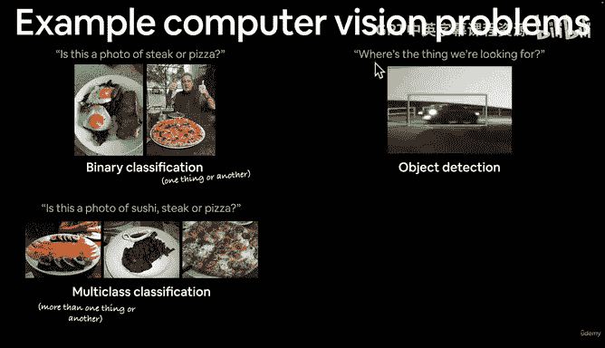

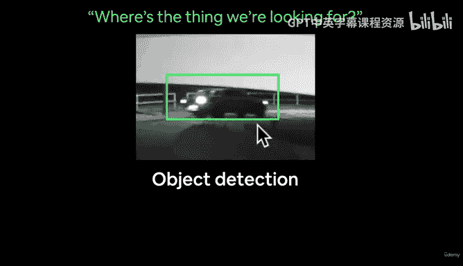

*   **二元分类问题：** 例如，判断一张图片是牛排还是披萨。我们的机器学习模型会接收图像的像素，并自行学习构成牛排和披萨的不同模式。我们不会明确告诉模型要学习什么，它会从不同的图像示例中自行学习这些模式。
*   **多元分类问题：** 例如，判断一张图片是寿司、牛排还是披萨。这涉及到三个类别，但也可以扩展到 100 个类别，例如 `nutrify.app` 这个应用就能对多达 100 种不同的食物进行分类。其原理是首先判断图像是否为食物，如果是，再进一步分类是哪种食物。
*   **目标检测问题：** 回答“我们要找的东西在哪里？”例如，在监控录像中寻找特定类型的车辆。这涉及到在图像中定位特定物体。
*   **图像分割问题：** 识别并分割图像中的不同部分。例如，苹果公司在 iPhone 和 iPad 上使用的技术，可以将图像中的人物、皮肤、头发、天空等部分分割开来，然后对每个部分进行不同的增强处理，这被称为计算摄影学。

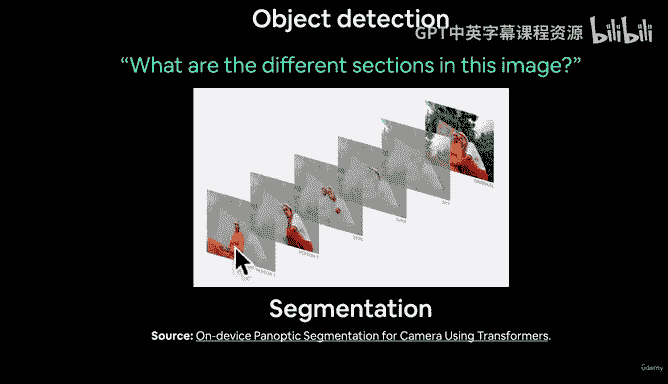

## 计算机视觉的行业应用 🚗

许多顶尖公司都在积极应用并分享他们的计算机视觉技术：

*   **特斯拉自动驾驶：** 特斯拉的每辆自动驾驶汽车都配备了 8 个摄像头，为其全自动驾驶（FSD）软件提供数据。它们使用计算机视觉来理解图像内容，并将车辆周围的环境表示转换为**三维向量空间**——即一长串数字。这是因为计算机理解数字远比理解图像更容易。有趣的是，特斯拉也使用 **PyTorch** 来训练其驱动自动驾驶软件的机器学习模型。
*   **苹果机器学习研究：** 苹果公司拥有“Apple Machine Learning Research”博客，分享其在机器学习领域的众多成果，包括先进的图像分割技术。

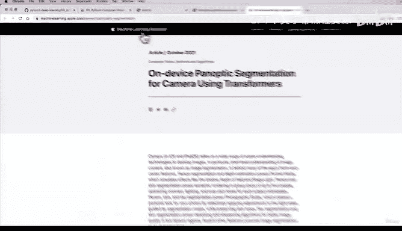

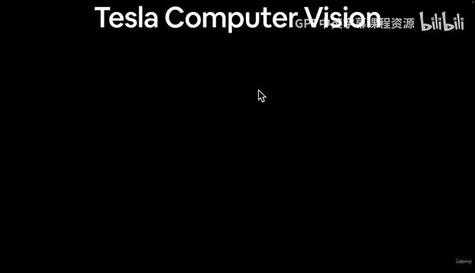

如果你想探索计算机视觉的更多应用，可以搜索“computer vision applications”，你会发现大量资源，例如“2022 年 27 个最流行的计算机视觉应用”。

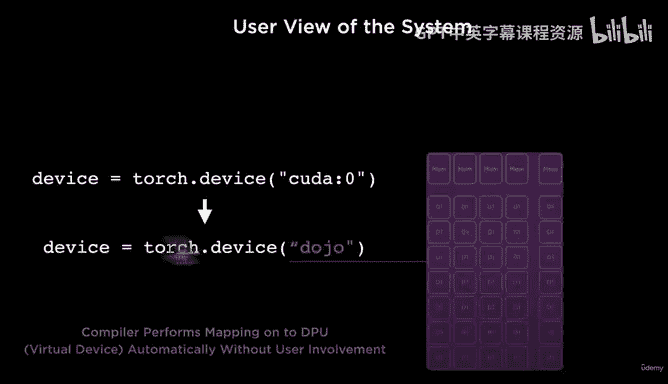

## 本课程内容规划 🗺️

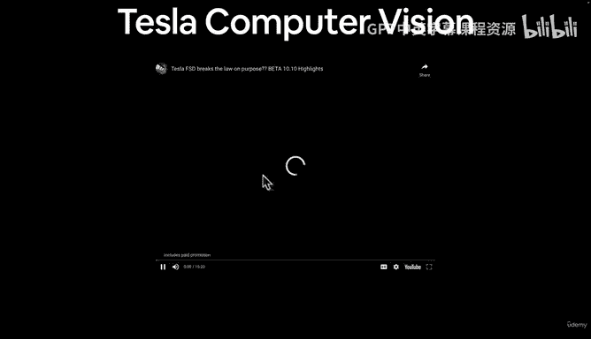

上一节我们介绍了计算机视觉的广阔天地和获取帮助的途径。本节中，我们来看看在 PyTorch 部分，我们将具体学习哪些内容。

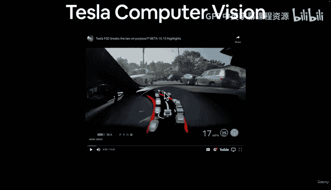

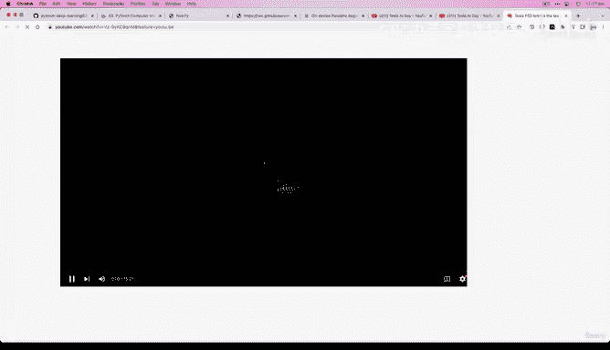

我们将使用 PyTorch 代码，以“部分艺术、部分科学”的方式，像烹饪一样编写大量代码。以下是我们的学习路线图：

1.  **获取视觉数据集：** 使用 `torchvision` 库来处理计算机视觉问题，并利用其中现有的数据集进行实验。
2.  **理解卷积神经网络架构：** 学习 CNN 的基本原理及其在 PyTorch 中的实现。
3.  **解决端到端的多元图像分类问题：** 处理涉及多个类别（可能是 3 个，也可能是 100 个）的图像分类任务。
4.  **使用 CNN 进行建模：** 在 PyTorch 中创建卷积神经网络。
5.  **选择损失函数和优化器：** 为我们的问题选择合适的损失函数和优化算法。
6.  **训练模型：** 实际训练我们构建的模型。
7.  **评估模型：** 评估训练好的模型的性能。

## 总结

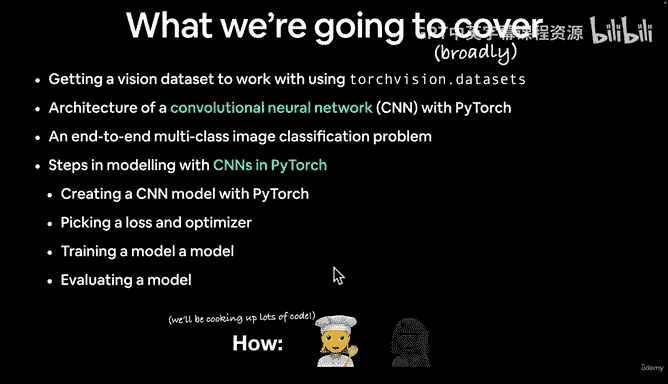

本节课中，我们一起学习了计算机视觉的广泛定义和多种问题类型，从简单的图像分类到复杂的自动驾驶感知。我们明确了遇到困难时的求助路径，并规划了接下来使用 PyTorch 学习计算机视觉和卷积神经网络的具体步骤。在下一节视频中，我们将深入探讨计算机视觉问题的输入和输出。