# 98：计算机视觉的输入与输出形状 🖼️

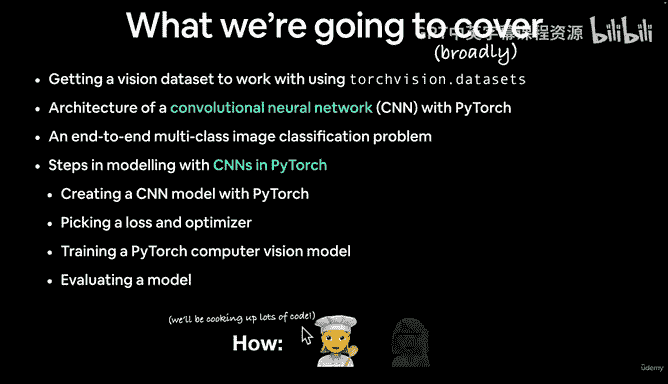

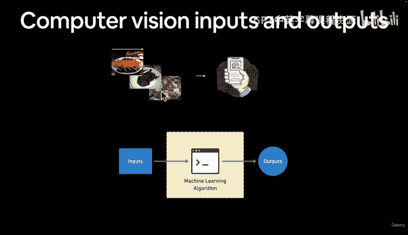

在本节课中，我们将学习计算机视觉问题的典型输入与输出形状。我们将探讨如何将图像表示为数字，以及机器学习模型如何处理这些数据以进行预测。

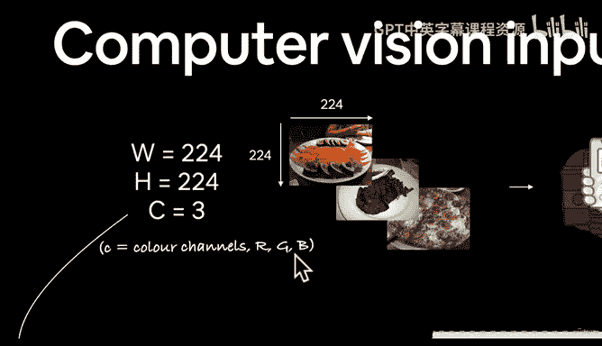

上一节我们介绍了计算机视觉的广泛概念。本节中，我们来看看一个典型计算机视觉问题的输入和输出具体是什么。

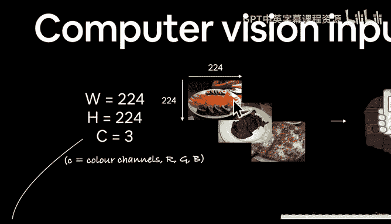

## 输入：将图像表示为数字

计算机视觉的核心是将图像转换为机器可以理解的数字形式。大多数数字图像使用 RGB（红、绿、蓝）色彩模式。

*   每个像素由三个数值表示：红色值、绿色值和蓝色值。
*   这些数值共同决定了像素的颜色。例如，一个偏橙色的像素可能红色值较高，绿色和蓝色值较低。

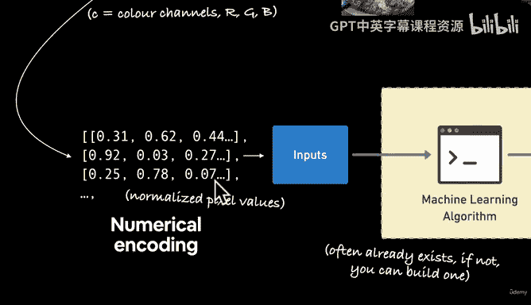

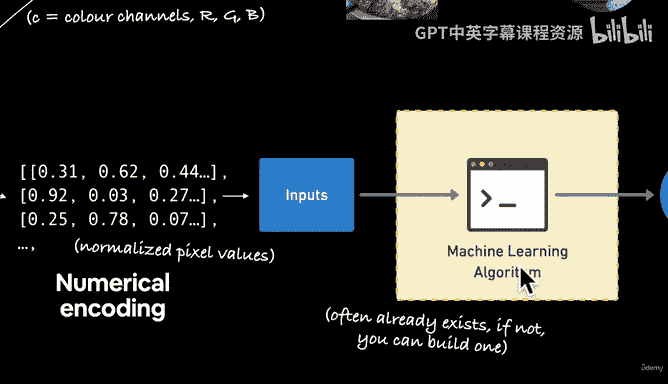

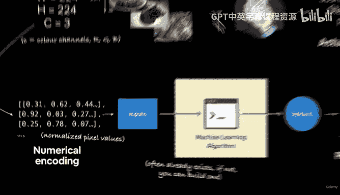

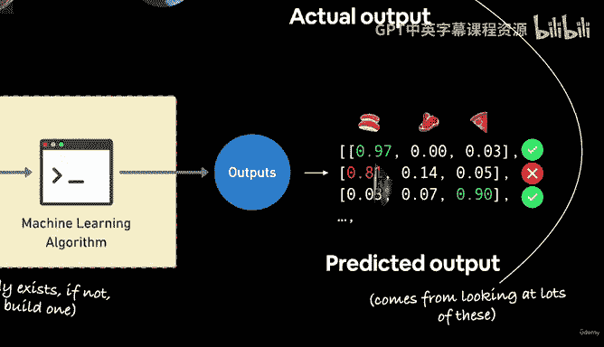

因此，一张图像在计算机中被表示为一个**张量**，其形状通常包含三个维度：**高度**、**宽度**和**颜色通道数**。

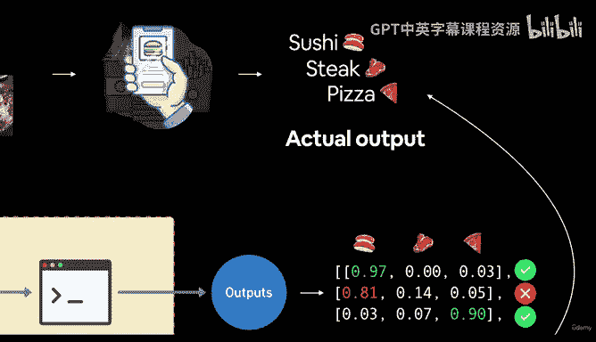

对于一个常见的图像尺寸，其输入形状可以表示为：
`[batch_size, height, width, color_channels]`
或
`[batch_size, color_channels, height, width]`

例如，一个批次大小为 32、尺寸为 224x224 的彩色图像，其形状可能是 `[32, 224, 224, 3]` 或 `[32, 3, 224, 224]`。其中 `3` 代表 RGB 三个颜色通道。

**请注意**：PyTorch 默认使用“通道优先”格式，即 `[batch_size, color_channels, height, width]`。而许多其他库使用“通道最后”格式。确保张量形状顺序正确至关重要，否则会导致错误。

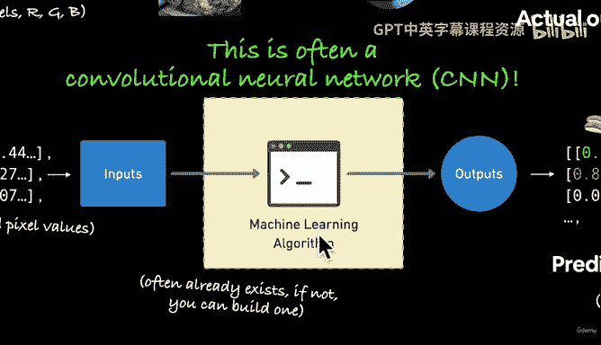

## 输出：模型的预测

模型的输出形状取决于你要解决的具体问题。以食物图像分类为例：

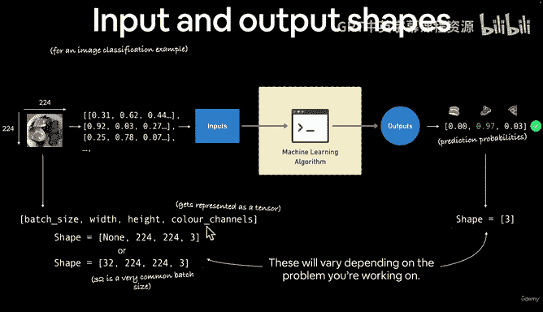

*   **目标**：让模型识别图像中是寿司、牛排还是披萨。
*   **输出**：模型为每个类别输出一个预测概率。因此，输出形状是 `[batch_size, num_classes]`。对于我们的三分类问题，就是 `[batch_size, 3]`。

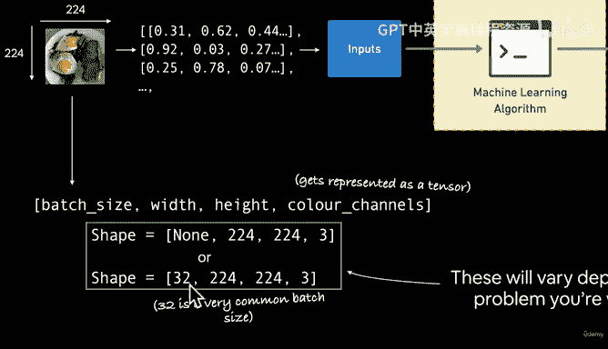

模型会输出类似这样的预测概率：`[0.01, 0.81, 0.18]`，分别对应寿司、牛排、披萨的概率。最高概率的类别即为模型的预测结果。

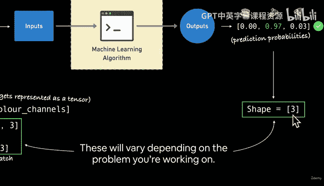

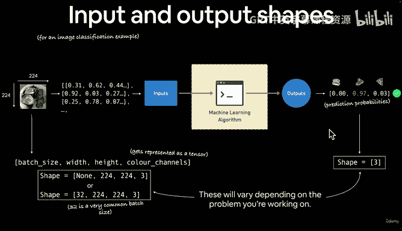

以下是核心流程的总结：
1.  **数值化编码**：将图像转换为形状为 `[batch_size, channels, height, width]` 的张量。
2.  **模型处理**：将张量输入机器学习模型（如卷积神经网络 CNN）。
3.  **产生输出**：模型输出形状为 `[batch_size, num_classes]` 的预测。

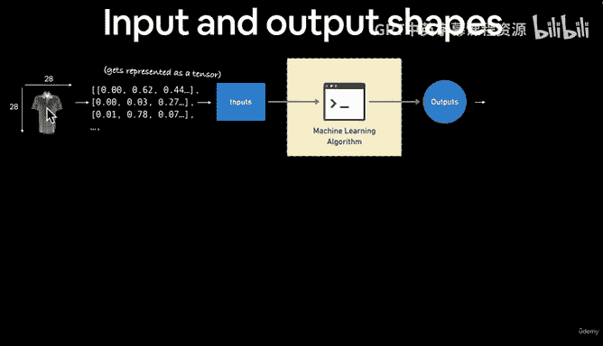

## 工作流程回顾

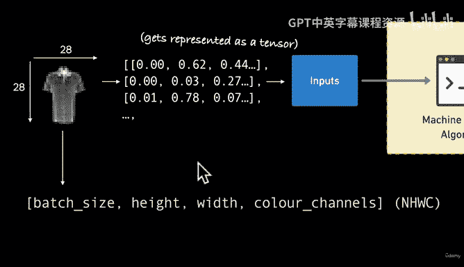

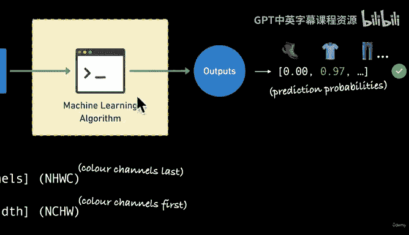

我们将遵循以下 PyTorch 工作流程来实现计算机视觉任务：

以下是实现上述过程的关键步骤：
1.  **准备数据**：使用 `torchvision.transforms` 和 `torch.utils.data.DataLoader` 将图像转换为张量。
2.  **构建模型**：使用 `torch.nn` 模块构建或选择预训练模型（如来自 `torchvision.models`）。
3.  **训练模型**：定义损失函数和优化器，并训练模型。
4.  **评估模型**：使用 `torchmetrics` 或自定义函数评估模型性能。
5.  **实验改进**：通过调整模型、数据或超参数来提升效果。
6.  **保存模型**：将训练好的模型保存下来以供后续使用。

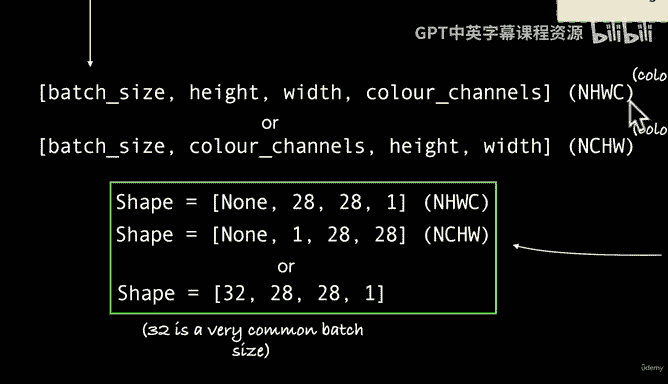

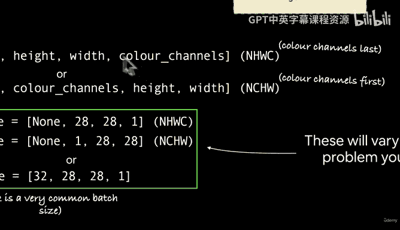

## 另一个例子：灰度图像分类

这个模式同样适用于其他问题。例如，对 28x28 的灰度时尚单品图像进行分类：

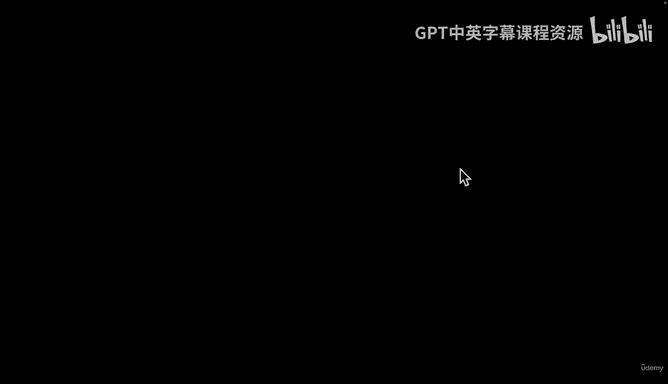

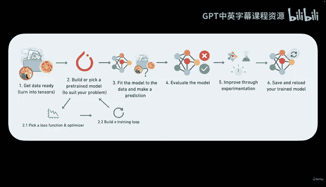

*   **输入形状**：由于是灰度图像，颜色通道数为 1。例如 `[batch_size, 1, 28, 28]`。
*   **输出形状**：如果有 10 种服装类别，则输出形状为 `[batch_size, 10]`。

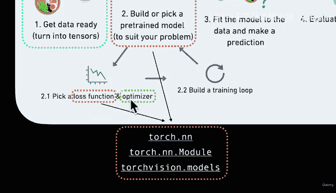

无论问题如何变化，其核心模式不变：将数据数值化，输入模型，并确保输出形状符合你的需求。

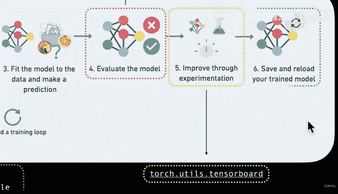

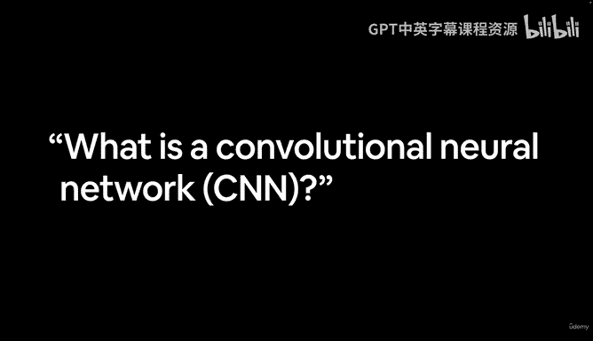

本节课中我们一起学习了计算机视觉中输入和输出张量的典型形状。我们了解了图像如何被表示为数值张量，以及模型的输出如何对应具体的预测任务。记住确保输入输出形状匹配是构建有效模型的关键。下一节，我们将深入探讨完成这些任务的强大工具——卷积神经网络。