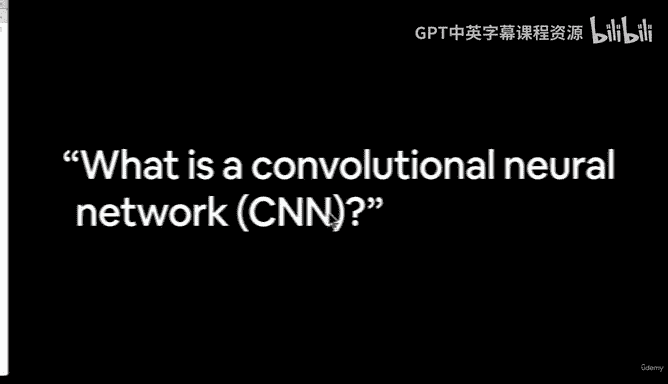
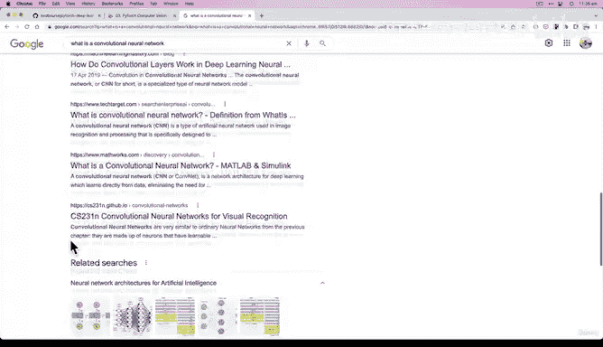
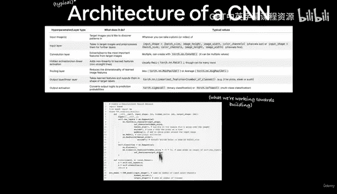
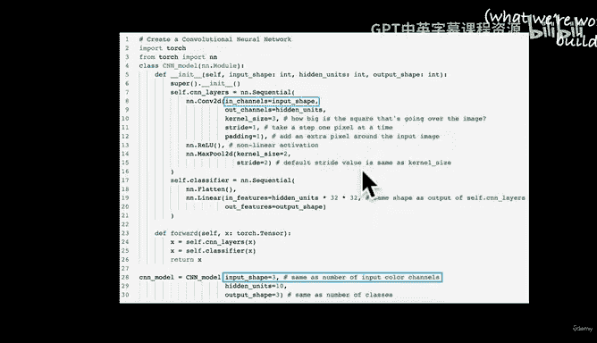
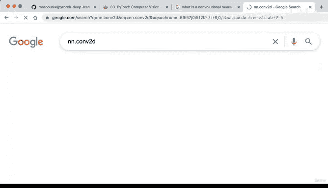
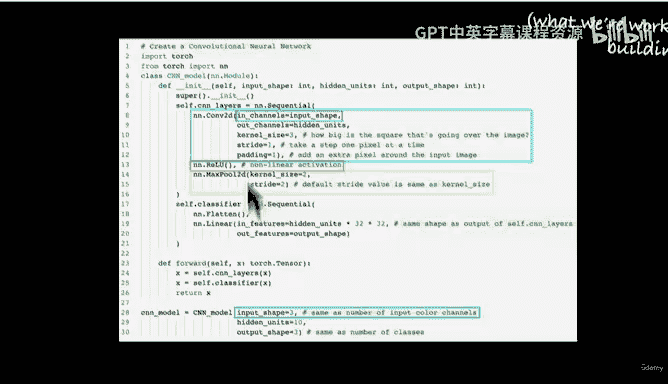
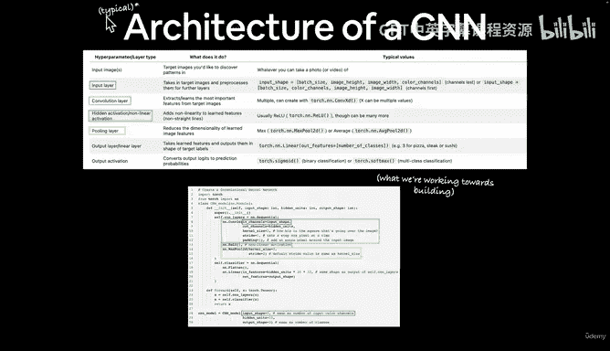
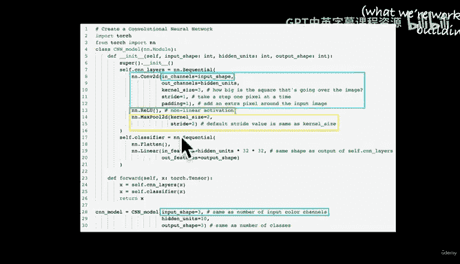
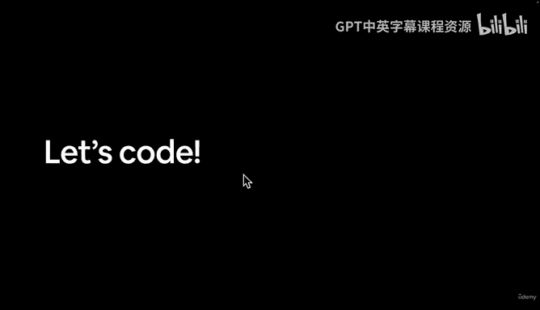

# 99：卷积神经网络概念解析 🧠

在本节课中，我们将学习卷积神经网络（CNN）的基本概念。我们将探讨CNN的典型架构、各层的作用，以及如何通过代码来理解和构建这些网络。




---

欢迎回来。在上一节视频中，我们看到了计算机视觉输入和输出形状的示例，并暗示了卷积神经网络（CNN）是擅长识别图像模式的深度学习模型。上一节视频结束时，我们提出了一个问题：什么是卷积神经网络？以及在哪里可以了解它？

以下是了解卷积神经网络的一种方式。网络上有很多相关资源，例如“卷积神经网络全面指南”。哪个资源最好？其实并不重要，最适合你的就是最好的。例如，Code Basics有一个很好的视频，我也看过。还有“卷积神经网络的简单解释”。你可以自行研究这些资源。如果你想通过图像学习，也有很多图像资料可供参考。



我更喜欢通过编写代码来学习，因为本课程以代码为先。作为机器学习工程师，我99%的时间都在编写代码，因此我们将重点放在代码上。

无论如何，这是CNN的典型架构。换句话说，卷积神经网络。如果在本课程中听到CNN，我指的不是新闻网站，而是卷积神经网络架构。以下是我们将要构建的PyTorch代码示例。

---



## CNN典型架构 🏗️

我们有一些超参数和层类型。首先是一个输入层，它接收输入通道和输入形状。在机器学习和深度学习中，对齐模型的输入和输出形状非常重要，无论你使用什么模型或解决什么问题。



接下来是卷积层。卷积层在图像或张量上执行卷积窗口操作，以发现模式。让我们看看具体操作。实际上，我们可以查看`torch.nn.Conv2d`的文档。

卷积层的输出公式为：
```
输出 = 偏置 + 权重张量在卷积通道上的和 × 输入
```
如果你想深入了解这里的具体操作，可以自行研究。我们将编写代码来使用`torch.nn.Conv2d`，并调整所有参数以适应我们的问题。



这里需要注意的是，偏置项和权重矩阵是卷积层的关键组成部分。偏置通常是一个向量，权重是一个矩阵，它们对输入数据进行操作。我们稍后会在代码中看到这些内容。请记住，神经网络中的每一层都对输入数据执行某种操作，这些操作逐层进行，最终希望将数据转换为有用的输出。

---

## 隐藏层与非线性激活 ⚡

接下来是隐藏层或非线性激活层。为什么使用非线性激活？因为如果数据是非线性的（不是直线），我们需要直线和非直线的帮助来建模和绘制模式。

然后通常有一个池化层。请注意，我在这里使用“典型”一词是有原因的，因为这些架构一直在变化。这只是CNN的一个典型示例，是最基础的CNN架构。随着时间的推移，你将学会构建更复杂的模型，甚至直接使用它们，正如我们将在课程的迁移学习部分看到的那样。

---

## 输出层 📤

最后是输出层。你注意到这里的趋势了吗？我们有一个输入层，多个隐藏层对数据执行数学操作，然后是一个输出层或线性层，将输出转换为理想的形状。因此，我们在这里有一个输出形状。



在过程中，我们输入一些图像，数据经过所有这些层（因为我们使用了`nn.Sequential`），希望`forward`方法返回的`X`处于可用状态，我们可以将其转换为类别名称，并以某种方式集成到计算机视觉应用中。





---

## 注意事项 ⚠️

请注意，构建卷积神经网络的方式几乎无限多，本幻灯片仅展示其中一种。请记住这一点。但练习这类内容的最佳方式不是盯着页面看，而是编写代码。如果有疑问，就编写代码来验证。让我们开始编写代码吧，我们将在Google Colab中见。

---

## 总结 📝



在本节课中，我们一起学习了卷积神经网络的基本概念。我们探讨了CNN的典型架构，包括输入层、卷积层、非线性激活层、池化层和输出层。我们还强调了通过编写代码来理解和构建CNN的重要性。在下一节中，我们将通过实际代码来进一步巩固这些概念。