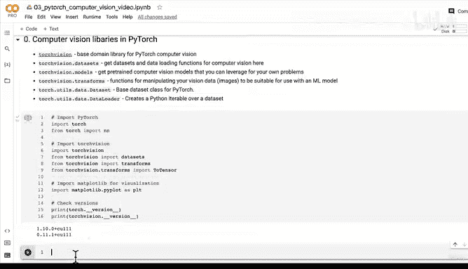

# 100：PyTorch 计算机视觉基础库导入与讨论 🖥️🔍


在本节课中，我们将学习PyTorch中用于计算机视觉任务的核心库，并了解如何导入它们以开始构建视觉模型。我们将从理论讨论转向实际编码。

## 概述

上一节我们讨论了计算机视觉问题和卷积神经网络的基础知识。本节中，我们将开始编写代码，并熟悉PyTorch生态系统中处理计算机视觉问题的关键库。

## 计算机视觉库介绍

以下是PyTorch中处理计算机视觉问题的主要库，了解它们对后续学习至关重要。

*   **`torchvision`**：这是PyTorch计算机视觉的基础领域库。
*   **`torchvision.datasets`**：包含获取数据集和数据加载的函数。
*   **`torchvision.models`**：提供预训练的计算机视觉模型。预训练模型是指在现有视觉数据上已经训练好、拥有可学习权重（训练好的模式）的模型，你可以将其用于自己的问题。
*   **`torchvision.transforms`**：提供用于处理视觉数据（即图像）的函数，使其适合机器学习模型使用。`transforms`帮助我们将图像数据转换为数字，以便模型能够处理。
*   **`torch.utils.data.Dataset`**：这不是视觉专用的，而是整个PyTorch的基础类。如果你想使用自己的自定义数据创建数据集，就需要用到这个基类。
*   **`torch.utils.data.DataLoader`**：这同样需要了解，因为你几乎在任何PyTorch问题中都会用到某种形式的数据集或数据加载器。它会围绕数据集创建一个Python可迭代对象。

## 导入核心库

现在，让我们导入一些核心库，以便开始使用它们。

```python
import torch
import torch.nn as nn
import torchvision
from torchvision import datasets
from torchvision import transforms
import matplotlib.pyplot as plt
```

## 检查版本

导入库后，最好检查一下当前使用的版本，以确保与教程代码兼容。

```python
print(torch.__version__)
print(torchvision.__version__)
```

运行上述代码后，你可能会看到类似 `torch 1.10` 和 `torchvision 0.11` 的输出。请确保你使用的版本至少不低于这些版本，它们是完成本部分内容所需的最低版本。

## 关于 `transforms` 的说明

`transforms` 模块对于准备图像数据至关重要。例如，`transforms.ToTensor()` 是一个常用的转换函数，它的作用是将PIL图像或NumPy数组转换为张量（Tensor）。这正是我们后续需要做的：将图像转换为张量，以便模型能够使用。

## 总结

本节课我们一起学习了PyTorch中用于计算机视觉的核心库。我们介绍了 `torchvision` 及其子模块（`datasets`、`models`、`transforms`）的作用，并完成了这些库的导入和版本检查。现在，我们已经为处理计算机视觉数据做好了基础准备。



在下一节视频中，我们将开始学习如何获取一个数据集。