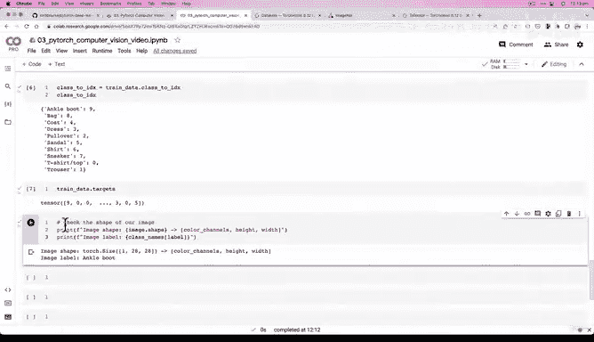
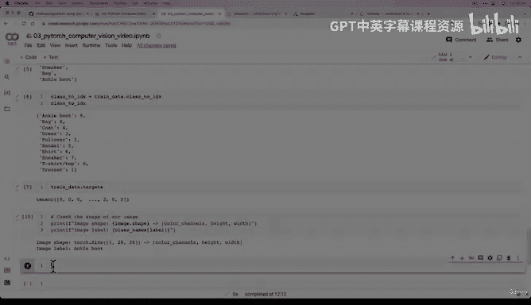

# 101：获取并检查计算机视觉数据集 🖼️


在本节课中，我们将学习如何使用 PyTorch 的 `torchvision` 库获取一个计算机视觉数据集，并检查其输入和输出数据的形状。这是构建任何机器学习模型的第一步。

---

## 概述

上一节我们介绍了 PyTorch 中用于计算机视觉的核心库 `torchvision`，以及用于处理数据的基础类 `torch.utils.data.Dataset` 和 `torch.utils.data.DataLoader`。本节中，我们将实际操作，下载一个名为 Fashion MNIST 的经典数据集，并检查其基本属性。

## 获取数据集

大多数机器学习项目都从获取数据集开始。我们将使用 `torchvision.datasets` 模块来下载 Fashion MNIST 数据集。这个数据集是原始 MNIST 数据集的一个变体，包含了10类服装的灰度图像，比手写数字识别更具挑战性。

以下是获取数据集的步骤：

1.  **导入必要的库**：我们需要 `torchvision` 来访问数据集和转换功能。
2.  **设置训练数据**：使用 `torchvision.datasets.FashionMNIST` 类下载训练集。
3.  **设置测试数据**：使用同一个类下载测试集，但指定参数 `train=False`。
4.  **应用数据转换**：使用 `torchvision.transforms.ToTensor()` 将图像数据转换为 PyTorch 张量。这是必需的，因为神经网络模型需要张量格式的输入。

以下是实现这些步骤的代码：

```python
import torch
from torchvision import datasets
from torchvision.transforms import ToTensor

# 设置训练数据
train_data = datasets.FashionMNIST(
    root="data", # 数据下载路径
    train=True, # 下载训练集
    download=True, # 如果本地没有则下载
    transform=ToTensor(), # 将图像转换为张量
    target_transform=None # 不对标签进行转换
)

# 设置测试数据
test_data = datasets.FashionMNIST(
    root="data",
    train=False, # 下载测试集
    download=True,
    transform=ToTensor(),
    target_transform=None
)
```

运行这段代码后，数据集会自动下载到当前目录下的 `data/` 文件夹中。

## 检查数据集属性

成功下载数据集后，我们需要了解它的基本情况。这包括数据集的样本数量、单个样本的形状以及标签的含义。

以下是检查数据集的关键步骤：

1.  **检查数据量**：查看训练集和测试集分别有多少个样本。
2.  **查看第一个样本**：通过索引获取第一个训练样本，它包含图像张量和对应的标签。
3.  **检查图像形状**：理解图像张量的维度含义（通道、高度、宽度）。
4.  **查看类别名称**：了解每个数字标签对应的具体服装类别。

让我们通过代码来探索这些属性：

```python
# 1. 检查数据量
print(f"训练样本数: {len(train_data)}")
print(f"测试样本数: {len(test_data)}")

# 2. 查看第一个训练样本
image, label = train_data[0]
print(f"第一个样本的图像张量:\n {image}")
print(f"第一个样本的标签: {label}")

# 3. 检查图像形状
# 使用 ToTensor() 转换后，图像形状为 [颜色通道, 高度, 宽度]
print(f"图像形状: {image.shape} -> [颜色通道数, 图像高度, 图像宽度]")

# 4. 查看类别名称
class_names = train_data.classes
print(f"数据集类别: {class_names}")
print(f"标签 {label} 对应的类别是: {class_names[label]}")
```

运行上述代码，你可能会看到类似以下的输出：
```
训练样本数: 60000
测试样本数: 10000
图像形状: torch.Size([1, 28, 28]) -> [颜色通道数, 图像高度, 图像宽度]
标签 9 对应的类别是: Ankle boot
```

**核心概念解释**：
*   **图像形状 `[1, 28, 28]`**：这表示图像是 `28` 像素高、`28` 像素宽的灰度图。第一个维度 `1` 代表颜色通道数。对于灰度图像，通道数为1；对于彩色（RGB）图像，通道数为3。
*   **标签 `9`**：这是一个整数，代表目标类别。通过 `train_data.classes` 列表，我们可以知道 `9` 对应的是“短靴”（Ankle boot）。

## 总结

本节课中我们一起学习了如何获取和初步探索一个计算机视觉数据集。我们使用 `torchvision.datasets` 轻松下载了 Fashion MNIST 数据集，并使用 `ToTensor()` 转换将图像数据预处理为模型可用的张量格式。最关键的是，我们检查了数据的**形状**，了解到输入图像是形状为 `[1, 28, 28]` 的张量，输出标签是0到9之间的整数。理解输入和输出的形状是构建有效模型的基础。





在下一节，我们将把这些数字可视化，真正“看到”我们正在处理的数据图像。