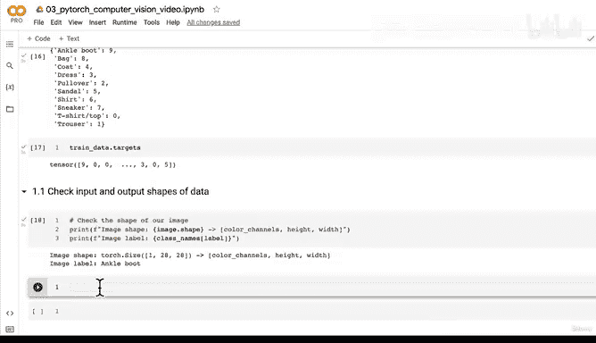
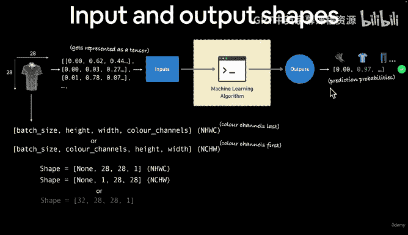
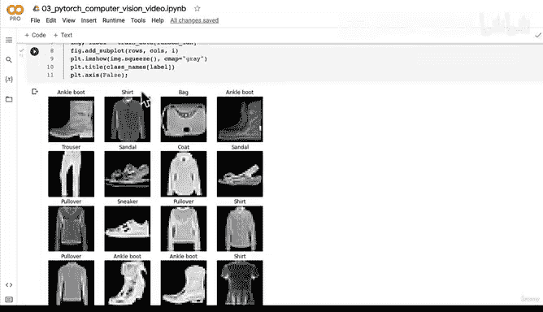
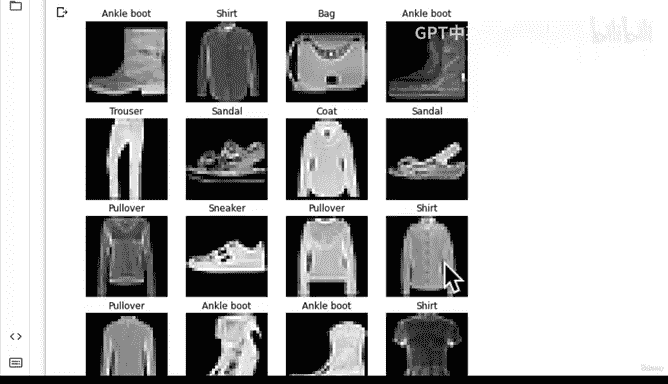
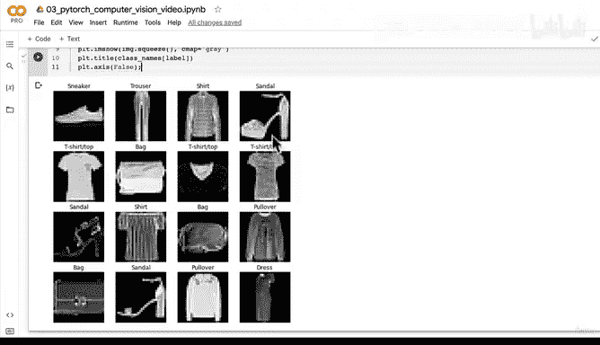
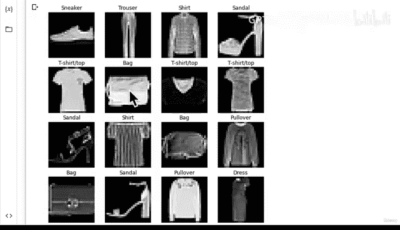
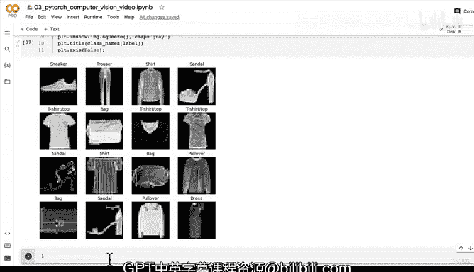

# 102：随机样本数据可视化 📊

在本节课中，我们将学习如何可视化FashionMNIST数据集中的图像样本。我们将检查数据的输入输出形状，并使用Matplotlib库来绘制和查看随机的图像样本，以更好地理解我们正在处理的数据。




---

## 数据形状回顾 🔍



上一节我们介绍了FashionMNIST数据集，并检查了其输入输出形状。本节中我们来看看如何将这些数值表示转换为可视化的图像。

FashionMNIST数据集包含10类服装的灰度图像，每张图像的尺寸是28x28像素。在PyTorch中，张量的默认格式是颜色通道优先（NCHW），这意味着一个批次的图像张量形状为 `[batch_size, 1, 28, 28]`。

**公式**：输入张量形状 = `[N, C, H, W]`
*   `N`：批次大小
*   `C`：颜色通道数（灰度图为1）
*   `H`：图像高度（28）
*   `W`：图像宽度（28）

---

## 可视化单个图像 🖼️

理解数据的第一步是查看它。我们将使用Matplotlib来绘制图像。但需要注意的是，Matplotlib期望的图像数据格式通常是高度和宽度（HW），或者颜色通道在最后（HWC），而我们的数据是颜色通道优先（CHW）。

以下是绘制训练集中第一张图像的步骤：

```python
import matplotlib.pyplot as plt

# 获取第一个样本（图像和标签）
image, label = train_data[0]

# 打印图像形状以了解数据结构
print(f"Image shape: {image.shape}") # 输出: torch.Size([1, 28, 28])

# 绘制图像
plt.imshow(image.squeeze(), cmap="gray")
plt.title(class_names[label])
plt.axis(False)
plt.show()
```

**代码解释**：
*   `image.squeeze()`：移除张量中大小为1的维度（即颜色通道维度），将形状从 `[1, 28, 28]` 变为 `[28, 28]`，以符合Matplotlib的输入要求。
*   `cmap="gray"`：将颜色映射设置为灰度，以正确显示灰度图像。
*   `plt.axis(False)`：关闭坐标轴，让图像显示更清晰。

运行上述代码后，我们将看到一张像素化的“踝靴”图像及其对应的标签（数字9）。

---

## 可视化随机图像样本 🎲

只看一张图像不足以了解数据全貌。更好的做法是随机查看一批图像样本。这有助于我们发现数据中的模式、潜在问题（如类别间相似度高）或异常值。

以下是创建4x4网格，展示16张随机训练图像的步骤：

```python
# 设置随机种子以确保结果可复现
torch.manual_seed(42)

# 设置子图网格的行数和列数
rows = 4
cols = 4

# 创建画布
fig = plt.figure(figsize=(9, 9))



# 循环创建16个子图
for i in range(1, rows * cols + 1):
    # 生成一个随机索引
    random_idx = torch.randint(0, len(train_data), size=[1]).item()

    # 根据随机索引获取图像和标签
    img, label = train_data[random_idx]

    # 添加子图
    fig.add_subplot(rows, cols, i)

    # 在子图中绘制图像
    plt.imshow(img.squeeze(), cmap="gray")
    plt.title(class_names[label])
    plt.axis(False)

plt.show()
```



**代码解释**：
*   `torch.manual_seed(42)`：固定随机数生成器的种子，确保每次运行代码时生成的随机索引序列相同，便于结果复现和分享。
*   `torch.randint(0, len(train_data), size=[1])`：生成一个在 `[0, 训练集长度)` 范围内的随机整数索引。
*   `fig.add_subplot(rows, cols, i)`：在 `rows x cols` 的网格中，在第 `i` 个位置创建一个子图。

通过这个可视化，我们可以快速浏览数据集中不同类型的服装，例如T恤、裤子、连衣裙、外套等。你可能会注意到一些类别（如“衬衫”和“套头衫”）在低分辨率下看起来非常相似，这可能是我们后续模型训练中需要关注的一个挑战点。

---



## 总结 📝

本节课中我们一起学习了如何可视化FashionMNIST数据集。
1.  **回顾了数据形状**：理解了PyTorch中图像张量的NCHW格式与Matplotlib库期望的格式差异。
2.  **绘制了单个图像**：学会了使用 `.squeeze()` 方法调整张量形状，并使用Matplotlib的 `imshow` 函数配合灰度色彩映射来显示图像。
3.  **批量查看随机样本**：通过设置随机种子和循环，创建了一个图像网格来同时查看多个随机数据样本，这是探索性数据分析（EDA）中理解数据分布和潜在问题的关键一步。





通过可视化，我们与数据建立了更直观的联系，并发现了可能影响模型性能的细节（如类别相似性）。在下一节中，我们将开始准备数据，以便将其加载到神经网络模型中进行训练。