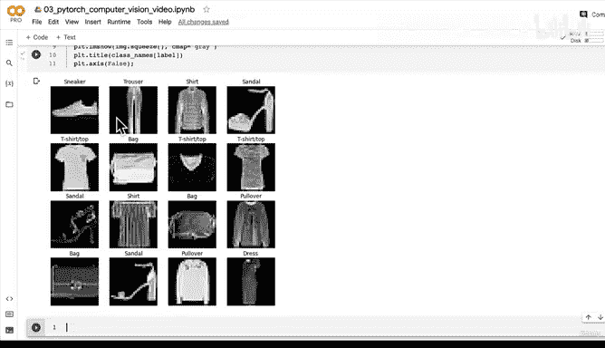
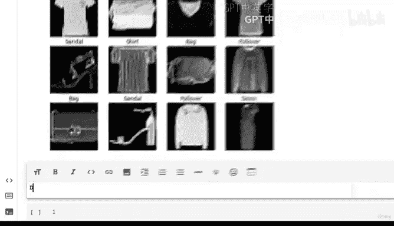
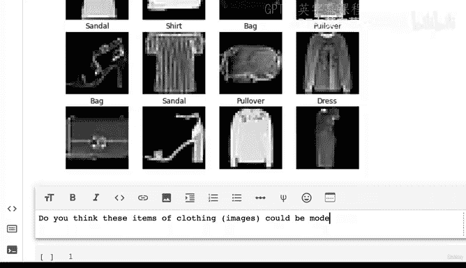
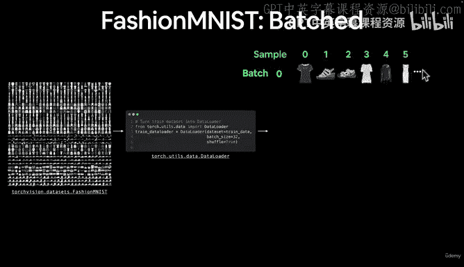

#  103：DataLoader 概览：理解小批次数据 📊


在本节课中，我们将要学习如何将 PyTorch 数据集转换为 DataLoader，并深入理解使用小批次数据进行训练的核心概念和优势。





上一节我们介绍了如何加载和可视化 FashionMNIST 数据集。本节中我们来看看如何为模型训练准备数据，特别是通过 DataLoader 将数据组织成小批次。



## 数据建模的思考

我们拥有 60000 张服装图像，目标是构建一个计算机视觉模型将其分类为 10 个不同的类别。

在可视化了一些样本之后，我们需要思考一个问题：这些图像是否可以用纯粹的线性线（直线）来建模？还是说我们需要一个具有非线性的模型？

这个问题可以留待后续测试。现在，让我们开始进一步准备数据，即创建 DataLoader。

## 从数据集到 DataLoader

目前，我们的数据是 PyTorch 数据集的形式。

```python
train_data
test_data
```

它们都是 `FashionMNIST` 数据集，并已应用了相同的转换（转换为张量）。我们的目标是将数据集转换为 DataLoader。

DataLoader 将我们的数据集转换为一个 Python 可迭代对象。更具体地说，它可以将数据分成批次或小批次。

## 为什么要使用小批次？

以下是使用小批次的两个主要原因：

1.  **计算效率更高**：你的计算硬件（如 RAM、GPU 内存）可能无法一次性在内存中存储和处理全部 60000 张图像。通过将其分解为每次处理 32 张图像（批次大小为 32），可以显著降低内存需求。32 是一个常见的起始批次大小，你可以根据问题调整这个数字。

2.  **为神经网络提供更多梯度更新机会**：在每个训练周期（epoch）中，如果一次性查看所有 60000 张图像，神经网络在整个数据集上每个周期只能更新一次权重。而如果我们每次查看 32 张图像，神经网络每处理 32 张图像（得益于优化器）就可以更新一次其内部状态（权重）。当我们编写训练循环时，这一点会变得更加清晰。

如果你想深入了解其背后的理论，强烈建议查阅 Andrew Ng 关于“小批次梯度下降”的讲座。


## DataLoader 的可视化目标

我们的目标是创建批次大小为 32 的 DataLoader，应用于全部 60000 张训练图像和 10000 张测试图像。

以下是我们要实现的代码结构概览：

```python
from torch.utils.data import DataLoader

train_dataloader = DataLoader(dataset=train_data,
                              batch_size=32,
                              shuffle=True)

test_dataloader = DataLoader(dataset=test_data,
                             batch_size=32,
                             shuffle=False) # 测试集通常不 shuffle
```

对于训练数据，我们设置 `shuffle=True`。这是因为如果数据集本身存在顺序（例如所有裤子图像排在一起），我们不希望神经网络记住数据的顺序，而只希望它学习不同类别之间的模式。打乱数据可以混合样本。



设置 `batch_size=32` 意味着每个批次包含 32 个样本。我们将拥有 `总样本数 / 批次大小` 个批次，例如训练集大约有 60000 / 32 ≈ 1875 个批次。

## 总结

本节课中我们一起学习了 DataLoader 的核心概念。我们了解到，将数据集转换为 DataLoader 并组织成小批次，主要出于计算效率和增加模型权重更新频率两方面的考虑。在下一节，我们将动手编写代码，为 FashionMNIST 数据集创建 DataLoader。