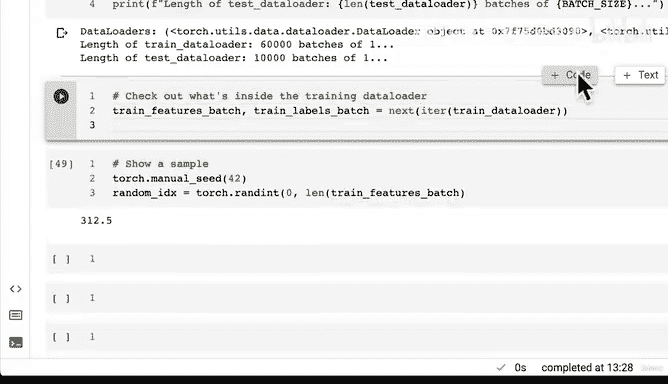
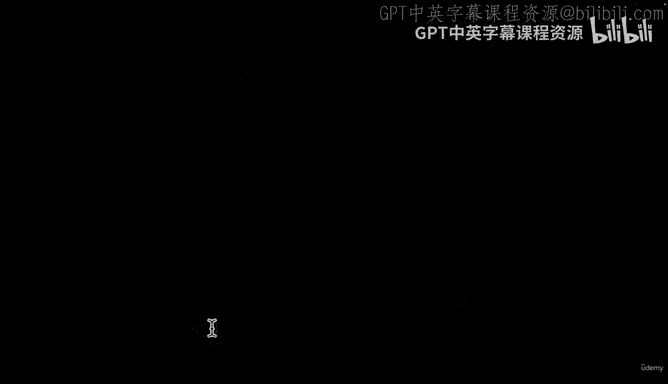
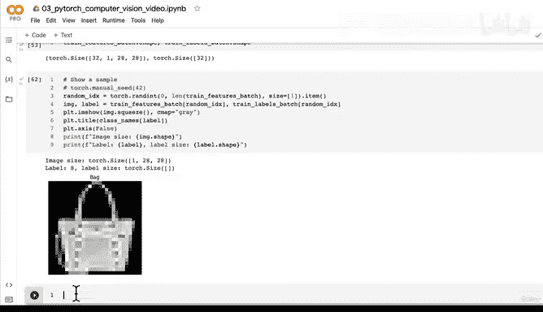

# 104：将数据集转换为DataLoader 📚


在本节课中，我们将学习如何将PyTorch数据集转换为DataLoader。DataLoader是PyTorch中一个非常重要的工具，它允许我们以**小批量（mini-batch）** 的形式高效地加载和处理数据。这对于训练深度学习模型至关重要，因为它能提高计算效率，并为模型提供更多更新梯度的机会。

---

## 概述

上一节我们介绍了小批量的概念。本节中，我们来看看如何通过代码实现这一过程。我们将使用PyTorch的`DataLoader`类，将FashionMNIST数据集转换为可迭代的数据加载器，以便在后续的模型训练中使用。

---

## 为什么要使用DataLoader？

使用DataLoader主要有两个原因：
1.  **计算效率更高**：GPU的内存有限，无法一次性加载整个数据集（例如60000张图像）。通过小批量加载，我们可以更有效地利用硬件资源。
2.  **提供更多梯度更新机会**：在每个训练周期（epoch）中，模型可以基于多个小批量数据多次更新其权重，这通常能带来更好的训练效果。

---

## 代码实现

以下是创建DataLoader的具体步骤。

### 1. 导入必要的库

首先，我们需要从`torch.utils.data`中导入`DataLoader`。

```python
from torch.utils.data import DataLoader
```

### 2. 设置超参数

接下来，我们定义**批量大小（batch size）** 这个超参数。批量大小是你可以自行设定的值，32是一个常用的起始值。

```python
BATCH_SIZE = 32
```

### 3. 创建训练和测试DataLoader

我们将为训练集和测试集分别创建DataLoader。

```python
# 创建训练DataLoader
train_dataloader = DataLoader(dataset=train_data, # 训练数据集
                              batch_size=BATCH_SIZE, # 批量大小
                              shuffle=True) # 打乱数据顺序

# 创建测试DataLoader
test_dataloader = DataLoader(dataset=test_data, # 测试数据集
                             batch_size=BATCH_SIZE,
                             shuffle=False) # 测试集通常不打乱
```

**参数说明**：
*   `dataset`：要加载的数据集。
*   `batch_size`：每个批次包含的样本数。
*   `shuffle`：是否在每个训练周期开始时打乱数据顺序。**训练集需要打乱**以防止模型学习到数据顺序；**测试集通常不打乱**，以便于评估和结果复现。

---

## 检查DataLoader

创建好DataLoader后，让我们检查一下它的属性。

### 查看DataLoader长度

DataLoader的长度代表数据被分成了多少个批次。

```python
print(f"训练DataLoader长度（批次数量）: {len(train_dataloader)}")
print(f"测试DataLoader长度（批次数量）: {len(test_dataloader)}")
```

输出结果类似于：
```
训练DataLoader长度（批次数量）: 1875
测试DataLoader长度（批次数量）: 313
```
这意味着训练数据被分成了1875个批次，每个批次包含32个样本（60000 / 32 ≈ 1875）。

### 查看一个批次的数据

我们可以从DataLoader中获取一个批次，并查看其形状。

```python
# 将DataLoader转换为迭代器并获取第一个批次
train_features_batch, train_labels_batch = next(iter(train_dataloader))

# 查看特征（图像）和标签的形状
print(f"特征批次形状: {train_features_batch.shape} -> [batch_size, color_channels, height, width]")
print(f"标签批次形状: {train_labels_batch.shape}")
```

输出结果类似于：
```
特征批次形状: torch.Size([32, 1, 28, 28]) -> [batch_size, color_channels, height, width]
标签批次形状: torch.Size([32])
```
这确认了我们有一个包含32张图像的批次，每张图像是1个颜色通道、28像素高、28像素宽。同时有32个对应的标签。



---

## 可视化批次中的样本

为了更直观地理解数据，我们可以从批次中随机选取并显示一张图像及其标签。



以下是可视化单个样本的步骤：

1.  设置随机种子以确保结果可复现。
2.  从批次中随机选择一个索引。
3.  获取该索引对应的图像和标签。
4.  使用Matplotlib显示图像。

```python
import torch
import matplotlib.pyplot as plt

# 设置随机种子
torch.manual_seed(42)

# 随机选择一个索引
random_idx = torch.randint(0, len(train_features_batch), size=[1]).item()

# 获取图像和标签
img, label = train_features_batch[random_idx], train_labels_batch[random_idx]

# 显示图像
plt.imshow(img.squeeze(), cmap="gray")
plt.title(f"Label: {label} | Class: {class_names[label]}")
plt.axis(False)
plt.show()

# 打印图像和标签信息
print(f"图像大小: {img.shape}")
print(f"标签: {label}")
```

运行这段代码，你将看到从当前批次中随机选取的一张FashionMNIST图像。

---

## 总结

本节课中我们一起学习了如何将PyTorch数据集转换为DataLoader。我们了解了使用DataLoader的重要性，掌握了创建和配置DataLoader的方法，并学会了如何检查和可视化DataLoader中的数据批次。



现在，我们的数据已经准备好以**小批量**的形式输入到神经网络模型中。在下一节课中，我们将开始构建我们的第一个模型——一个基线模型（Model 0），并着手进行训练。