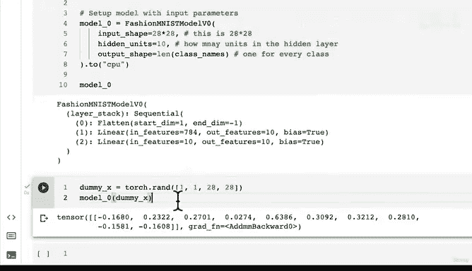

# 105：构建基线模型 🧠


在本节课中，我们将学习如何构建一个用于图像分类的基线神经网络模型。我们将从准备数据开始，逐步创建一个简单的模型，并理解其核心组件。

## 概述

上一节我们将FashionMNIST数据集加载并转换成了DataLoader，以便进行批量处理。本节中，我们将开始构建我们的第一个模型——一个简单的基线模型。基线模型是一个起点，后续我们将通过实验对其进行改进。

## 构建基线模型的重要性

在开始一系列机器学习实验时，最佳实践是从一个基线模型开始。基线模型是一个简单的模型，你将在后续的模型或实验中尝试改进它。换句话说，从简单开始，必要时再增加复杂性。神经网络非常强大，容易在数据集上“表现过好”，即过拟合。因此，我们先构建一个简单的基线模型，然后整个目标就是按照工作流程进行实验，通过实验来改进。

## 引入Flatten层

在构建模型之前，我们先介绍一个新的层：Flatten层。Flatten层的作用是将输入张量的连续维度展平。为了更好地理解，我们通过代码来演示。

首先，我们创建一个Flatten层：
```python
flatten = nn.Flatten()
```

然后，我们取一个训练样本进行测试：
```python
x = train_features_batch[0]
print(f"Shape before flattening: {x.shape}")
```

样本的初始形状是 `[1, 28, 28]`，代表1个颜色通道，高度28像素，宽度28像素。接下来，我们将这个样本通过Flatten层：
```python
output = flatten(x)
print(f"Shape after flattening: {output.shape}")
print(output)
```

经过Flatten层后，形状变成了 `[1, 784]`。这是因为 `28 * 28 = 784`，每个像素的值被展平成了一个长向量。这个过程类似于将多维数据压缩成一个单一的向量空间，这是许多深度学习模型处理图像数据的第一步。

## 创建基线模型类

现在，我们来构建我们的基线模型。这个模型将继承自 `nn.Module`，并包含一个Flatten层和两个线性层。

以下是模型的定义：
```python
import torch
from torch import nn

class FashionMNISTModelV0(nn.Module):
    def __init__(self, input_shape: int, hidden_units: int, output_shape: int):
        super().__init__()
        self.layer_stack = nn.Sequential(
            nn.Flatten(),
            nn.Linear(in_features=input_shape, out_features=hidden_units),
            nn.Linear(in_features=hidden_units, out_features=output_shape)
        )
    
    def forward(self, x):
        return self.layer_stack(x)
```

在这个模型中：
1.  `nn.Flatten()` 层将输入的图像数据展平。
2.  第一个 `nn.Linear` 层将展平后的向量映射到隐藏层。
3.  第二个 `nn.Linear` 层将隐藏层的输出映射到最终的类别数（10类）。

## 实例化模型

接下来，我们实例化这个模型。我们需要指定输入形状、隐藏单元数和输出形状。

```python
torch.manual_seed(42)

model_0 = FashionMNISTModelV0(
    input_shape=784,  # 28*28
    hidden_units=10,
    output_shape=len(class_names)  # 10
).to("cpu")
```

我们使用一个随机生成的张量进行前向传播测试，以确保模型能正常工作：
```python
dummy_x = torch.rand([1, 1, 28, 28])
model_0(dummy_x)
```

输出应该是一个形状为 `[1, 10]` 的张量，代表10个类别的原始分数（logits）。

## 理解模型结构

我们的基线模型结构简单，没有使用非线性激活函数。这意味着它只能学习数据中的线性关系。对于像FashionMNIST这样的复杂图像数据，这可能不够。我们将在后续课程中通过添加非线性激活函数和更多层来改进模型。

## 总结

本节课中，我们一起学习了如何构建一个用于图像分类的基线神经网络模型。我们从介绍Flatten层开始，理解了其将多维图像数据展平为向量的作用。然后，我们创建了一个简单的模型类，包含Flatten层和两个线性层。最后，我们实例化了模型并进行了前向传播测试，确保其结构正确。



在下一节课中，我们将开始训练这个模型，并学习如何评估其性能。