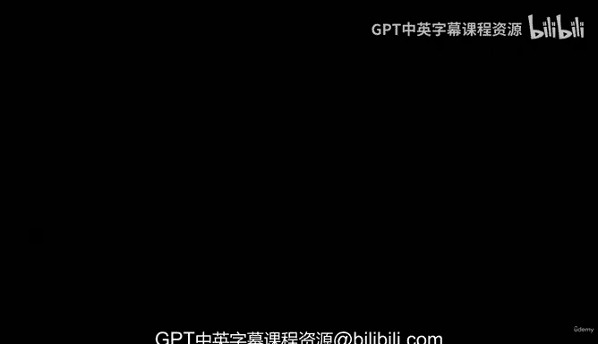
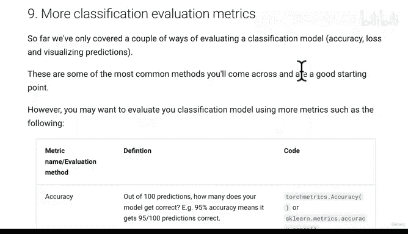
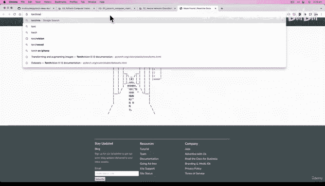
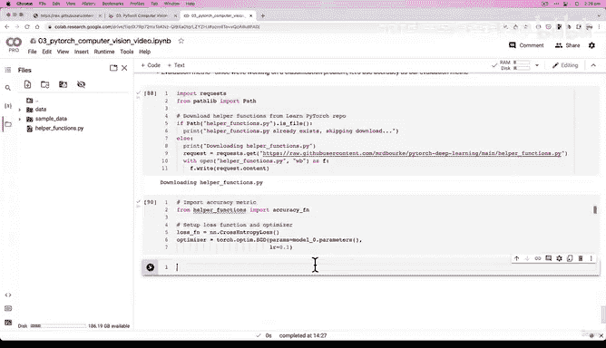

# 106：为模型0创建损失函数与优化器 🧠



在本节课中，我们将学习如何为上一节创建的基准模型（Model 0）设置损失函数和优化器。这是训练神经网络的关键步骤，它们将指导模型如何从数据中学习。

上一节我们介绍了如何构建一个用于处理28x28灰度服装图像分类的基准模型，并验证了其输入输出形状的正确性。本节中我们来看看如何为这个模型配备“学习指南”——损失函数和优化器。

## 设置损失函数、优化器与评估指标

我们的模型目前包含随机初始化的权重和偏置参数。深度学习的核心就是通过优化器，根据损失函数的反馈，不断更新这些随机值，使其能更好地表示数据中的特征。这里的“特征”可以是图像中的任何模式，例如手提袋的圆形手柄或边缘轮廓，模型将自动学习这些重要特征。

以下是设置步骤：

1.  **损失函数**：由于我们处理的是多类别分类问题（10种服装），因此选择 `nn.CrossEntropyLoss`。
2.  **优化器**：我们选择随机梯度下降（SGD）作为入门优化器，即 `torch.optim.SGD`。
3.  **评估指标**：对于分类问题，准确率（Accuracy）是一个直观的评估指标。

## 导入辅助函数





在大型项目中，将常用功能（如计算准确率的函数）编写在独立的Python脚本中是常见做法。这避免了代码重复。我们将从课程GitHub仓库导入一个包含 `accuracy_fn` 的辅助函数文件。

```python
# 下载 helper_functions.py 文件（如果尚未存在）
import requests
from pathlib import Path

if Path("helper_functions.py").is_file():
    print("helper_functions.py 已存在，跳过下载。")
else:
    print("正在下载 helper_functions.py...")
    request = requests.get("https://raw.githubusercontent.com/mrdbourke/pytorch-deep-learning/main/helper_functions.py")
    with open("helper_functions.py", "wb") as f:
        f.write(request.content)

# 从 helper_functions.py 中导入准确率计算函数
from helper_functions import accuracy_fn
```

## 代码实现

现在，让我们用代码具体实现损失函数和优化器的设置。

```python
# 导入必要的库
import torch
from torch import nn

# 设置损失函数
loss_fn = nn.CrossEntropyLoss()

# 设置优化器（随机梯度下降）
# 参数：要优化的模型参数，学习率
optimizer = torch.optim.SGD(params=model_0.parameters(),
                            lr=0.1)
```

**代码解释**：
*   `loss_fn`：交叉熵损失函数，用于衡量模型预测与真实标签之间的差异。
*   `optimizer`：SGD优化器。`params=model_0.parameters()` 告诉优化器需要更新的是模型0的所有参数（权重和偏置）。`lr=0.1` 是学习率，它控制着每次参数更新的步长。我们为这个相对简单的数据集设置了一个较高的初始值。

## 总结

本节课中我们一起学习了为PyTorch模型配置训练核心组件的流程：
1.  我们为多分类任务选择了 **`nn.CrossEntropyLoss`** 作为损失函数。
2.  我们选择了 **`torch.optim.SGD`** 作为优化器，并为其指定了要优化的模型参数以及学习率。
3.  我们介绍了通过导入外部Python脚本（`helper_functions.py`）来复用代码（如 `accuracy_fn`）的实践方法，这是管理大型项目的良好习惯。



现在，我们的模型（Model 0）已经配备了损失函数和优化器，万事俱备，只欠训练。在下一节课中，我们将编写训练循环，并创建一个计时函数来跟踪实验过程。