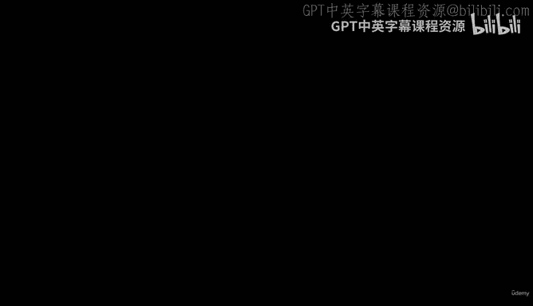
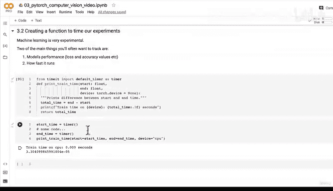

# 107：创建模型代码计时函数 ⏱️



在本节课中，我们将学习如何创建一个函数来计时我们的机器学习实验。计时对于评估模型训练效率、比较不同设备（如CPU与GPU）的性能至关重要。

上一节我们导入了辅助函数文件并引入了准确率计算函数。本节中，我们将编写一个计时函数，用于量化模型训练所花费的时间。

## 概述：为什么需要计时？

机器学习本质上是实验性的。在实验中，我们通常需要追踪两个核心指标：
1.  **模型性能**，例如损失值和准确率。
2.  **模型运行速度**。

理想情况下，我们希望模型性能高且运行速度快。然而，这两者之间常常存在权衡。例如，增加神经网络层数或隐藏单元数可能提升性能，但也会因计算量增加而降低运行速度。运行速度对于在互联网、专用GPU或移动设备上部署模型尤为重要。

既然我们已经通过损失函数和准确率函数追踪了模型性能，现在就来编写代码检查其运行速度。请注意，我们目前有意将模型保持在CPU上，以便后续与GPU的运行速度进行比较。

## 创建计时函数

我们将使用Python的`time`模块来创建计时函数。

首先，导入所需的计时器：
```python
from time import perf_counter as timer
```
`perf_counter`（这里别名为`timer`）提供了高精度的计时功能。你可以查阅Python官方文档了解更多计时函数细节。其基本原理是：记录代码开始执行的精确时间（开始时间），再记录代码结束的精确时间（结束时间），两者之差即为代码运行时长。

以下是计时函数的定义：
```python
def print_train_time(start: float,
                     end: float,
                     device: torch.device = None):
    """
    打印并返回开始时间与结束时间之间的差值。
    """
    total_time = end - start
    print(f"Train time on {device}: {total_time:.3f} seconds")
    return total_time
```
**函数解析**：
*   **参数**：
    *   `start`：实验开始时间。
    *   `end`：实验结束时间。
    *   `device`：模型运行的设备（如`cpu`或`cuda`），默认为`None`。这有助于我们比较模型在不同设备上的运行速度。
*   **功能**：计算总时间差，并以保留三位小数的格式打印出在特定设备上的训练时间，最后返回总时间值。

## 如何使用计时函数

你可以通过以下方式使用这个函数：
```python
# 记录开始时间
start_time = timer()

# 此处放置你的模型训练代码
# ... (你的训练循环代码) ...

# 记录结束时间
end_time = timer()

# 计算并打印训练时间
total_train_time = print_train_time(start=start_time,
                                    end=end_time,
                                    device="cpu")
```
在上面的示例中，由于开始和结束时间之间几乎没有执行任何代码，所以打印出的时间会是一个非常小的数字（例如 `3.304e-05` 秒）。当你将实际的模型训练代码放入中间时，这个函数就能准确测量出训练过程所花费的时间。

## 总结与展望

本节课中，我们一起学习了如何创建一个实用的模型实验计时函数。我们了解了追踪模型运行速度的重要性，并实现了使用`perf_counter`进行高精度计时的代码。

至此，我们已经为构建完整的训练流程准备好了所有关键组件：
*   **损失函数** (`nn.CrossEntropyLoss`)
*   **优化器** (`torch.optim.SGD`)
*   **评估指标** (`accuracy_fn`)
*   **计时函数** (`print_train_time`)
*   **模型** (`FashionMNISTModelV2`)
*   **数据** (`train_dataloader`, `test_dataloader`)



在接下来的视频中，我们将利用所有这些组件，训练我们的第一个基线计算机视觉模型。敬请期待！