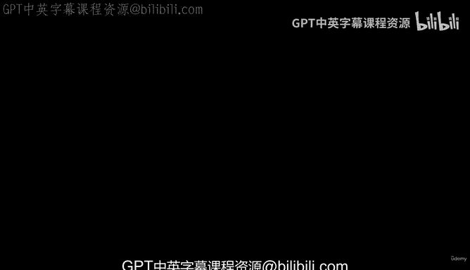
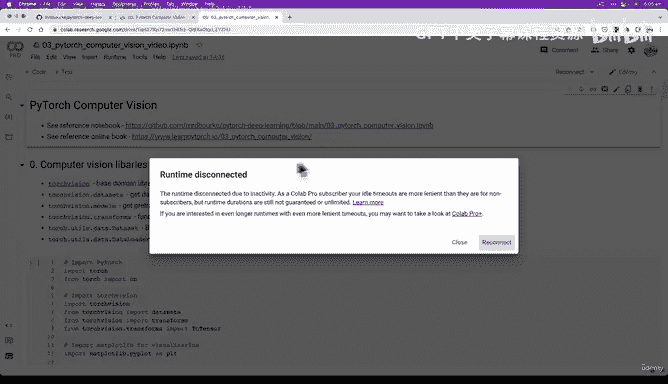
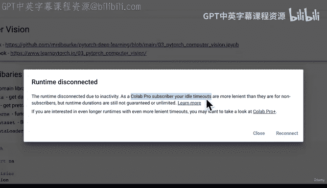
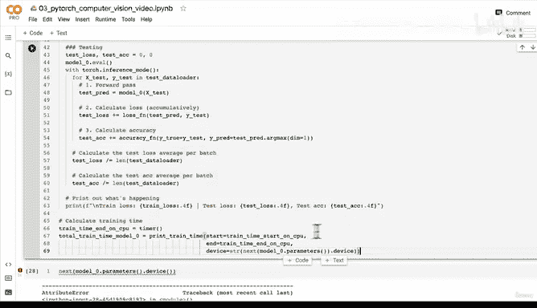
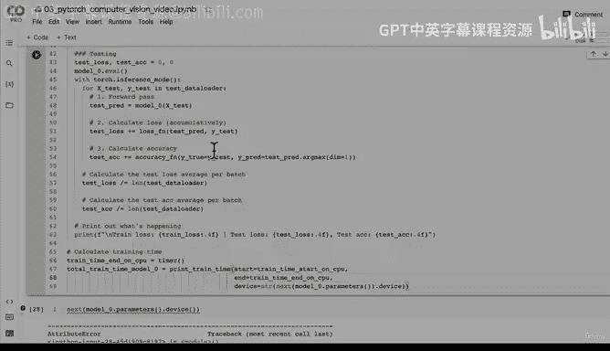

# 108：编写批次数据训练测试循环 🚀





在本节课中，我们将学习如何编写一个完整的训练和测试循环，使用批次数据来训练我们的第一个PyTorch模型。我们将使用`DataLoader`来处理数据批次，并理解优化器如何基于每个批次（而非每个周期）来更新模型参数。



---

## 环境准备与数据加载

上一节我们介绍了如何使用`DataLoader`将数据划分为批次。现在，我们将在这些批次数据上构建训练循环。

首先，确保我们已准备好数据和模型。以下代码初始化了数据加载器和模型。

```python
# 假设 train_dataloader 和 test_dataloader 已定义
# 假设 model_0 是一个简单的神经网络模型
# 假设 loss_fn 和 optimizer 已定义
```

---

## 构建训练循环

本节中，我们将逐步构建一个包含训练和测试步骤的循环。核心步骤包括遍历周期、遍历训练批次、执行训练步骤、计算损失，然后对测试数据执行相同操作。

以下是构建循环的主要步骤：

1.  遍历周期。
2.  遍历训练批次并执行训练步骤。
3.  计算每个批次的训练损失。
4.  遍历测试批次并执行测试步骤。
5.  计算每个批次的测试损失和准确率。
6.  打印训练过程并计时。

### 导入进度条工具

为了可视化训练进度，我们将使用`tqdm`库。

```python
from tqdm.auto import tqdm
```

### 设置计时器与周期数

我们设置一个较小的周期数以进行快速实验。

```python
from timeit import default_timer as timer
train_time_start_on_cpu = timer()
epochs = 3  # 使用较小的周期数以便快速实验
```

### 编写训练与测试循环

现在，我们开始编写核心循环。循环结构如下：

```python
for epoch in tqdm(range(epochs)):
    print(f"Epoch: {epoch}\n-------")
    # 训练阶段
    train_loss = 0
    for batch, (X, y) in enumerate(train_dataloader):
        model_0.train()
        # 1. 前向传播
        y_pred = model_0(X)
        # 2. 计算损失
        loss = loss_fn(y_pred, y)
        train_loss += loss
        # 3. 优化器梯度清零
        optimizer.zero_grad()
        # 4. 反向传播
        loss.backward()
        # 5. 优化器步进（关键：每个批次更新一次参数）
        optimizer.step()

        # 每400个批次打印一次进度
        if batch % 400 == 0:
            print(f"Looked at {batch * len(X)}/{len(train_dataloader.dataset)} samples.")

    # 计算平均训练损失（每个周期）
    train_loss /= len(train_dataloader)

    # 测试阶段
    test_loss, test_acc = 0, 0
    model_0.eval()
    with torch.inference_mode():
        for X_test, y_test in test_dataloader:
            # 1. 前向传播
            test_pred = model_0(X_test)
            # 2. 计算损失和准确率
            test_loss += loss_fn(test_pred, y_test)
            test_acc += accuracy_fn(y_true=y_test, y_pred=test_pred.argmax(dim=1))

        # 计算平均测试损失和准确率（每个周期）
        test_loss /= len(test_dataloader)
        test_acc /= len(test_dataloader)

    # 打印结果
    print(f"\nTrain loss: {train_loss:.4f} | Test loss: {test_loss:.4f}, Test acc: {test_acc:.4f}")
```

**核心概念**：优化器步进 `optimizer.step()` 位于批次循环内部，这意味着模型参数在每个批次后都会更新，而不是等待整个周期结束。这使学习过程更高效、更稳定。

### 计算总训练时间

循环结束后，我们计算并打印总训练时间。

```python
train_time_end_on_cpu = timer()
total_train_time_model_0 = train_time_end_on_cpu - train_time_start_on_cpu
print(f"Total training time: {total_train_time_model_0:.2f} seconds on {next(model_0.parameters()).device}.")
```

---

## 总结

本节课中，我们一起学习了如何构建一个完整的PyTorch训练测试循环。关键点包括：

*   使用 `DataLoader` 按批次处理数据。
*   在循环中分别处理训练和测试阶段。
*   理解并实现了优化器在每个批次（而非每个周期）更新模型参数的核心机制。
*   使用 `tqdm` 添加进度条，并使用计时器跟踪训练时间。





这个循环是我们进行深度学习实验的基础模板。在接下来的课程中，我们将对此进行封装和优化，以便更高效地进行模型开发。