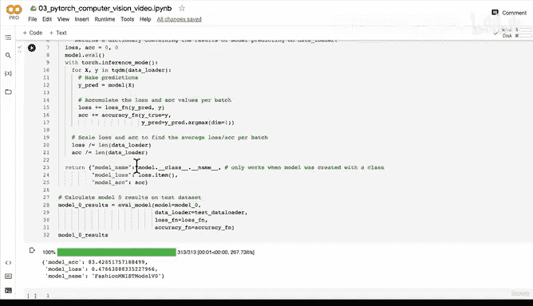
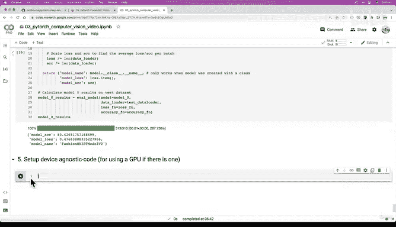

# 109：编写模型评估函数 🧪


在本节课中，我们将学习如何编写一个通用的模型评估函数。这个函数将帮助我们评估不同模型在测试数据集上的性能，并以字典形式返回结果，便于后续比较。

---

## 概述

上一节我们构建并训练了一个基线模型。本节中，我们将编写一个可复用的函数来评估模型在测试数据上的损失和准确率。通过函数化评估过程，我们可以轻松地比较多个模型的性能。

---

## 修复代码缩进错误

在开始编写评估函数之前，我们需要先修复上一节代码中的一个常见错误：缩进问题。

有时，即使代码逻辑正确，一个错误的空格或制表符也可能导致整个程序无法运行。这是我们刚才遇到的典型缩进错误。

```python
# 示例：修复前的错误缩进
def train_model():
    for epoch in range(epochs):
    for batch in dataloader:  # 这里缺少缩进
        # ... 训练代码
```

通过逐行检查并调整缩进，我们确保所有代码块都正确对齐。修复后，模型训练成功运行，并输出了进度条和结果。

我们的基线模型在测试集上取得了约 **83.5%** 的准确率和约 **0.47** 的损失，训练时间约为 **22秒**。请注意，由于机器学习的随机性以及硬件差异（例如使用Google Colab的CPU），你的具体数值可能略有不同，但应处于相近范围。

---

## 编写模型评估函数

现在，我们进入核心部分：编写一个通用的模型评估函数。以下是该函数的详细步骤。

我们将创建一个名为 `eval_model` 的函数。它接收一个模型、一个数据加载器、一个损失函数和一个评估指标函数（如准确率计算函数）作为参数，并返回一个包含模型名称、平均损失和平均准确率的字典。

```python
def eval_model(model: torch.nn.Module,
               data_loader: torch.utils.data.DataLoader,
               loss_fn: torch.nn.Module,
               accuracy_fn):
    """
    评估给定模型在指定数据加载器上的性能。

    参数:
        model: 要评估的PyTorch模型。
        data_loader: 用于评估的数据加载器。
        loss_fn: 用于计算损失的函数。
        accuracy_fn: 用于计算准确率的函数。

    返回:
        包含模型名称、平均损失和平均准确率的字典。
    """
    loss, acc = 0, 0
    model.eval()

    # 使用推理模式上下文管理器，禁用梯度计算以提升效率
    with torch.inference_mode():
        for X, y in data_loader:
            # 1. 前向传播，获取预测值
            y_pred = model(X)

            # 2. 累加批次损失
            loss += loss_fn(y_pred, y)

            # 3. 累加批次准确率
            # 注意：模型原始输出是logits，我们使用argmax获取预测类别
            acc += accuracy_fn(y_true=y,
                               y_pred=y_pred.argmax(dim=1))

        # 4. 计算整个数据集上的平均损失和准确率
        loss /= len(data_loader)
        acc /= len(data_loader)

    return {"model_name": model.__class__.__name__,  # 获取模型的类名
            "model_loss": loss.item(),
            "model_acc": acc}
```

**关键点说明：**
*   `model.__class__.__name__` 用于动态获取模型的类名，这有助于在评估多个模型时进行区分。
*   `torch.inference_mode()` 上下文管理器在评估时关闭梯度计算，节省内存并加快计算速度。
*   损失和准确率在批次循环中累加，最后除以批次总数得到平均值。

---

## 使用评估函数

函数编写完成后，我们可以用它来评估之前训练的基线模型（`model_0`）。

以下是调用评估函数的代码：

```python
# 计算 model_0 在测试数据集上的结果
model_0_results = eval_model(model=model_0,
                             data_loader=test_dataloader,
                             loss_fn=loss_fn,
                             accuracy_fn=accuracy_fn)
model_0_results
```

运行上述代码，我们将得到一个类似这样的字典：
`{'model_name': 'FashionMNISTModelV0', 'model_loss': 0.4766, 'model_acc': 83.42}`

这个结果与我们训练循环结束时打印的测试结果一致。现在，我们有了一个结构化的方式来存储模型性能。

---

## 当前工作流程总结

至此，我们已经完成了机器学习项目工作流程中的多个关键步骤：
1.  **数据准备**：下载并加载了FashionMNIST数据集。
2.  **选择/构建模型**：创建了第一个全连接神经网络 (`model_0`)。
3.  **选择损失函数和优化器**：使用了交叉熵损失和SGD优化器。
4.  **构建训练循环**：编写了代码来迭代数据并更新模型参数。
5.  **拟合模型**：在训练数据上训练了模型。
6.  **评估模型**：使用我们刚编写的函数在测试数据上评估了模型性能。

---

## 下一步：通过实验改进模型

我们当前的基线模型在CPU上训练，取得了不错的结果。然而，深度学习通常可以利用GPU来显著加速训练过程。

下一节的挑战是：**建立设备无关的代码**。这意味着我们的代码应该能够自动检测并使用可用的GPU（如果存在），否则回退到CPU。这将为后续在GPU上构建和训练更复杂的模型（例如`model_1`，甚至是卷积神经网络）做好准备。

在下一个视频开始前，请尝试在Google Colab中设置你的运行时使用GPU（“运行时” -> “更改运行时类型” -> “硬件加速器”选择GPU），并准备好重新运行之前的单元格以恢复所有数据和函数。

---




## 本节课总结

在本节课中，我们一起学习了：
1.  如何修复常见的代码缩进错误。
2.  如何编写一个通用、可复用的模型评估函数 (`eval_model`)。
3.  如何使用该函数评估模型并获取结构化的结果字典。
4.  回顾了截至目前完成的完整机器学习工作流程。
5.  为下一阶段——利用GPU加速训练并改进模型——做好了准备。



通过将评估过程函数化，我们为系统性地比较不同模型的性能奠定了坚实的基础。