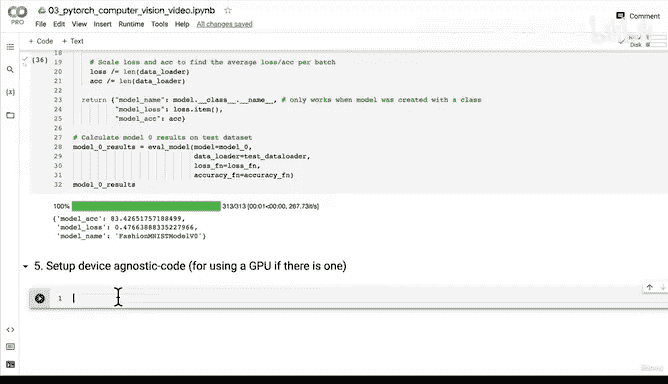
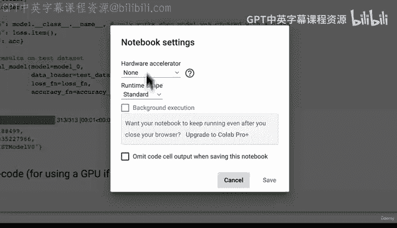
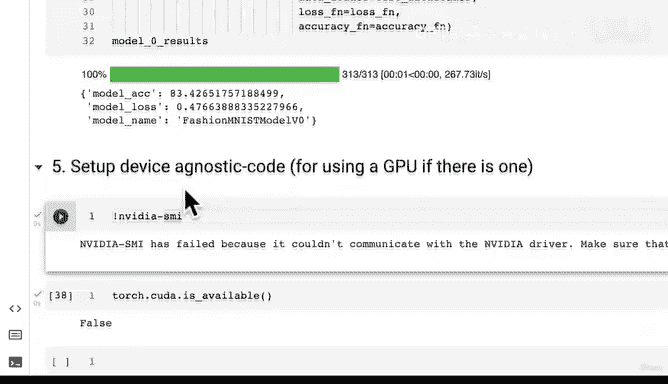
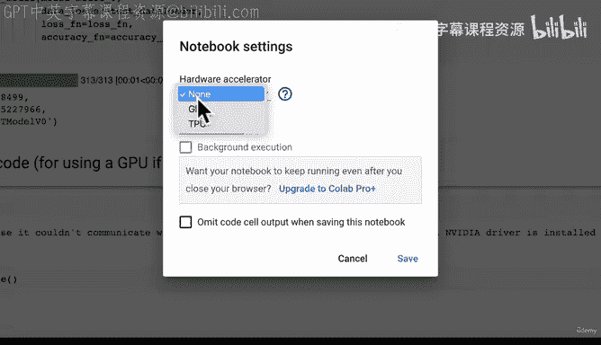
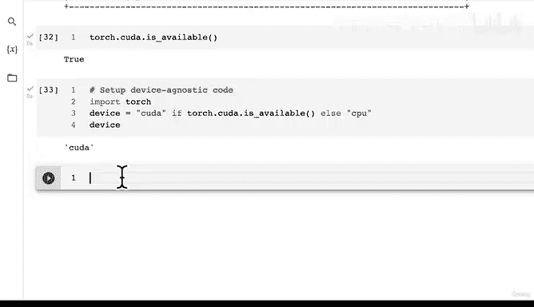

# 110：配置GPU与设备无关代码 🚀


在本节课中，我们将学习如何配置GPU并编写设备无关的代码，确保我们的PyTorch模型能够在不同硬件上运行。



---



上一节我们介绍了如何构建和训练一个基线模型。本节中，我们来看看如何利用GPU加速计算，并编写能够自动适应不同硬件环境的代码。

## 检查GPU可用性

首先，我们需要检查当前环境中是否有可用的GPU。在PyTorch中，我们可以使用以下代码来检查：

```python
import torch
torch.cuda.is_available()
```

如果返回`True`，则表示有可用的GPU；如果返回`False`，则只能使用CPU。

## 在Google Colab中激活GPU





如果你在Google Colab中运行代码，需要手动激活GPU。以下是激活步骤：

1.  点击菜单栏中的“运行时”。
2.  选择“更改运行时类型”。
3.  在“硬件加速器”下拉菜单中选择“GPU”。
4.  点击“保存”。

保存后，Colab笔记本会重启并连接到GPU后端。你可以通过运行`!nvidia-smi`命令来确认GPU的详细信息。

## 编写设备无关的代码

设备无关的代码意味着无论你的系统使用CPU还是GPU，PyTorch都能自动利用相应的硬件。这是通过设置一个`device`变量来实现的。

以下是设置设备无关代码的标准方法：

```python
import torch

# 设置设备
device = "cuda" if torch.cuda.is_available() else "cpu"
print(f"Using device: {device}")
```

这段代码会检查CUDA（即NVIDIA GPU支持）是否可用。如果可用，`device`变量将被设置为`"cuda"`；否则，设置为`"cpu"`。

## 将模型和数据移动到设备上

定义了`device`之后，我们需要确保模型和输入数据都位于同一个设备上。这通常通过调用`.to(device)`方法来实现。

以下是关键步骤：

1.  **将模型移动到设备**：
    ```python
    model = YourModelClass().to(device)
    ```
2.  **将数据移动到设备**：
    ```python
    # 对于单个张量
    X = X.to(device)
    y = y.to(device)
    
    # 在训练循环中
    for batch, (X, y) in enumerate(train_dataloader):
        X, y = X.to(device), y.to(device)
        # ... 训练步骤 ...
    ```

## 实践建议

以下是编写稳健的设备无关代码时的一些建议：

*   **在笔记本开头设置**：通常，最好在导入库之后立即设置`device`变量。
*   **处理运行时重启**：在Colab中切换硬件后，需要重新运行之前的所有单元格，以确保所有变量和导入都正确初始化。
*   **从小规模开始**：对于大型数据集和复杂模型，在GPU上运行可能需要更多时间和内存。建议从小规模实验开始，必要时再扩大规模。

---

本节课中我们一起学习了如何检查GPU可用性、在Google Colab中激活GPU，以及编写能够自动适应CPU和GPU的设备无关代码。这是进行高效深度学习实验的重要一步。



接下来，我们将利用GPU的强大算力，构建一个包含非线性激活函数的更复杂模型，看看它能否在FashionMNIST数据集上取得更好的表现。