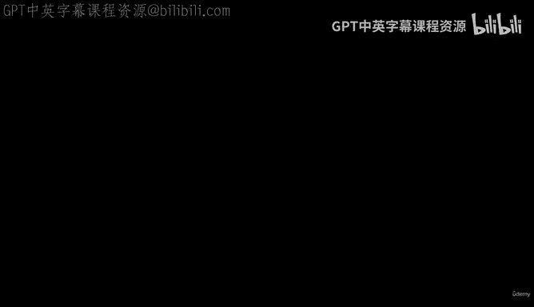
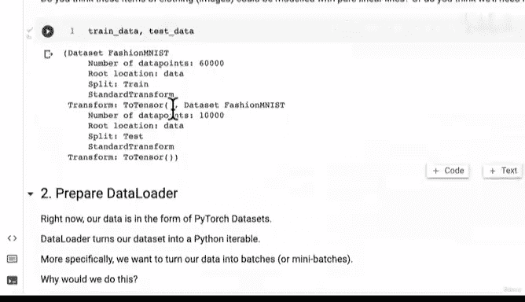
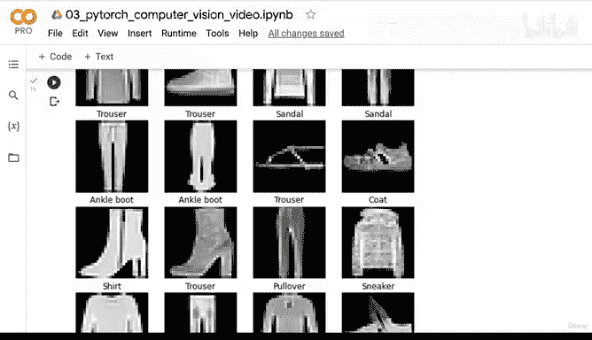
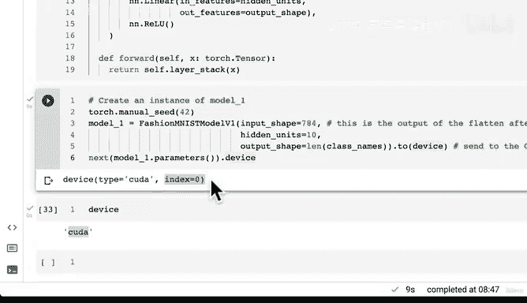

# 111：模型1 - 创建含非线性函数的模型 🚀



在本节课中，我们将学习如何构建一个包含非线性激活函数的神经网络模型，以探索其对模型性能的潜在提升。

## 概述

上一节我们介绍了设备无关代码的编写。本节中，我们来看看如何通过构建一个包含非线性层的模型来改进我们的基线模型。我们将创建一个名为 `FashionMNISTModelV1` 的新模型，它在原有的线性层之间插入了ReLU非线性激活函数。

## 非线性函数的作用

在之前的教程中，我们学习了非线性的重要性。非线性函数帮助神经网络建模非线性数据。例如，仅用直线（线性）难以完美拟合一个圆形数据分布。通过结合线性和非线性函数，神经网络能够以适当的方式建模几乎任何类型的数据。

## 构建非线性模型





现在，让我们创建一个新的模型类。这个模型的结构与之前的 `Model 0` 类似，但会在线性层之间穿插ReLU层。

ReLU（Rectified Linear Unit）是一个非线性激活函数，其公式为：
```
ReLU(x) = max(0, x)
```
这意味着，如果输入值是负数，ReLU会将其变为0；如果输入值是正数，则保持不变。

以下是创建新模型的代码：

```python
class FashionMNISTModelV1(nn.Module):
    def __init__(self, input_shape: int, hidden_units: int, output_shape: int):
        super().__init__()
        self.layer_stack = nn.Sequential(
            nn.Flatten(), # 将输入展平为单个向量
            nn.Linear(in_features=input_shape, out_features=hidden_units),
            nn.ReLU(), # 添加非线性激活函数
            nn.Linear(in_features=hidden_units, out_features=output_shape),
            nn.ReLU() # 在末尾再添加一个非线性层
        )
    
    def forward(self, x: torch.Tensor):
        return self.layer_stack(x)
```

这个模型与之前网络的主要区别在于添加了两个ReLU函数。第一个线性层的输出特征数需要与第二个线性层的输入特征数匹配，而ReLU层不会改变数据的形状。

## 实例化模型并部署到设备

接下来，我们需要实例化这个模型。为了确保结果的可复现性，我们先设置一个随机种子。然后，我们将模型部署到之前设置的设备（GPU，如果可用）上。

以下是实例化模型的步骤：

1.  设置随机种子。
2.  定义输入形状（28*28=784）、隐藏单元数（例如10）和输出形状（类别数量）。
3.  创建模型实例并将其发送到目标设备。

```python
torch.manual_seed(42)
model_1 = FashionMNISTModelV1(
    input_shape=784,
    hidden_units=10,
    output_shape=len(class_names)
).to(device)
```

现在，我们可以检查模型的参数所在的设备，确认它已部署在GPU上。

## 后续步骤

我们已经成功创建了第二个模型。回顾我们的工作流程，在构建模型之后，我们需要为其设置损失函数和优化器。

对于模型1，我们可以使用与模型0完全相同的损失函数和优化器。这是一个很好的练习机会，请你尝试自己为 `model_1` 创建损失函数和优化器。

在下一节视频中，我们将一起完成这一步，并开始训练和评估这个新的非线性模型。



## 总结

本节课中我们一起学习了如何构建一个包含非线性激活函数（ReLU）的神经网络模型。我们创建了 `FashionMNISTModelV1` 类，理解了非线性层在模型中的作用，并将模型实例部署到了GPU设备上。接下来，我们将为这个新模型配置训练组件并观察其性能。