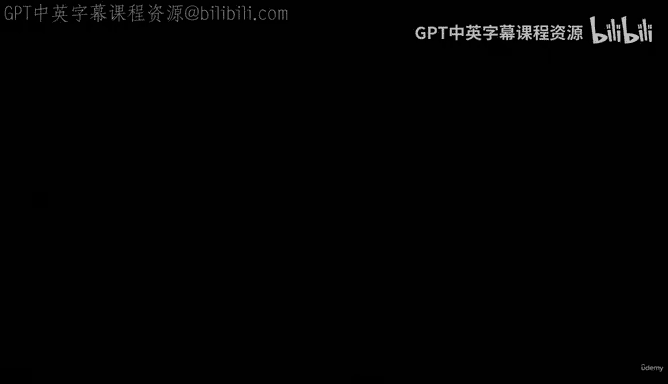
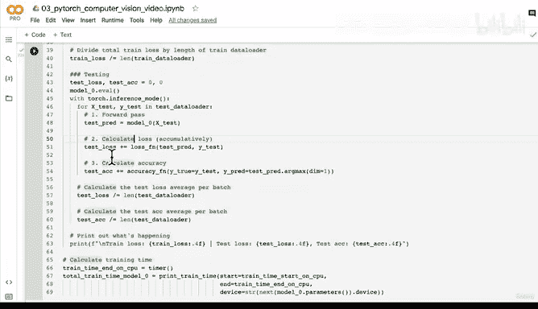

# 112：配置损失函数与优化器 🧠



在本节课中，我们将学习如何为我们的神经网络模型配置损失函数和优化器。这是训练模型的关键步骤，它们共同决定了模型如何从错误中学习并改进。

上一节我们创建了第二个模型（FashionMNIST Model V1），它与V0的主要区别在于引入了非线性层。现在，我们需要为这个新模型设置训练所需的组件。

## 设置损失函数与优化器

我们已经为Model 0完成过类似步骤，因此这里将快速回顾核心概念。损失函数用于**衡量模型的预测错误程度**，而优化器则负责**根据损失值更新模型的参数以减少错误**。

以下是具体步骤：

1.  首先，从之前下载的辅助函数脚本中导入评估准确率的函数。
2.  由于我们处理的是多分类问题，因此选择 `torch.nn.CrossEntropyLoss` 作为损失函数。
3.  选择 `torch.optim.SGD`（随机梯度下降）作为优化器，并传入模型参数和学习率。

核心代码如下：
```python
# 导入准确率计算函数
from helper_functions import accuracy_fn

# 设置损失函数
loss_fn = torch.nn.CrossEntropyLoss()

# 设置优化器
optimizer = torch.optim.SGD(params=model_1.parameters(),
                            lr=0.1)
```

## 关于实验设计的建议

进行多次模型实验时，一个重要的原则是：**每次实验最好只调整一两个变量**（例如，这里我们保持学习率与之前模型一致）。这种方法能帮助你清晰地分辨出究竟是哪些改动真正影响了模型的性能，是提升还是降低了效果。

## 回顾与预告

本节课我们一起学习了如何为PyTorch模型配置损失函数 (`nn.CrossEntropyLoss`) 和优化器 (`optim.SGD`)。损失函数量化了模型的错误，而优化器则利用这个信息来调整模型参数。

我们已经多次重复了创建训练循环的步骤。在之前的视频中，我们甚至将训练过程封装成了一个函数。因此，在下一节课中，我们将更进一步，**创建两个可复用的函数：`train_step`（训练步骤）和 `test_step`（测试步骤）**。这将使我们的代码更加模块化和整洁。我建议你先思考一下这两个函数需要接收哪些参数，我们下节课将一起编写它们。



我们下节课见。