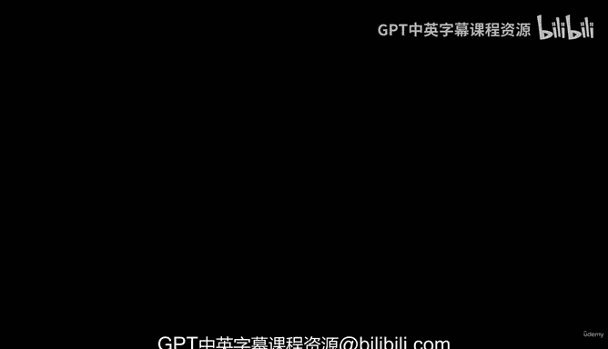
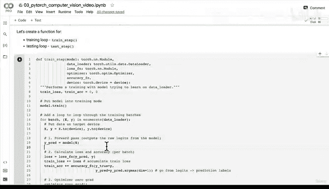

# 113：将训练与评估循环封装为函数 🔄



在本节课中，我们将学习如何将之前编写的训练和测试循环代码封装成可复用的函数。这是编写高效、整洁且不易出错代码的最佳实践。

---

## 概述

我们已经准备好了损失函数和优化器。下一步是创建训练和评估循环。在本节中，我们将把之前编写的训练和测试循环代码封装成函数。这样做不仅能遵循最佳实践，还能减少因重复编写相似代码而可能引入的错误。

## 函数化训练与评估循环

上一节我们介绍了训练循环的基本步骤。本节中，我们来看看如何将这些步骤封装成一个名为 `train_step` 的函数。

我们将创建一个函数来执行训练步骤，并计划创建另一个函数来执行测试步骤。这样，在每次迭代中，我们只需调用 `train_step`  和 `test_step` 即可。

### 创建训练步骤函数

以下是创建 `train_step` 函数所需的参数和步骤：

*   **模型**：一个 `torch.nn.Module` 实例。
*   **数据加载器**：一个 `torch.utils.data.DataLoader` 实例。
*   **损失函数**：用于计算模型预测与真实值之间差异的函数。
*   **优化器**：一个 `torch.optim.Optimizer` 实例，用于更新模型参数。
*   **准确率函数**：用于评估模型性能的可选函数。
*   **设备**：指定计算设备（如CPU或GPU），使代码与设备无关。

函数的核心逻辑如下：

1.  将模型设置为训练模式：`model.train()`。
2.  遍历数据加载器中的每个批次。
3.  将数据移动到目标设备：`X.to(device), y.to(device)`。
4.  执行前向传播：`y_pred = model(X)`。
5.  计算损失：`loss = loss_fn(y_pred, y)`。
6.  计算准确率（如果提供了准确率函数）。
7.  将优化器的梯度归零：`optimizer.zero_grad()`。
8.  执行反向传播：`loss.backward()`。
9.  更新模型参数：`optimizer.step()`。
10. 累积整个数据集的平均损失和准确率。

以下是 `train_step` 函数的代码实现：

```python
def train_step(model: torch.nn.Module,
               data_loader: torch.utils.data.DataLoader,
               loss_fn: torch.nn.Module,
               optimizer: torch.optim.Optimizer,
               accuracy_fn,
               device: torch.device = device):
    """
    使用模型在数据加载器上执行训练步骤。
    """
    train_loss, train_acc = 0, 0

    # 将模型设置为训练模式
    model.train()

    for batch, (X, y) in enumerate(data_loader):
        # 将数据移动到目标设备
        X, y = X.to(device), y.to(device)

        # 1. 前向传播
        y_pred = model(X)

        # 2. 计算损失
        loss = loss_fn(y_pred, y)
        train_loss += loss

        # 3. 计算准确率
        train_acc += accuracy_fn(y_true=y,
                                 y_pred=y_pred.argmax(dim=1))

        # 4. 优化器梯度归零
        optimizer.zero_grad()

        # 5. 反向传播
        loss.backward()

        # 6. 更新参数
        optimizer.step()

    # 计算平均损失和准确率
    train_loss /= len(data_loader)
    train_acc /= len(data_loader)

    print(f"Train loss: {train_loss:.5f} | Train accuracy: {train_acc:.2f}%")
```

### 创建测试步骤函数

现在，我们来看看如何将测试循环也封装成函数。其逻辑与训练步骤类似，但无需执行反向传播和优化器更新。

以下是创建 `test_step` 函数的基本步骤：

1.  将模型设置为评估模式：`model.eval()`。
2.  使用 `torch.inference_mode()` 上下文管理器来禁用梯度计算，以提升效率。
3.  遍历数据加载器中的每个批次。
4.  执行前向传播并计算损失和准确率。
5.  累积整个数据集的平均损失和准确率。

> **你的挑战**：请参考上面 `train_step` 函数的格式，尝试将之前编写的测试循环代码封装成一个名为 `test_step` 的函数。我们将在下个视频中一起完成它。

---

## 总结



本节课中我们一起学习了如何将训练循环封装成一个可复用的 `train_step` 函数。我们明确了函数所需的参数，并逐步实现了前向传播、损失计算、准确率评估、反向传播和参数更新的完整流程。我们还提出了将测试循环封装为 `test_step` 函数的挑战。通过函数化这些循环，我们的代码将变得更加模块化、易于维护和复用。