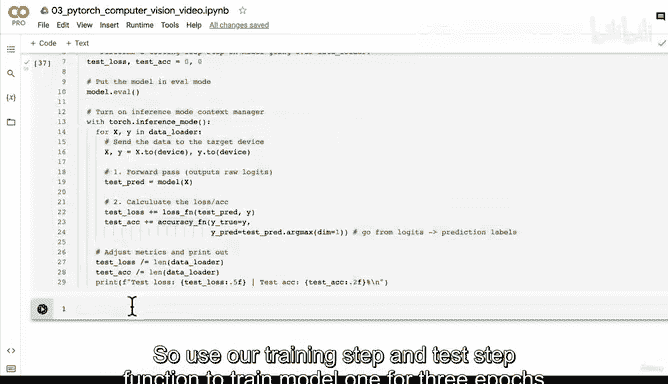

# 114：将测试循环封装为函数 🧪


## 概述
在本节课中，我们将学习如何将PyTorch中的测试循环封装成一个可复用的函数。上一节我们介绍了如何封装训练循环，本节中我们来看看如何对测试循环进行同样的操作，以提高代码的模块化和可读性。

## 测试循环函数设计
测试循环函数的目标是评估模型在测试数据集上的性能。与训练循环不同，测试循环不涉及参数优化（即不需要优化器），其主要任务是计算损失和准确率。

以下是测试循环函数需要接收的核心参数：
*   **模型**：待评估的PyTorch模型。
*   **数据加载器**：用于提供测试数据的`DataLoader`。
*   **损失函数**：用于计算模型预测与真实标签之间差异的函数。
*   **准确率函数**：用于计算模型预测准确率的自定义函数。
*   **设备**：指定计算设备（如CPU或GPU），默认为目标设备。

函数的基本框架如下：
```python
def test_step(model: torch.nn.Module,
              data_loader: torch.utils.data.DataLoader,
              loss_fn: torch.nn.Module,
              accuracy_fn,
              device: torch.device = device):
    """在模型上执行测试循环步骤，遍历数据加载器。"""
    # 函数实现将放在这里
```

## 实现测试循环函数
现在，让我们一步步实现这个函数。

首先，初始化测试损失和测试准确率，并将模型设置为评估模式。评估模式会关闭如Dropout等特定于训练层的功能。

```python
    test_loss, test_acc = 0, 0
    model.eval()  # 将模型设置为评估模式
```

接下来，我们使用`torch.inference_mode()`上下文管理器。在推理模式下，PyTorch会禁用梯度计算，从而节省内存并加速预测过程。

```python
    with torch.inference_mode():  # 开启推理模式上下文管理器
        for X, y in data_loader:
            # 将数据发送到目标设备
            X, y = X.to(device), y.to(device)
            # 1. 前向传播
            test_pred = model(X)
            # 2. 计算损失和准确率（按批次累加）
            test_loss += loss_fn(test_pred, y)
            test_acc += accuracy_fn(y_true=y,
                                    y_pred=test_pred.argmax(dim=1))
```

在循环结束后，我们需要计算整个测试集上的平均损失和准确率。注意，调整度量的代码仍需保持在`inference_mode`上下文管理器内部。

```python
        # 调整度量指标（计算整个测试集的平均值）
        test_loss /= len(data_loader)
        test_acc /= len(data_loader)
```

最后，打印测试结果。

```python
        # 打印结果
        print(f"Test loss: {test_loss:.5f} | Test accuracy: {test_acc:.2f}%\n")
```

## 整合训练与测试函数
通过封装训练和测试循环，我们的主训练代码变得非常简洁。我们可以这样使用它们：

```python
epochs = 3
for epoch in tqdm(range(epochs)):
    print(f"Epoch: {epoch}\n---------")
    train_step(model=model1,
               data_loader=train_dataloader,
               loss_fn=loss_fn,
               optimizer=optimizer,
               accuracy_fn=accuracy_fn,
               device=device)
    test_step(model=model1,
              data_loader=test_dataloader,
              loss_fn=loss_fn,
              accuracy_fn=accuracy_fn,
              device=device)
```



## 总结
本节课中我们一起学习了如何将PyTorch的测试循环封装成一个独立的函数。我们明确了函数所需的参数，实现了包括设置评估模式、使用推理模式、遍历数据、计算度量指标以及输出结果在内的完整步骤。将训练和测试逻辑模块化，能使代码更清晰、更易于维护和复用。在下一节，我们将利用这两个封装好的函数来训练我们的模型。