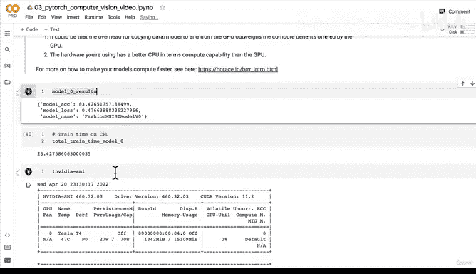

# 115：使用训练与测试函数评估模型 🚀


在本节课中，我们将学习如何将之前编写的训练步骤函数和测试步骤函数组合起来，创建一个完整的模型训练与评估循环。我们将使用GPU进行实验，并比较其与CPU在训练时间上的差异。

---

## 概述

上一节我们介绍了如何编写独立的训练步骤和测试步骤函数。本节中，我们将把这些函数整合到一个优化循环中，对模型进行多轮训练与评估。我们还将测量模型在GPU上的训练时间，并与之前CPU上的结果进行对比。

## 实验设置

首先，我们设置随机种子以确保实验的可重复性，并导入计时工具。

```python
import torch
from timeit import default_timer as timer

torch.manual_seed(42)
```

接下来，我们初始化计时器，并设置训练轮数为3，以保持实验条件的一致性。

```python
train_time_start_on_gpu = timer()
epochs = 3
```

## 创建训练与评估循环

现在，我们将使用 `train_step` 和 `test_step` 函数来构建主循环。

以下是构建循环所需的步骤：

1.  遍历每一个训练轮次。
2.  在每个轮次中，调用 `train_step` 函数进行模型训练。
3.  随后，调用 `test_step` 函数评估模型在测试集上的性能。
4.  打印每个轮次的训练损失、训练准确率和测试准确率。

```python
from tqdm.auto import tqdm

for epoch in tqdm(range(epochs)):
    print(f"Epoch: {epoch}\n---------")
    # 执行训练步骤
    train_step(model=model_1,
               data_loader=train_dataloader,
               loss_fn=loss_fn,
               optimizer=optimizer,
               accuracy_fn=accuracy_fn,
               device=device)
    # 执行测试步骤
    test_step(model=model_1,
              data_loader=test_dataloader,
              loss_fn=loss_fn,
              accuracy_fn=accuracy_fn,
              device=device)
```

循环结束后，我们停止计时器，并计算总训练时间。

```python
train_time_end_on_gpu = timer()
total_train_time_model_1 = print_train_time(start=train_time_start_on_gpu,
                                            end=train_time_end_on_gpu,
                                            device=device)
```

## 结果分析与讨论

运行上述代码后，我们得到了模型在GPU上的训练结果和时间。将其与之前模型在CPU上的基线结果进行对比，是评估改进的关键。

对比时，需要关注两个核心指标：
*   **模型性能**：例如测试准确率。
*   **训练效率**：即总训练时间。

有时你可能会发现一个有趣的现象：在某些情况下，模型在CPU上的训练速度可能反而比GPU更快。

这通常主要由以下两个原因造成：

1.  **数据转移开销**：将数据和模型在CPU和GPU内存之间来回复制所产生的耗时，可能超过了GPU本身的计算优势。
2.  **硬件差异**：你所使用的CPU在计算能力上可能强于你所使用的GPU。这种情况较为少见，但对于一些计算量不大的小型模型和数据集，确实可能发生。

> **提示**：GPU在深度学习中的速度优势，在处理**大型模型**、**海量数据集**和**计算密集型网络层**时最为明显。

## 总结

本节课中，我们一起学习了如何将模块化的训练和测试函数组合成一个完整的训练循环。我们实践了在GPU上进行模型训练，并分析了影响训练速度的潜在因素，特别是数据转移开销对GPU加速效果的影响。



理解这些概念有助于你在未来实践中，根据任务规模和硬件条件，更有效地利用计算资源。在接下来的课程中，我们将继续探索如何改进模型架构以获得更好的性能。