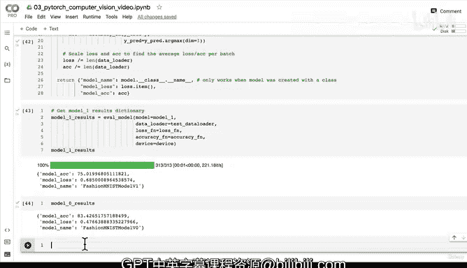

# 116：获取模型1结果字典 📊

在本节课中，我们将学习如何为训练好的模型1创建一个结果字典，以便后续与其他模型进行性能对比。同时，我们还将解决一个常见的PyTorch错误：设备不匹配问题。


---

上一节我们介绍了模型1的训练过程，本节中我们来看看如何评估模型1的性能并存储结果。

为了后续能够方便地比较所有模型的性能，我们需要将模型1在测试集上的评估结果存储在一个字典中。这个字典将包含损失值和准确率。

以下是创建模型1结果字典的步骤：

1.  调用评估函数 `eval_model`。
2.  传入模型1、测试数据加载器、损失函数和准确率计算函数。
3.  将结果存储在 `model_1_results` 变量中。

```python
# 获取模型1结果字典
model_1_results = eval_model(model=model_1,
                             data_loader=test_dataloader,
                             loss_fn=loss_fn,
                             accuracy_fn=accuracy_fn)
```

然而，运行上述代码时，我们遇到了一个错误：`RuntimeError: Expected all tensors to be on the same device, but found at least two devices, cuda and cpu`。这个错误表明我们的数据和模型位于不同的设备上（例如，一个在GPU，一个在CPU）。

在深度学习中，有三个常见的错误来源：数据与模型的形状不匹配、设备不匹配以及数据类型不匹配。我们当前遇到的就是设备不匹配问题。

为了解决这个问题，我们需要确保在评估函数 `eval_model` 中，输入数据与模型位于同一设备上。因此，我们需要修改 `eval_model` 函数，使其具备设备无关性。

以下是修改后的 `eval_model` 函数代码：

```python
def eval_model(model: torch.nn.Module,
               data_loader: torch.utils.data.DataLoader,
               loss_fn: torch.nn.Module,
               accuracy_fn,
               device: torch.device = device): # 添加设备参数
    """返回一个包含模型在给定数据加载器上性能结果的字典。"""
    loss, acc = 0, 0
    model.eval()
    with torch.inference_mode():
        for X, y in data_loader:
            # 确保数据与模型在同一设备上
            X, y = X.to(device), y.to(device)
            # 前向传播
            y_pred = model(X)
            # 累加损失和准确率
            loss += loss_fn(y_pred, y)
            acc += accuracy_fn(y_true=y, y_pred=y_pred.argmax(dim=1))

        # 计算平均损失和准确率
        loss /= len(data_loader)
        acc /= len(data_loader)

    return {"model_name": model.__class__.__name__,
            "model_loss": loss.item(),
            "model_acc": acc}
```

修改完成后，我们再次运行获取结果字典的代码。这次它应该能成功运行，并输出模型1在测试集上的损失和准确率。

将 `model_1_results` 与之前得到的 `model_0_results`（基线模型结果）进行比较，我们可能会发现基线模型的表现仍然领先。这没关系，在接下来的课程中，我们将引入更强大的模型——卷积神经网络（CNN），来提升性能。

请注意，如果你的结果数字与我的不完全相同，只要相差不大就无需担心，这是机器学习和深度学习固有的随机性所致。如果结果差异巨大，请检查代码单元格是否都正确运行。

---



本节课中我们一起学习了如何为模型创建评估结果字典，并解决了因数据和模型设备不匹配导致的运行时错误。我们通过修改评估函数，使其能够自动将数据发送到模型所在的设备，从而编写了设备无关的代码，这是PyTorch最佳实践之一。