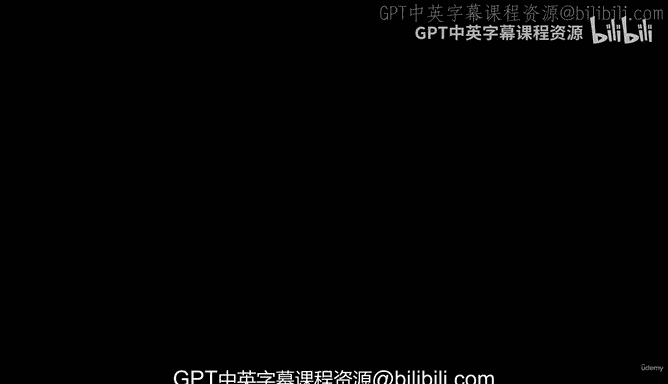
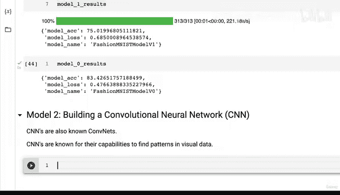
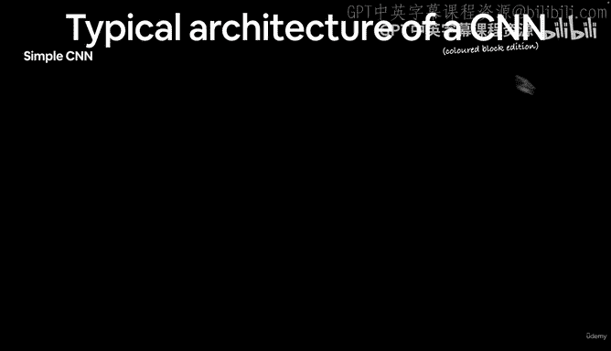
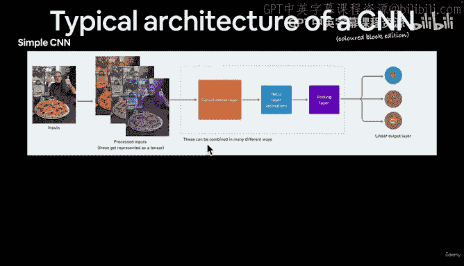
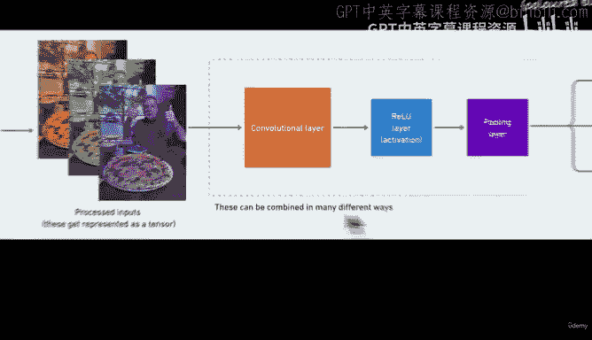
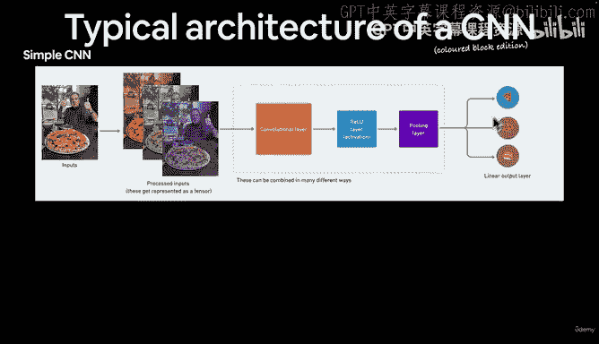
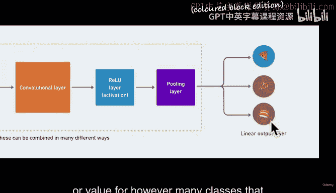
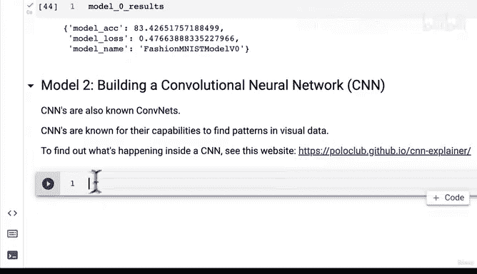

# 117：卷积神经网络高层概览 🧠

在本节课中，我们将学习卷积神经网络（CNN）的基本概念和架构。我们将了解CNN如何专门用于处理图像等视觉数据，并探索其核心组件的工作原理。

上一节我们介绍了第一个模型实验，它未能超越基线。本节中我们来看看第二个模型：卷积神经网络。

## 什么是卷积神经网络？

卷积神经网络是一种专门用于处理具有网格状拓扑结构数据（如图像）的深度学习模型。其核心能力在于**自动从视觉数据中寻找模式**。

CNN的典型架构包含以下层类型：
*   **输入层**：接收图像数据（通常表示为张量）。
*   **隐藏层**：通常包含卷积层、激活函数层（如ReLU）和池化层。
*   **输出层**：通常是线性层，输出分类结果。

## CNN工作流程可视化

以下是CNN处理图像的简化流程：

1.  **输入**：一张图像（例如，一张比萨的图片）。
2.  **预处理**：将图像转换为RGB通道的张量。
3.  **特征提取**：通过一系列**卷积层**、**ReLU激活层**和**池化层**的组合传递数据。这些层协同工作以识别图像中的特征。
4.  **分类输出**：最后通过**线性输出层**，为每个可能的类别生成一个值（例如，判断图像属于“比萨”或“汽车”）。

关于深度学习模型，一个重要概念是：**层的确切顺序并非一成不变**。研究人员每天都在探索新的层组合方式。更重要的总体原则是：如何将输入有效地转化为理想的输出。

## 构建更深的网络

“深度学习”中的“深度”来源于向模型中添加更多层。理论上，**模型层数越多，其发现数据中模式的机会就越大**。

每一层都对输入数据执行一系列数学运算，后续层接收前一层的输出作为输入。虽然存在像残差连接这样的高级架构，但本课程我们专注于构建第一个基础的CNN。

## 探索CNN内部机制

为了更好地理解CNN，强烈推荐使用[CNN Explainer](https://poloclub.github.io/cnn-explainer/)网站进行交互式学习。这个工具可以直观展示图像如何逐层通过CNN。

以下是该网站演示的核心过程：

*   **输入分解**：彩色图像被分解为红、绿、蓝三个通道。
*   **卷积操作**：**卷积核**（或过滤器）在图像上滑动，执行`卷积运算`，以检测局部特征（如边缘、纹理）。
*   **特征激活**：每个隐藏单元会学习数据的不同特征。深度学习的魅力（也是挑战）在于，**模型自行决定学习什么特征最有效**。
*   **尺寸变化**：通常，经过卷积或池化层后，特征图的尺寸会发生变化。
*   **最终输出**：网络末端输出每个类别的得分，得分最高的类别即为预测结果。

## 核心概念总结

本节课中我们一起学习了：
1.  **卷积神经网络**是处理视觉数据的强大工具。
2.  CNN的基本架构包括**输入层**、**卷积层**、**激活层**、**池化层**和**输出层**。
3.  网络的“深度”通过添加更多层来实现，以增强模式识别能力。
4.  **卷积操作**是CNN的核心，其数学形式可简化为：`输出特征图 = 卷积(输入图像, 卷积核) + 偏置`。
5.  理解CNN内部机制的最佳方式是进行交互式可视化探索。

在下一节视频中，我们将开始编写PyTorch代码，亲手构建一个用于计算机视觉任务的卷积神经网络。