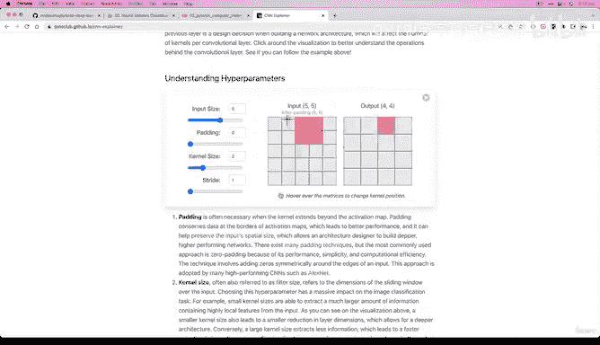

# 118：编写首个PyTorch卷积神经网络 🧠


在本节课中，我们将要学习如何构建一个卷积神经网络。我们将复现CNN Explainer网站上的“Tiny VGG”架构，并逐步理解其每一层的含义和作用。

---

## 概述

上一节我们介绍了CNN Explainer网站，这是一个可视化理解卷积神经网络的优秀工具。本节中，我们来看看如何用代码实现一个真实的卷积神经网络模型。

我们将构建一个名为“Tiny VGG”的模型，它由多个卷积块组成，每个块包含卷积层、激活函数和池化层。这是深度学习实践中常见的模式：找到一个在特定问题上表现良好的架构，然后用代码复现它，以解决我们自己的问题。

---

## 构建模型类

首先，我们像往常一样，通过子类化 `nn.Module` 来创建我们的模型。

```python
class FashionMNISTModelV2(nn.Module):
    def __init__(self, input_shape: int, hidden_units: int, output_shape: int):
        super().__init__()
```

在初始化方法中，我们接收三个参数：输入形状（图像通道数）、隐藏单元数和输出形状（类别数）。

---

## 定义第一个卷积块

卷积神经网络通常由多个“块”组成。一个块是多个层的组合，而整个架构则由多个块堆叠而成。这就像搭乐高积木一样。

以下是第一个卷积块的构建代码：

```python
        self.conv_block_1 = nn.Sequential(
            nn.Conv2d(in_channels=input_shape,
                      out_channels=hidden_units,
                      kernel_size=3,
                      stride=1,
                      padding=1),
            nn.ReLU(),
            nn.Conv2d(in_channels=hidden_units,
                      out_channels=hidden_units,
                      kernel_size=3,
                      stride=1,
                      padding=1),
            nn.ReLU(),
            nn.MaxPool2d(kernel_size=2)
        )
```

我们使用了 `nn.Sequential` 容器来顺序组织这些层。这个块复现了CNN Explainer网站上第一个蓝色块的结构：卷积层 -> ReLU激活 -> 卷积层 -> ReLU激活 -> 最大池化层。

`nn.Conv2d` 是我们使用的第一个卷积层。其中的 `in_channels`、`out_channels`、`kernel_size`、`stride` 和 `padding` 都是我们可以自己设置的**超参数**。`2D` 表示我们处理的是二维图像数据（高度和宽度）。

`nn.MaxPool2d` 是最大池化层，其 `kernel_size=2` 表示使用一个2x2的窗口。该层会取窗口内所有值的最大值作为输出，这有助于压缩数据并提取最显著的特征。

---

## 定义第二个卷积块

第二个卷积块的结构与第一个完全相同，只是它接收第一个块的输出作为输入。

```python
        self.conv_block_2 = nn.Sequential(
            nn.Conv2d(in_channels=hidden_units,
                      out_channels=hidden_units,
                      kernel_size=3,
                      stride=1,
                      padding=1),
            nn.ReLU(),
            nn.Conv2d(in_channels=hidden_units,
                      out_channels=hidden_units,
                      kernel_size=3,
                      stride=1,
                      padding=1),
            nn.ReLU(),
            nn.MaxPool2d(kernel_size=2)
        )
```

通过堆叠相同的块，我们可以构建更深的网络，从而学习更复杂的特征。

---

## 定义分类器层

前面的卷积块是**特征提取器**，它们学习最能代表我们数据的模式。最后，我们需要一个**分类器层**，将这些提取出的特征映射到我们的目标类别上。

分类器层通常包含一个展平层和一个或多个全连接层。

```python
        self.classifier = nn.Sequential(
            nn.Flatten(),
            nn.Linear(in_features=hidden_units*?, # 需要计算
                      out_features=output_shape)
        )
```

这里有一个小问题：我们需要知道展平后的特征向量的长度（即 `in_features` 的值）。这个值取决于输入图像经过所有卷积和池化层后的尺寸。我们将在后续视频中介绍一个技巧来计算它。

---

## 定义前向传播

定义了所有组件后，我们需要在 `forward` 方法中定义数据如何流经这些组件。

```python
    def forward(self, x):
        x = self.conv_block_1(x)
        print(x.shape) # 打印形状以跟踪变化
        x = self.conv_block_2(x)
        print(x.shape)
        x = self.classifier(x)
        return x
```

我们让输入 `x` 依次通过第一个卷积块、第二个卷积块，最后通过分类器层。打印形状有助于我们理解数据在每一层后的变化。

---

## 实例化模型

现在，我们可以实例化我们的第一个卷积神经网络了。

```python
torch.manual_seed(42)
model_2 = FashionMNISTModelV2(input_shape=1,      # 灰度图像，1个通道
                              hidden_units=10,    # 与Tiny VGG一致
                              output_shape=len(class_names)).to(device)
```

对于FashionMNIST数据集，输入形状是1，因为它是灰度图像。如果是彩色图像（RGB），则输入形状应为3。隐藏单元数设置为10，与Tiny VGG架构保持一致。输出形状是数据集中类别的数量。

---

## 总结

本节课中我们一起学习了如何从零开始构建一个卷积神经网络。我们复现了Tiny VGG架构，它由两个相同的卷积块和一个分类器层组成。每个卷积块包含卷积层、ReLU激活函数和最大池化层。

我们编写了大量代码，这是目前最大的神经网络，你应该为此感到自豪。深度学习中的常见做法是：找到一个在某个问题上有效的架构，然后用代码复现它，并尝试解决你自己的问题。

你的课后任务是花至少20分钟深入研究CNN Explainer网站，特别是“理解超参数”部分，了解 `padding`、`kernel_size` 和 `stride` 的具体含义。这将使接下来的课程内容更容易理解。



在下一个视频中，我们将逐步分解这个网络，并解决 `in_features` 的计算问题。