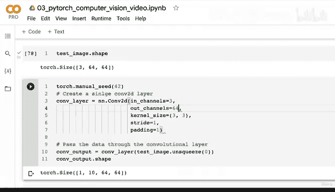

# 119：模型2 - 逐步解析Conv2D层 🧠


在本节课中，我们将深入探讨PyTorch中的`nn.Conv2D`层。我们将通过代码实践，理解卷积神经网络（CNN）中这一核心组件的工作原理，并学习如何调整其参数以改变模型的行为。

## 概述

上一节我们共同编写了第一个PyTorch卷积神经网络，复现了CNN Explainer网站上的Tiny VGG架构。本节中，我们来看看构成该网络的两个新层之一：`nn.Conv2D`层。我们将通过创建虚拟数据并手动调整参数，来直观地理解卷积操作。

## 7.1 逐步解析 `nn.Conv2D`

要了解`nn.Conv2D`的内部运作，最直接的方法是查阅官方文档。其核心是一个数学运算，可以概括为以下公式：

**输出 = 偏置项 + Σ (权重 × 输入)**

这个公式表明，输出是通过权重张量和偏置值对输入数据进行某种变换得到的。权重矩阵和偏置值以某种方式操纵我们的输入，从而产生输出。

我们不会过度纠结于数学细节，而是通过代码来复现CNN Explainer网站上显示的第一个卷积层。使用虚拟输入进行测试是理解层行为的绝佳方式。

### 创建虚拟数据

首先，我们需要创建与CNN Explainer示例尺寸匹配的虚拟数据。在PyTorch中，默认使用“通道优先”的数据格式。

```python
import torch

# 设置随机种子以保证结果可复现
torch.manual_seed(42)

# 创建一个批次的图像数据：批次大小=32, 通道数=3, 高度=64, 宽度=64
image_batch = torch.randn(size=(32, 3, 64, 64))

# 从批次中取出第一张单张图像
single_image = image_batch[0]

# 检查数据形状
print(f"图像批次形状: {image_batch.shape}")
print(f"单张图像形状: {single_image.shape}")
print(f"单张图像数据:\n{single_image}")
```

运行以上代码，你会得到形状为`(32, 3, 64, 64)`的图像批次和形状为`(3, 64, 64)`的单张图像。这些数据目前只是随机数，我们的模型（由随机初始化的参数构成）目标就是学习如何调整这些随机数，以最佳地表示真实数据。

### 创建并测试单个Conv2D层

现在，让我们创建一个单独的`nn.Conv2D`层，并将我们的虚拟数据传递给它。

以下是创建卷积层时需要理解的关键参数：

*   **`in_channels`**: 输入数据的通道数，必须与图像通道数匹配（本例中为3）。
*   **`out_channels`**: 输出通道数，类似于全连接层中的隐藏单元数，决定了该层将学习多少种不同的特征（或滤波器）。
*   **`kernel_size`**: 卷积核（或滤波器）的大小。例如，`3` 等价于 `(3, 3)`，表示一个3x3的滑动窗口。
*   **`stride`**: 卷积核在输入上滑动时的步长。默认值为1，表示每次移动一个像素。
*   **`padding`**: 在输入图像边缘添加的像素填充数。默认值为0，表示不添加填充。

让我们用与CNN Explainer示例相同的参数创建一个层：

```python
import torch.nn as nn

# 创建一个Conv2D层
conv_layer = nn.Conv2d(in_channels=3,  # 输入通道数，匹配图像
                       out_channels=10, # 输出通道数，学习10种特征
                       kernel_size=3,   # 3x3的卷积核
                       stride=1,        # 步长为1
                       padding=0)       # 无填充

print(conv_layer)
```

### 理解卷积参数

为了直观理解这些参数，可以参考CNN Explainer网站的可视化：

*   **卷积核（Kernel/Filter）**: 这是卷积层中可学习的权重矩阵，在输入图像上滑动。在CNN Explainer中，它是一个3x3的红色方块，其内部的数字就是权重。卷积层的目标就是学习能使输出最有用的权重值。
*   **步长（Stride）**: 控制卷积核每次滑动的像素数。步长为1时，卷积核逐个像素移动；步长为2时，则每次跳过两个像素，这会导致输出尺寸缩小。
*   **填充（Padding）**: 在输入图像的边缘添加额外的像素（通常值为0）。这确保了卷积核能够处理图像边缘的信息，有时也用于控制输出尺寸。

在深度学习中，一个常见的起步策略是复制现有成功架构中使用的参数值，然后根据自己任务的表现进行调整。

### 将数据通过卷积层

现在，尝试将我们的单张图像通过卷积层：

```python
# 尝试传递数据
# conv_output = conv_layer(single_image) # 这行会引发错误！
```

直接传递`single_image`会引发一个常见的形状错误：`nn.Conv2d`期望一个四维张量 `[batch_size, channels, height, width]`，但我们只提供了一个三维张量 `[channels, height, width]`。

解决方法是为我们的单张图像添加一个批次维度：

```python
# 在维度0（最前面）添加一个批次维度
single_image_with_batch = single_image.unsqueeze(dim=0)
print(f"添加批次维度后的形状: {single_image_with_batch.shape}")

# 现在可以正确通过卷积层了
conv_output = conv_layer(single_image_with_batch)
print(f"卷积层输出形状: {conv_output.shape}")
print(f"卷积层输出数据:\n{conv_output}")
```

成功！输出是一个形状为 `[1, 10, 62, 62]` 的张量。我们来解读一下：
*   `1`: 批次大小（我们只输入了一张图）。
*   `10`: 输出通道数，与我们设置的`out_channels`一致。
*   `62, 62`: 输出特征图的高度和宽度。由于我们使用了3x3卷积核且无填充，每边各减少了1个像素（公式：`输出尺寸 = (输入尺寸 - 核尺寸 + 2*填充) / 步长 + 1`）。

### 探索参数变化的影响

理解参数如何影响输出的最佳方式是动手实验。以下是你可以尝试的练习：

*   **增大`kernel_size`**: 例如设为5，观察输出尺寸如何变得更小。
*   **改变`stride`**: 例如设为2，观察输出尺寸如何近似减半。
*   **添加`padding`**: 例如设为1，观察输出尺寸如何恢复为与输入相近的64x64。

你可以通过修改`conv_layer`的初始化参数并重新运行代码来观察这些变化。例如：

```python
# 尝试不同的参数
conv_layer_2 = nn.Conv2d(in_channels=3, out_channels=10, kernel_size=5, stride=2, padding=1)
output_2 = conv_layer_2(single_image_with_batch)
print(f"新参数下的输出形状: {output_2.shape}")
```

## 总结



本节课中，我们一起学习了PyTorch中`nn.Conv2D`层的核心机制。我们通过创建虚拟数据，逐步解析了卷积层的各个参数（`in_channels`, `out_channels`, `kernel_size`, `stride`, `padding`）的含义和作用，并亲眼见证了它们如何改变输入数据的形状。关键在于，卷积层通过其可学习的权重（卷积核）在输入数据上滑动执行计算，目的是提取对任务有用的特征。虽然我们目前使用的是随机数据，但同样的过程将应用于真实图像，模型中的随机权重将通过训练过程逐渐调整以识别有意义的模式。请务必动手尝试改变参数，这是巩固理解的最有效方式。