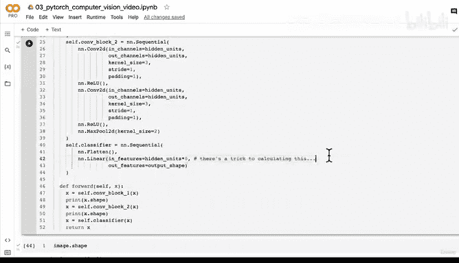

# 120：逐步解析MaxPool2D层 🧠


在本节课中，我们将深入探讨PyTorch中的`MaxPool2D`层。我们将通过编写测试代码，观察输入和输出的变化，来理解最大池化层如何工作。我们将从理论概念出发，结合实践代码，帮助你直观地掌握这一重要操作。

---

## 概述

最大池化层是卷积神经网络中的关键组件，它通过提取局部区域的最大值来降低特征图的空间尺寸，从而压缩信息并保留最重要的特征。本节我们将通过代码示例，逐步解析`MaxPool2D`层的工作原理。

---

## 1. 理解MaxPool2D层

上一节我们介绍了卷积层，本节中我们来看看最大池化层。`MaxPool2D`层的主要作用是对输入数据进行下采样，减少计算量并提取主要特征。

在PyTorch文档中，`MaxPool2D`层的输入输出关系可以描述为：
- 输入尺寸：`(N, C, H_in, W_in)`
- 输出尺寸：`(N, C, H_out, W_out)`

其中：
- `N`：批次大小
- `C`：通道数
- `H_in`、`W_in`：输入的高度和宽度
- `H_out`、`W_out`：输出的高度和宽度

输出值的计算公式为：
```
output = max(input[i, j, k: k + kernel_size, l: l + kernel_size])
```

---

## 2. 创建测试图像

为了理解最大池化层的工作方式，我们首先创建一个测试图像张量。这个张量的形状模拟了单个图像在CNN中的尺寸。

以下是创建测试图像的代码：

```python
import torch

# 设置随机种子以确保结果可重复
torch.manual_seed(42)

# 创建随机张量，形状为(3, 64, 64)，模拟RGB图像
test_image = torch.randn(size=(3, 64, 64))
print("原始图像形状:", test_image.shape)
```

---

## 3. 添加批次维度

在将图像传递给卷积层之前，我们需要添加一个批次维度。这是因为PyTorch的卷积层期望输入为四维张量：`(batch_size, channels, height, width)`。

以下是添加批次维度的代码：

```python
# 在第0维度添加批次维度
test_image_unsqueezed = test_image.unsqueeze(dim=0)
print("添加批次维度后的形状:", test_image_unsqueezed.shape)
```

---

## 4. 创建卷积层和最大池化层

接下来，我们创建一个卷积层和一个最大池化层。我们将使用`kernel_size=2`的最大池化层，这意味着池化窗口为2x2。

以下是创建层的代码：

```python
import torch.nn as nn

# 创建卷积层
conv_layer = nn.Conv2d(in_channels=3, out_channels=10, kernel_size=3, padding=1)

# 创建最大池化层
maxpool_layer = nn.MaxPool2d(kernel_size=2)
```

---

## 5. 逐步传递数据

现在，我们将测试图像依次通过卷积层和最大池化层，并观察每一步的形状变化。以下是传递数据的代码：

```python
# 通过卷积层
test_image_through_conv = conv_layer(test_image_unsqueezed)
print("卷积层输出形状:", test_image_through_conv.shape)

# 通过最大池化层
test_image_through_conv_and_maxpool = maxpool_layer(test_image_through_conv)
print("最大池化层输出形状:", test_image_through_conv_and_maxpool.shape)
```

---

## 6. 可视化最大池化操作

为了更直观地理解最大池化操作，我们创建一个更小的张量，并手动计算最大值。以下是可视化代码：

```python
# 创建一个小型随机张量
random_tensor = torch.randn(size=(1, 1, 2, 2))
print("随机张量:\n", random_tensor)
print("随机张量形状:", random_tensor.shape)

# 通过最大池化层
maxpool_tensor = maxpool_layer(random_tensor)
print("最大池化张量:\n", maxpool_tensor)
print("最大池化张量形状:", maxpool_tensor.shape)
```

---

## 7. 最大池化的作用

最大池化层通过提取局部区域的最大值来压缩特征图。例如，一个2x2的池化窗口会将四个值压缩为一个最大值。这种操作有助于：
- 减少计算量
- 提取主要特征
- 增强模型的平移不变性

在CNN中，卷积层学习特征，激活函数引入非线性，而最大池化层进一步压缩这些特征，形成更紧凑的表示。

---

## 8. 扩展实验

你可以尝试调整最大池化层的`kernel_size`参数，观察输出形状的变化。例如，将`kernel_size`设置为4，输出形状将进一步缩小。

```python
# 创建kernel_size=4的最大池化层
maxpool_layer_4 = nn.MaxPool2d(kernel_size=4)
test_image_through_maxpool_4 = maxpool_layer_4(test_image_through_conv)
print("kernel_size=4的输出形状:", test_image_through_maxpool_4.shape)
```

---

## 总结

本节课中，我们一起学习了`MaxPool2D`层的工作原理。我们通过创建测试图像、添加批次维度、逐步传递数据以及可视化操作，深入理解了最大池化层如何压缩特征图并提取主要特征。最大池化层是卷积神经网络中的重要组件，它帮助模型减少计算量并保留关键信息。



在下一节课中，我们将尝试使用Tiny VGG网络，并观察数据通过卷积块时的形状变化。