# 121：模型2 - 层输入输出形状计算技巧 🧮

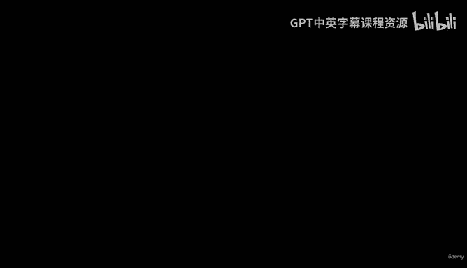

在本节课中，我们将学习如何计算和调试卷积神经网络中各层的输入输出形状。我们将通过向模型传递虚拟数据，并打印各层输出的形状，来确保模型结构正确，并解决常见的形状不匹配问题。

---

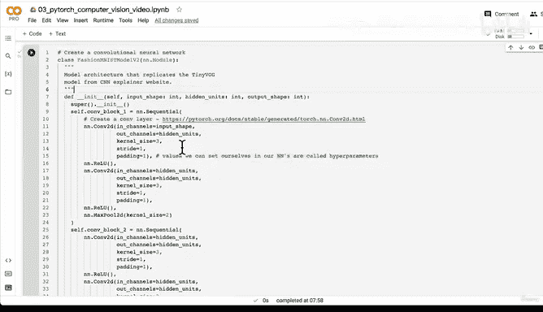

在之前的几节视频中，我们一直在复现CNN Explainer网站上的Tiny VGG架构。这实际上非常令人兴奋，因为几年前这可能需要数月的工作，而我们仅用几行PyTorch代码就分解并重建了它。这充分展示了PyTorch的强大以及深度学习领域的巨大进步。

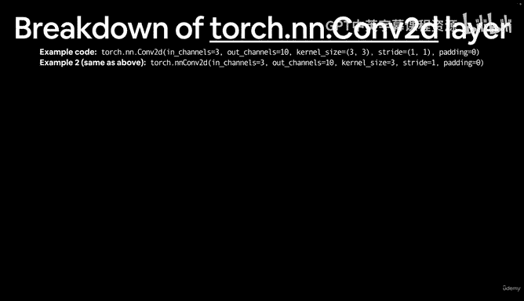

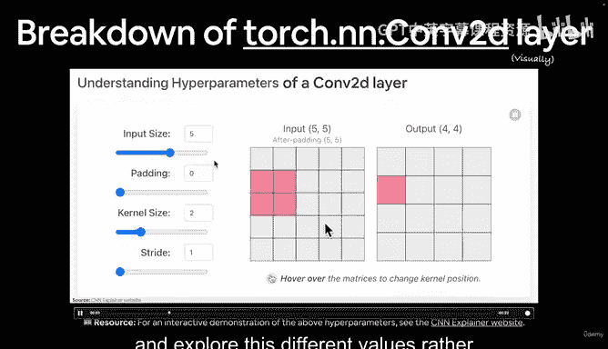

然而，我们的工作尚未完成。让我们回顾一下我们已经完成的部分：我们创建了输入层、Conv2D层、ReLU激活层、池化层，最后是输出层。现在，让我们看看当实际数据通过整个模型时会发生什么。这是一个常见的实践：复现一个模型，然后用你自己的数据测试它。

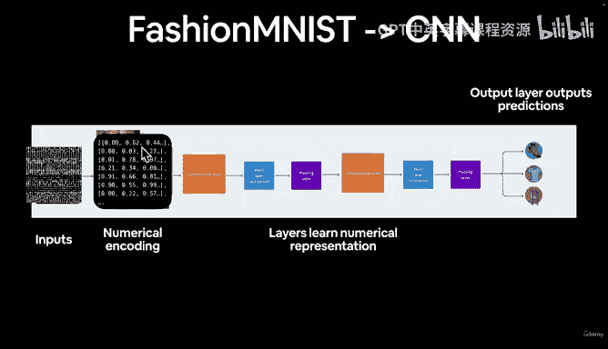

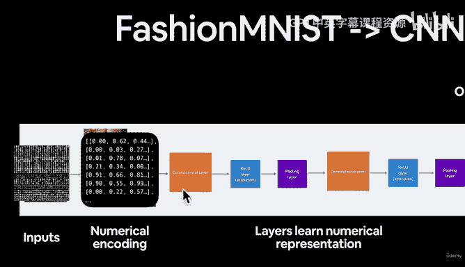

我们将从使用一些虚拟数据开始，以确保我们的模型正常工作，然后再传递真实数据。

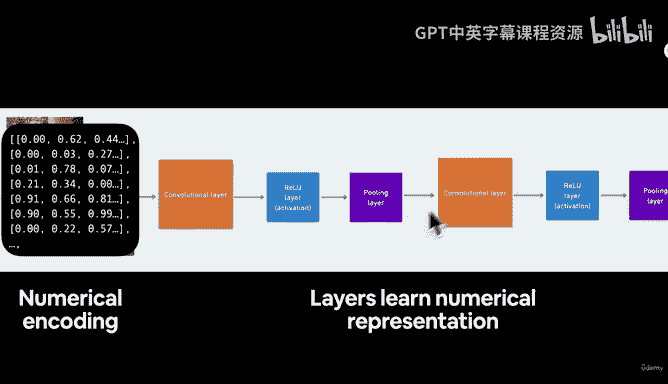

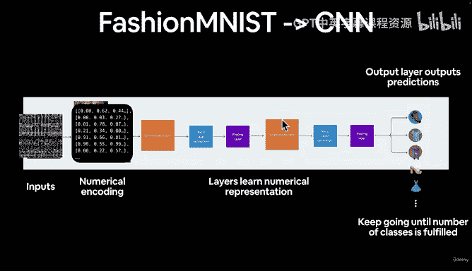

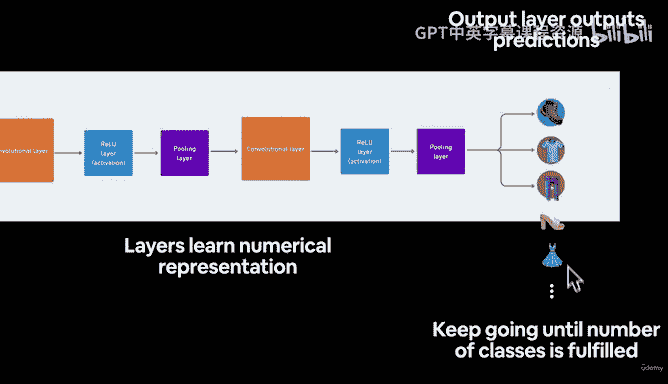

---

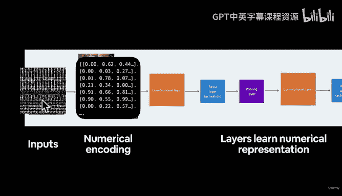

## 使用虚拟数据测试模型

为了测试模型，我们首先创建一个与真实数据形状相同的随机张量。我们的FashionMNIST图像形状是 `(1, 28, 28)`。

以下是创建随机张量的代码：
```python
random_image_tensor = torch.randn(size=(1, 28, 28))
```

接下来，我们需要将这个张量传递给模型。但在此之前，我们必须处理两个常见问题：**形状不匹配**和**设备不匹配**。

1.  **添加批次维度**：PyTorch模型通常期望输入具有批次维度，即形状为 `(batch_size, channels, height, width)`。我们的随机张量只有三个维度，因此需要使用 `unsqueeze(0)` 添加一个批次维度。
2.  **确保设备一致**：如果模型在GPU上，输入数据也必须在GPU上。我们之前已经设置了设备无关的代码，因此需要将张量移动到目标设备。

以下是准备并传递张量的代码：
```python
# 添加批次维度并移动到正确设备
random_image_tensor = random_image_tensor.unsqueeze(0).to(device)
# 进行前向传播
output = model2(random_image_tensor)
```

---

## 打印各层形状以进行调试

当我们首次尝试传递数据时，可能会遇到形状错误。我的调试技巧是：在模型的 `forward` 方法中，打印每个主要模块（如卷积块）输出张量的形状。

例如，在我们的 `model2` 中，我们可以在 `forward` 方法中添加打印语句：

```python
def forward(self, x):
    x = self.conv_block_1(x)
    print(f"Output shape of conv_block_1: {x.shape}")
    x = self.conv_block_2(x)
    print(f"Output shape of conv_block_2: {x.shape}")
    x = self.classifier(x)
    print(f"Output shape of classifier: {x.shape}")
    return x
```

通过运行这个修改后的模型，我们可以看到：
*   `conv_block_1` 的输出形状可能是 `(1, 10, 14, 14)`。
*   `conv_block_2` 的输出形状可能是 `(1, 10, 7, 7)`。

这些打印出来的形状信息至关重要。

---

## 解决分类器层的输入形状问题

问题通常出现在最后的分类器层（全连接层）。全连接层需要知道输入特征的数量。在我们的例子中，`conv_block_2` 的输出在展平后，应该作为分类器的输入。

从打印信息得知，`conv_block_2` 的输出形状是 `(1, 10, 7, 7)`。将其展平后，特征数量为：
**`10 * 7 * 7 = 490`**

因此，我们分类器中第一个线性层（`nn.Linear`）的 `in_features` 参数应设置为 490。矩阵乘法的规则是内部维度必须匹配，这个计算确保了这一点。

我们可以手动计算，但更高效的方法是让代码通过打印形状来告诉我们这个值。这就是“如有疑问，用代码解决”的策略。

在修正了 `in_features` 参数后，再次运行模型。现在，分类器的输出形状应该是 `(1, 10)`，这正好对应我们数据集的10个类别。太棒了！我们刚刚成功计算并验证了模型中每一层的输入和输出形状。

---

## 总结

本节课我们一起学习了如何计算和调试CNN模型的层间形状。核心技巧是：
1.  使用与真实数据同形状的虚拟张量测试模型。
2.  在 `forward` 方法中打印关键节点的张量形状。
3.  根据打印出的形状信息，修正后续层（尤其是全连接层）的输入参数。
4.  始终注意处理批次维度、设备一致性和数据类型这三个深度学习中的常见问题。

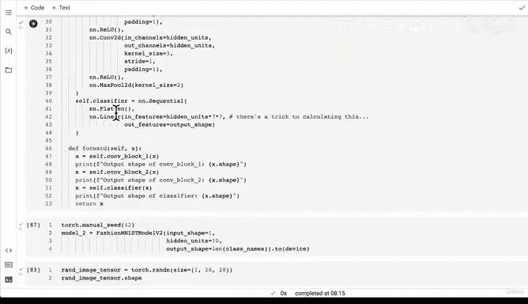


通过这种方法，我们可以确保数据能顺畅地流经整个网络，为下一步使用真实的训练和测试数据训练我们的第一个卷积神经网络做好准备。