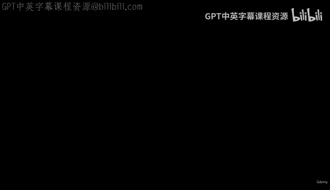
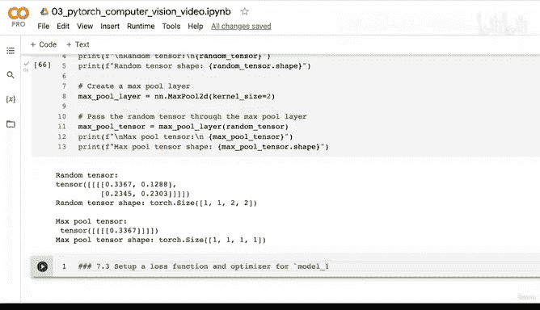
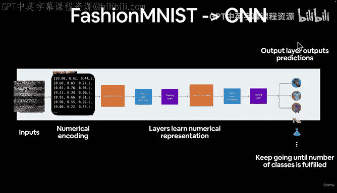
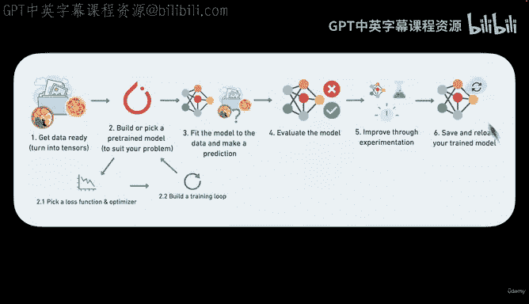
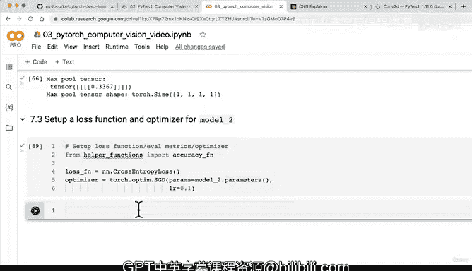

# 122：配置损失函数与优化器 🧠



在本节课中，我们将学习如何为我们的第一个卷积神经网络（CNN）配置训练所需的关键组件：损失函数和优化器。这是将模型从静态架构转变为能够从数据中学习的关键一步。

上一节我们构建并分析了CNN模型的结构，本节中我们来看看如何为其设置训练过程。

## 工作流程回顾 📋



首先，让我们回顾一下当前的PyTorch工作流程。我们已经完成了数据准备和模型构建。现在，我们正处于工作流程的下一步：选择损失函数和优化器。

我们的目标是创建一个预测模型，它可以接收服装的灰度图像作为输入，并输出预测的类别。

## 配置损失函数与优化器 ⚙️





以下是配置训练组件的具体步骤。

首先，我们需要设置损失函数、评估指标和优化器。我们将从辅助函数中导入准确率计算函数。

```python
# 导入准确率计算函数
from helper_functions import accuracy_fn

# 设置损失函数
loss_fn = nn.CrossEntropyLoss()

# 设置优化器
optimizer = torch.optim.SGD(params=model_2.parameters(),
                            lr=0.1)
```

我们选择 `nn.CrossEntropyLoss` 作为损失函数，因为这是一个多类别分类问题。优化器我们沿用之前使用过的随机梯度下降（SGD），并传入 `model_2` 的参数，学习率设置为 0.1。

## 优化目标 🎯

现在，我们的优化目标是 `model_2.state_dict()` 中的所有参数。这些参数包括模型各层中的权重和偏置，它们目前是随机初始化的。训练过程就是通过优化器调整这些参数，使模型能够在 FashionMNIST 数据集上做出更好的预测。

## 下一步：构建训练循环 🔄

在下一节视频中，我们将进入工作流程的最后一步：构建训练循环。幸运的是，我们可以复用之前编写的 `train_step` 和 `test_step` 函数来训练我们的 Model 2。你可以先尝试自己完成，我们将在下一节课一起实现。



本节课中我们一起学习了如何为CNN模型配置损失函数和优化器，这是启动模型训练前的必要准备。下一节，我们将把这些组件组合起来，开始真正的模型训练过程。