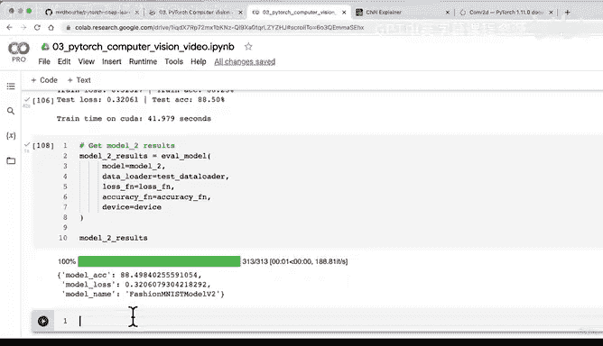

# 123：训练首个CNN并评估结果 🚀


在本节课中，我们将要学习如何训练我们的第一个卷积神经网络模型，并使用之前创建的训练和测试函数来评估其性能。我们将设置随机种子以确保实验的可重复性，并测量训练时间以比较不同模型的效率。

---

## 模型二：使用训练和测试函数

上一节我们介绍了如何构建一个卷积神经网络。本节中我们来看看如何使用之前创建的训练和测试函数来训练和评估这个模型。

我们首先设置随机种子，以确保实验的可重复性。

```python
torch.manual_seed(42)
torch.cuda.manual_seed(42)
```

接下来，我们测量训练时间，因为除了评估指标外，训练时间也是模型比较的一个重要方面。

```python
from timeit import default_timer as timer
train_time_start_model2 = timer()
```

以下是训练循环的步骤：

1.  我们使用 `tqdm` 来可视化训练进度。
2.  设置训练周期为3个，以保持实验简短。
3.  调用 `train_step` 函数进行训练。
4.  调用 `test_step` 函数进行测试。

```python
epochs = 3
for epoch in tqdm(range(epochs)):
    print(f"Epoch: {epoch}\n---------")
    train_step(model=model_2,
               data_loader=train_dataloader,
               loss_fn=loss_fn,
               optimizer=optimizer,
               accuracy_fn=accuracy_fn,
               device=device)
    test_step(model=model_2,
              data_loader=test_dataloader,
              loss_fn=loss_fn,
              accuracy_fn=accuracy_fn,
              device=device)
```

训练结束后，我们计算总训练时间。

```python
train_time_end_model2 = timer()
total_train_time_model2 = print_train_time(start=train_time_start_model2,
                                           end=train_time_end_model2,
                                           device=device)
```

现在，我们准备训练我们的第一个卷积神经网络。运行代码，观察训练过程。

---

## 评估模型性能

训练完成后，我们需要评估模型的性能。我们使用之前创建的 `eval_model` 函数来计算模型在测试数据集上的结果。

```python
model_2_results = eval_model(model=model_2,
                             data_loader=test_dataloader,
                             loss_fn=loss_fn,
                             accuracy_fn=accuracy_fn,
                             device=device)
```

让我们查看模型二的结果。

```python
print(model_2_results)
```

模型达到了约88.5%的测试准确率。这比我们之前的基线模型有显著提升。同时，我们记录了训练时间，以便后续与其他模型进行比较。

---

## 总结

本节课中我们一起学习了如何训练和评估我们的第一个卷积神经网络。我们使用了封装好的训练和测试函数，设置了随机种子以确保可重复性，并测量了训练时间。最终，我们的CNN模型在测试集上取得了不错的准确率，为后续的模型比较奠定了基础。



在下一讲中，我们将开始比较所有已训练模型的结果。