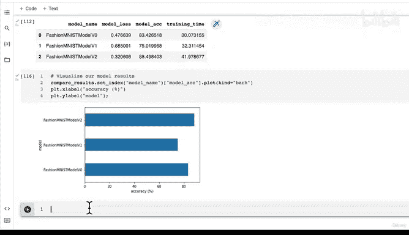

#  124：模型实验效果对比 📊


在本节课中，我们将学习如何对比不同机器学习模型的实验结果。我们将通过创建数据表格和可视化图表，来比较之前训练的多个模型的准确率、损失和训练时间，从而评估哪个模型表现最佳。

---

## 概述

在上一节中，我们训练了第一个卷积神经网络，并且从初步结果看，它似乎比基线模型有所提升。本节中，我们将通过系统化的对比来确认这一点。我们将使用 Pandas 创建数据表格，并绘制图表，直观地展示各个模型的性能差异。

---

## 创建对比数据表格

首先，我们需要导入 Pandas 库，并将之前保存的三个模型结果字典转换为数据表格进行对比。

```python
import pandas as pd

compare_results = pd.DataFrame([model_0_results,
                                model_1_results,
                                model_2_results])
```

以下是三个模型的简要回顾：
*   **模型 0 (基线模型)**：仅包含两个线性层，准确率为 83.4%，损失为 0.47。
*   **模型 1**：在 GPU 上训练并引入了非线性激活函数，但结果比基线模型更差。
*   **模型 2**：采用了来自 CNN Explainer 网站的 Tiny VGG 架构，训练了我们的第一个卷积神经网络，取得了目前最好的结果。

---

## 考虑训练时间

在模型对比中，训练时间是一个重要的考量因素。有时，一个模型虽然准确率略低，但训练和推理速度快得多，这在某些应用场景下是可接受的。这被称为 **性能与速度的权衡**。

我们将训练时间也加入到对比表格中：

```python
compare_results["training_time"] = [total_train_time_model_0,
                                    total_train_time_model_1,
                                    total_train_time_model_2]
```

请注意，训练时间高度依赖于你使用的计算硬件（如 CPU、GPU 型号）。因此，如果你的训练时间与示例中显示的不同，只要性能指标相近，就无需担心。如果性能指标差异巨大，则应检查代码设置，例如随机种子是否正确。

---

## 可视化模型结果

数字表格虽然精确，但图表能提供更直观的对比。我们将绘制一个条形图来展示各模型的准确率。

以下是绘制水平条形图的代码：

```python
compare_results.set_index("model_name")["test_acc"].plot(kind="barh")
plt.xlabel("Accuracy (%)")
plt.title("Model Accuracy Comparison on FashionMNIST")
```

通过这张图表，你可以清晰地看到哪个模型准确率最高。例如，你可以向他人展示：“在 FashionMNIST 数据集上，我们的卷积神经网络模型（模型 2）表现最佳，它是在 GPU 上训练的，架构参考了 CNN Explainer 网站。”

---

## 总结

本节课中，我们一起学习了如何系统化地对比机器学习实验的结果。我们使用 Pandas 整合了不同模型的准确率、损失和训练时间，并通过可视化图表直观地展示了性能差异。记住，在评估模型时，不仅要看最终准确率，还要考虑训练时间等实际因素。

---

## 下一步：进行可视化预测

目前我们看到的只是页面上的数字。既然我们的模型是基于计算机视觉数据训练的，那么其核心目的之一就是能够对图像进行预测并可视化结果。



在下一节课中，我们将使用表现最佳的模型——FashionMNIST Model V2，对测试集中的随机样本进行预测，并将预测结果以标题的形式标注在图像上。建议你先尝试自己实现这个功能，我们下节课再一起完成。