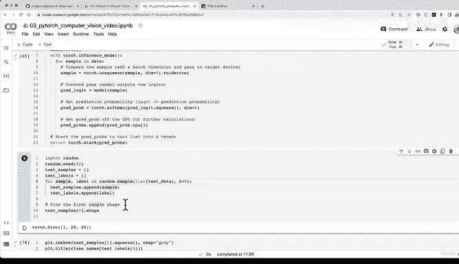

# 125：使用最优模型对随机测试样本预测 📊


在本节课中，我们将学习如何使用训练好的最优模型对随机选取的测试样本进行预测，并将预测结果可视化。我们将编写一个预测函数，处理数据，并将模型的原始输出转换为可读的预测标签。

---

## 模型性能回顾与硬件影响 ⚙️

上一节我们比较了不同模型的性能。我们尝试了三个实验：一个基础线性模型、一个带非线性激活函数的线性模型，以及一个卷积神经网络（Fashion MNIST模型V2）。从准确率角度看，卷积神经网络表现最佳，但其训练时间也最长。

需要强调的是，训练时间会因运行硬件不同而变化。我们在上一节讨论过这一点。在完成上一节后，我中断了工作，重新运行了之前编写的所有代码单元。你会发现，本节的训练时间与上一节的记录值有所不同。虽然不确定Google Colab后台具体使用的硬件，但请记住这一点。至少现在我们知道如何跟踪不同的变量，例如模型的训练时长和性能指标。

---

## 可视化预测：数据探索者的信条 👁️

是时候进行可视化了。让我们创建一个新标题：“制作与评估”。这是训练完机器学习模型后我最喜欢的步骤之一。

我们将遵循数据探索者的信条：可视化、可视化、再可视化。让我们编写一个名为 `make_predictions` 的函数。

```python
def make_predictions(model: torch.nn.Module,
                     data: list,
                     device: torch.device = device):
    pred_probs = []
    model.eval()
    with torch.inference_mode():
        for sample in data:
            sample = torch.unsqueeze(sample, dim=0).to(device)
            pred_logit = model(sample)
            pred_prob = torch.softmax(pred_logit.squeeze(), dim=0)
            pred_probs.append(pred_prob.cpu())
    return torch.stack(pred_probs)
```

以下是该函数的关键步骤：
1.  **初始化列表**：创建一个空列表 `pred_probs` 来存储预测概率。
2.  **模型评估模式**：将模型设置为评估模式（`model.eval()`），因为进行预测时应使用此模式。
3.  **推理模式**：启用 `torch.inference_mode()` 上下文管理器，因为预测（prediction）是推理（inference）的同义词。
4.  **遍历数据**：对 `data` 列表中的每个样本进行循环处理。
5.  **准备样本**：对单个图像样本使用 `unsqueeze(0)` 添加批次维度，并将其移动到目标设备。
6.  **前向传播**：将样本输入模型，获得原始逻辑值（logits）。
7.  **计算概率**：使用 `torch.softmax()` 函数将逻辑值转换为预测概率，并移除多余的维度。
8.  **转移数据**：将预测概率移至CPU，因为Matplotlib库无法直接处理GPU数据。
9.  **堆叠结果**：使用 `torch.stack()` 将列表中的所有预测概率合并为一个张量。

这只是一种实现方式，预测和可视化的方法有很多种，此处仅作示例。

---

## 准备随机测试样本 🎲

现在让我们在实战中尝试这个函数。首先导入 `random` 模块并设置随机种子以确保结果可复现。

```python
import random
random.seed(42)
```

接下来，创建两个空列表，一个用于存储测试样本，另一个用于存储对应的真实标签。这样，在模型做出预测后，我们可以将其与真实标签进行比较。

```python
test_samples = []
test_labels = []
```

我们将从整个测试数据集（而非测试数据加载器）中随机抽取9个样本。选择9是因为后续我们将创建一个3x3的绘图网格。

```python
for sample, label in random.sample(list(test_data), k=9):
    test_samples.append(sample)
    test_labels.append(label)
```

让我们查看第一个样本的形状和图像。

```python
print(f"First sample shape: {test_samples[0].shape}")
plt.imshow(test_samples[0].squeeze(), cmap="gray")
plt.title(class_names[test_labels[0]])
plt.show()
```

输出显示，第一个样本是一个形状为 `[1, 28, 28]` 的张量，其对应的标签是“凉鞋”。

---

## 使用最优模型进行预测 🔮

现在，使用我们之前创建的 `make_predictions` 函数，传入训练好的最优模型（`model_2`）和随机测试样本列表（`test_samples`），进行预测。

```python
pred_probs = make_predictions(model=model_2,
                              data=test_samples)
```

查看前两个预测概率：

```python
print(pred_probs[:2])
```

输出是每个样本对应10个类别的概率张量。为了与整数形式的真实标签（`test_labels`）进行公平比较，我们需要将这些概率转换为预测标签。

---

## 将预测概率转换为预测标签 🏷️

我们可以使用 `argmax()` 函数，获取每个样本预测概率中最大值所在的索引，该索引即为预测的类别标签。

```python
pred_classes = pred_probs.argmax(dim=1)
print(pred_classes)
```

现在，`pred_classes` 中的预测标签与 `test_labels` 中的真实标签格式一致，便于后续比较。

---

## 总结与下节预告 📝

本节课我们一起学习了如何使用训练好的PyTorch模型对随机测试样本进行预测。我们编写了一个通用的预测函数，处理了数据准备和设备转移，并将模型的原始输出转换成了具体的类别标签。

在下一节中，我们将编写代码创建一个Matplotlib绘图函数，将九个随机样本、它们的真实标签以及模型的预测标签一起可视化显示出来，从而直观地评估模型的性能。如果你希望样本完全随机，可以注释掉设置随机种子的代码行。我将其设为42是为了确保你我运行代码时能抽取到相同的样本，便于结果对比。



让我们拭目以待下一节的可视化结果！