# 126：可视化最优模型的随机测试样本预测与评估 📊


在本节课中，我们将学习如何可视化我们训练好的模型在随机测试样本上的预测结果，并与真实标签进行比较。通过直观的图表，我们可以更深入地评估模型的性能，并发现潜在的问题。

---

上一节我们介绍了如何对测试数据进行预测并计算准确率。本节中，我们来看看如何将这些预测结果以图像的形式直观地展示出来。

我们将创建一个Matplotlib图表，用于绘制随机选择的测试样本图像，并在图像上方显示模型的预测标签和真实标签。为了快速判断预测是否正确，我们将根据预测结果的正误来改变标题文字的颜色。

以下是实现这一可视化功能的核心代码步骤：

1.  **创建图表**：设置一个3x3的图表布局，用于展示9个随机样本。
    ```python
    import matplotlib.pyplot as plt
    fig = plt.figure(figsize=(9, 9))
    rows, cols = 3, 3
    ```

2.  **遍历样本并绘制**：对每个随机选择的测试样本，创建一个子图。
    ```python
    for i, sample in enumerate(test_samples):
        # 创建子图
        plt.subplot(rows, cols, i+1)
        # 绘制图像，移除批次维度并设置为灰度图
        plt.imshow(sample.squeeze(), cmap="gray")
        plt.axis(False)
    ```

3.  **获取预测与真实标签**：将模型输出的数字类别转换为可读的文本标签。
    ```python
        # 获取预测标签
        pred_label = class_names[pred_classes[i]]
        # 获取真实标签
        truth_label = class_names[test_labels[i]]
    ```

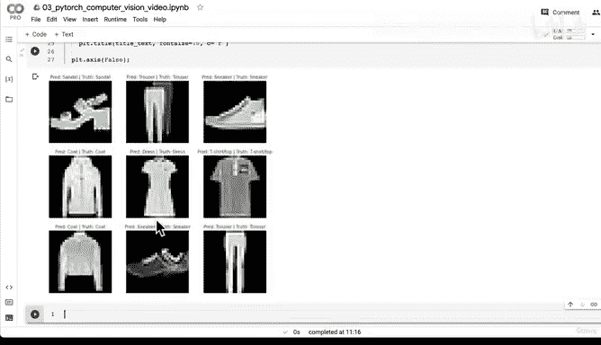

4.  **设置动态颜色的标题**：根据预测是否正确，将标题文字设置为绿色或红色。
    ```python
        title_text = f"Pred: {pred_label} | Truth: {truth_label}"
        if pred_label == truth_label:
            plt.title(title_text, fontsize=10, color="green")  # 正确为绿色
        else:
            plt.title(title_text, fontsize=10, color="red")    # 错误为红色
    ```

运行上述代码后，我们得到了一个包含9个样本的图表。从结果来看，我们的模型表现相当出色，所有预测都是正确的。例如，“预测：凉鞋，真实：凉鞋”、“预测：裤子，真实：裤子”。

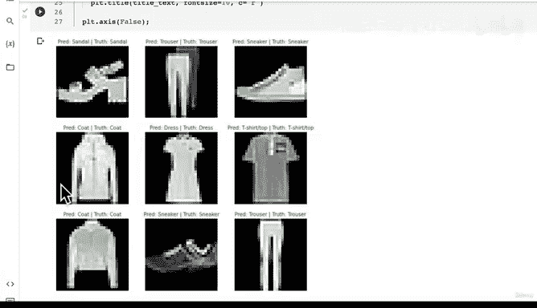

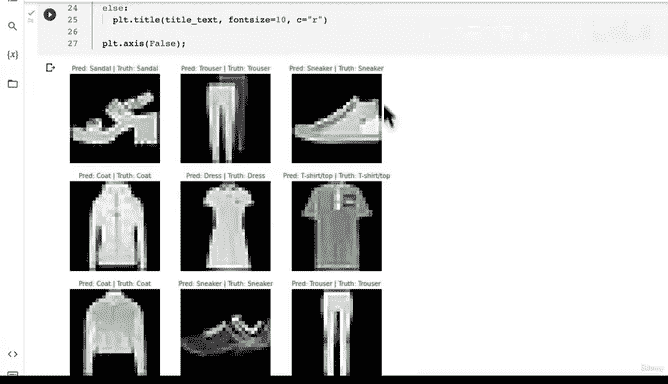

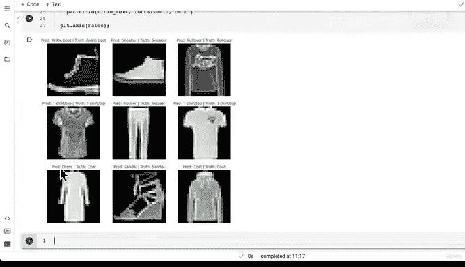

---

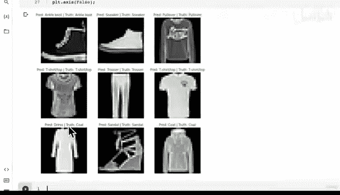

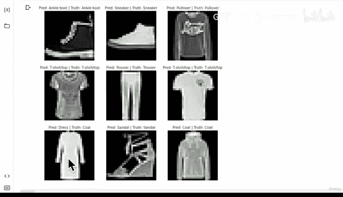

然而，为了更全面地评估模型，我们需要查看它在更多样本上的表现，特别是它犯错误的情况。因此，我们可以多次运行随机采样和可视化的代码。

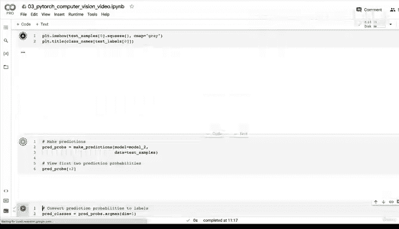

在后续的随机抽样中，模型开始出现一些错误预测。例如，它将一件“外套”预测为“连衣裙”，或将一件“衬衫”预测为“T恤/上衣”。这些错误揭示了模型可能存在的混淆点，也提示我们数据集中某些类别的标签定义本身可能存在重叠或模糊之处（例如“T恤”和“衬衫”的区别）。

这种可视化方法的价值在于，它不仅能验证模型在数字指标（如准确率）上的表现，还能让我们直观地看到模型在哪些具体情况下会出错，从而为进一步的模型改进或数据清洗提供方向。

---

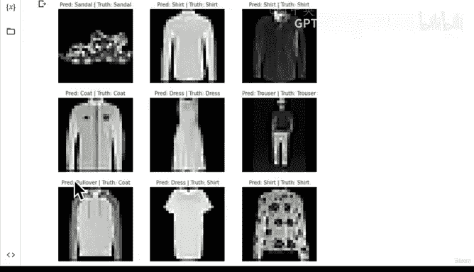

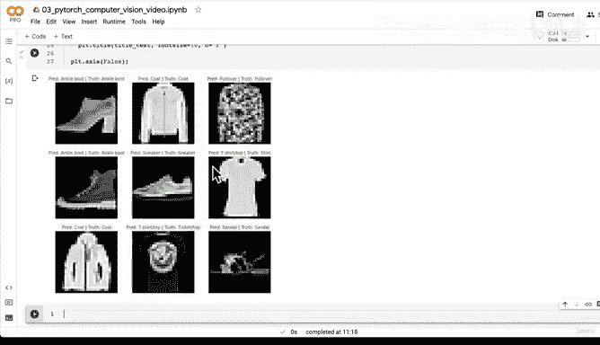

本节课中我们一起学习了如何可视化PyTorch模型在测试集上的预测结果。我们编写代码绘制了随机测试样本的图像，并对比了模型的预测标签与真实标签，通过颜色高亮显示了预测的正误。这个过程是探索性数据分析的重要一环，它能帮助我们更直观、更深入地理解模型的性能和行为，发现数字指标背后隐藏的细节问题。

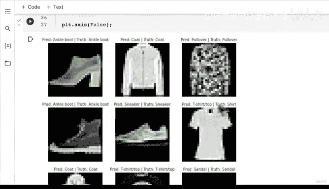

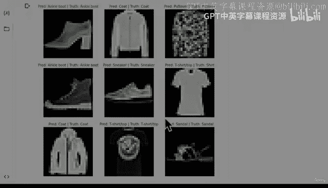

在下一节课中，我们将引入另一种强大的评估工具——混淆矩阵，来系统性地分析模型在所有类别上的错误模式。