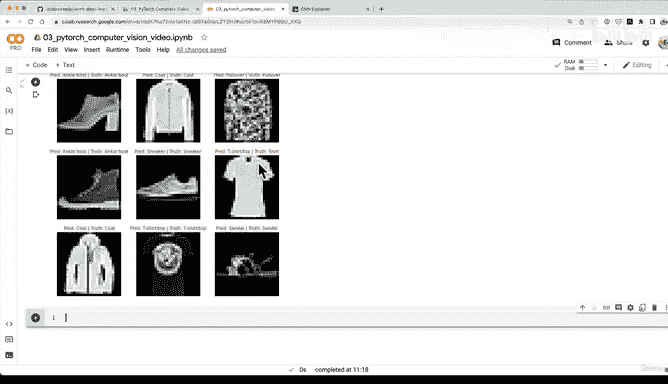
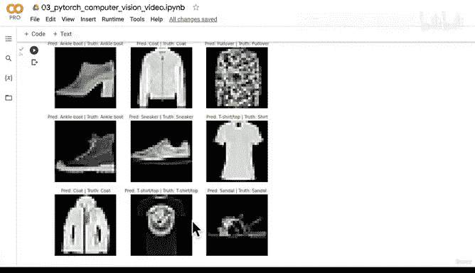
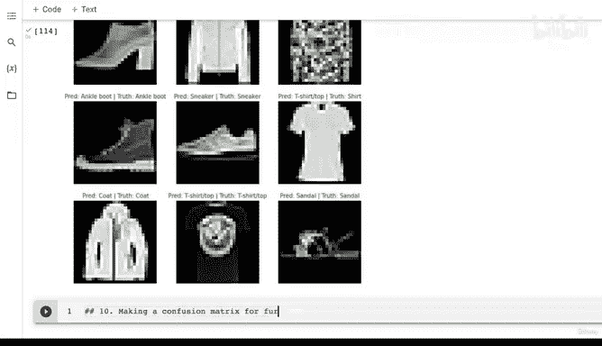
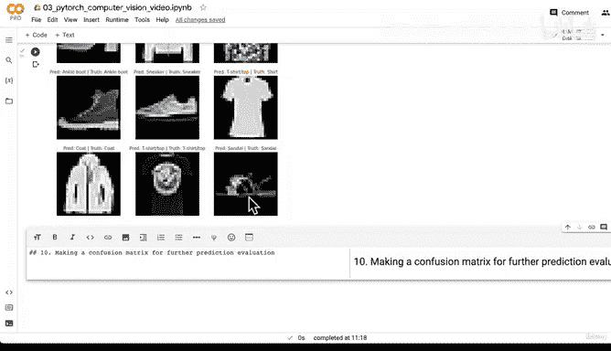
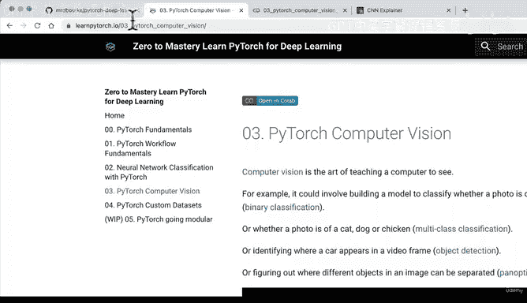
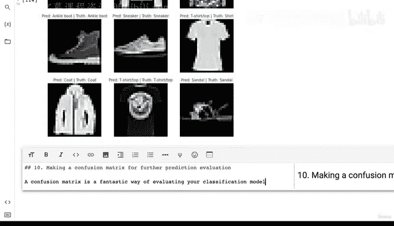
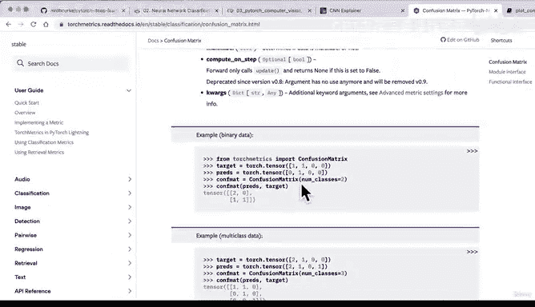

#  127：预测与混淆矩阵绘制库导入 📊








在本节课中，我们将学习如何评估机器学习模型，特别是通过可视化预测结果和使用混淆矩阵来深入理解模型的性能。我们将从对整个测试数据集进行预测开始，然后安装必要的库来创建和绘制混淆矩阵。





---



## 模型预测可视化

上一节我们介绍了如何对随机样本进行预测。本节中，我们来看看如何对整个测试数据集进行预测，以获得更全面的模型性能视图。

我们观察到，模型有时会对某些类别（例如T恤/上衣和衬衫）感到困惑。这种对模型预测的洞察也可能提示我们某些数据标签或许可以改进。

以下是进行批量预测的步骤：

1.  将模型设置为评估模式。
2.  使用 `torch.inference_mode()` 上下文管理器来禁用梯度计算，提高效率。
3.  遍历测试数据加载器，对每个批次进行前向传播。
4.  将模型的原始输出（logits）转换为预测概率，再转换为预测标签。
5.  将所有批次的预测结果收集到一个张量中。

```python
import torch
from tqdm.auto import tqdm

# 1. 创建空列表以存储预测
test_preds = []
# 2. 将模型设置为评估模式
model_2.eval()

# 3. 在推理模式下进行预测
with torch.inference_mode():
    for X, y in tqdm(test_dataloader, desc="Making predictions"):
        # 将数据发送到目标设备
        X, y = X.to(device), y.to(device)
        # 4. 前向传播
        y_logit = model_2(X)
        # 将logits转换为预测概率，再转换为标签
        y_pred = torch.softmax(y_logit, dim=1).argmax(dim=1)
        # 5. 将预测移到CPU并添加到列表
        test_preds.append(y_pred.cpu())

# 将预测列表连接成一个张量
test_preds_tensor = torch.cat(test_preds)
```

运行此代码后，我们将得到一个包含所有10000个测试样本预测结果的张量。

---

## 安装评估库

为了创建混淆矩阵，我们需要使用两个外部库：`torchmetrics` 和 `mlxtend`。`torchmetrics` 提供了丰富的机器学习评估指标，而 `mlxtend` 包含了许多实用的辅助函数，例如绘制混淆矩阵。

由于 Google Colab 默认可能没有安装或没有所需版本的这些库，我们需要先进行检查和安装。

以下是安装和验证库的步骤：

```python
# 尝试导入所需的库，如果失败则安装
try:
    import torchmetrics, mlxtend
    # 检查 mlxtend 版本是否 >= 0.19.0
    assert int(mlxtend.__version__.split('.')[1]) >= 19, "mlxtend version should be 0.19.0 or higher"
    print(f"mlxtend version: {mlxtend.__version__}")
except:
    # 安装 torchmetrics 并升级 mlxtend
    !pip install -q torchmetrics
    !pip install -q --upgrade mlxtend
    import torchmetrics, mlxtend
    print(f"mlxtend version: {mlxtend.__version__}")
```

**注意**：在 Google Colab 中运行安装命令后，可能需要**重启运行时**才能使新安装的库生效。如果遇到错误，请手动重启内核并重新运行必要的单元格。

安装完成后，我们就可以利用 `torchmetrics` 中的 `ConfusionMatrix` 类和 `mlxtend.plotting` 中的 `plot_confusion_matrix` 函数了。

---

## 总结

本节课中我们一起学习了模型评估的重要步骤。首先，我们编写了代码对整个测试数据集进行批量预测，这比随机抽样更能代表模型的整体性能。接着，我们介绍了如何安装和验证 `torchmetrics` 和 `mlxtend` 这两个强大的库，为下一节课实际创建和绘制混淆矩阵做好了准备。



混淆矩阵是一种非常直观的工具，它能清晰地展示模型在各个类别上的预测情况，帮助我们识别模型容易混淆的类别，从而为进一步优化模型或数据集提供方向。