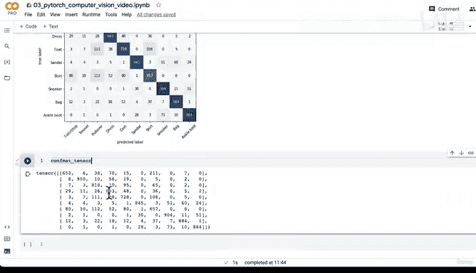

#  128：使用混淆矩阵评估最优模型预测 📊


在本节课中，我们将学习如何使用混淆矩阵来评估和可视化我们训练好的PyTorch模型在测试集上的预测性能。混淆矩阵是分类任务中一个非常强大的评估工具。

---

在上一节中，我们编写了代码来导入绘制混淆矩阵所需的一些额外库。同时，我们也对整个测试数据集进行了预测，得到了一个包含10,000个预测结果的张量。本节中，我们将使用混淆矩阵来对比这些预测结果与测试集中的真实标签。

以下是实现此目标的三个主要步骤：
1.  准备必要的库。
2.  创建混淆矩阵实例并计算。
3.  绘制混淆矩阵。

我们已经完成了第一步，并为第二、三步安装了 `torchmetrics` 和 `mlxtend` 库。现在，让我们继续后续步骤。

## 步骤二：创建混淆矩阵实例

首先，我们需要从已安装的库中导入必要的类。

```python
# 导入混淆矩阵类和绘图函数
from torchmetrics import ConfusionMatrix
from mlxtend.plotting import plot_confusion_matrix
```

接下来，我们设置混淆矩阵实例，并将模型的预测结果与真实目标标签进行比较。这是模型评估的核心。

```python
# 实例化混淆矩阵，参数为类别数量
confmat = ConfusionMatrix(num_classes=len(class_names))

# 计算混淆矩阵张量
confmat_tensor = confmat(preds=y_pred_tensor,
                         target=test_data.targets)
```

在这段代码中：
*   `class_names` 是我们数据集中所有类别的列表。
*   `y_pred_tensor` 是上一节中模型对整个测试集做出的预测张量。
*   `test_data.targets` 是测试数据集的真实标签。

## 步骤三：绘制混淆矩阵

现在，我们已经得到了一个包含数值的混淆矩阵张量。为了更直观地分析，我们使用 `mlxtend` 库将其绘制成图。

```python
# 设置图形尺寸
fig, ax = plt.subplots(figsize=(10, 7))

# 绘制混淆矩阵
plot_confusion_matrix(conf_mat=confmat_tensor.numpy(), # matplotlib 需要 NumPy 数组
                      class_names=class_names,
                      figsize=(10, 7))
```

运行代码后，我们将看到一个可视化的混淆矩阵。理想情况下，一个完美的模型其混淆矩阵只有对角线（从左上到右下）有高亮值，其他位置都应为零，这表示预测标签与真实标签完全一致。

## 分析混淆矩阵

观察我们得到的混淆矩阵，可以看到一条非常明显的高亮对角线，这说明模型整体表现良好。然而，我们也可以发现一些预测错误：

例如，模型有时会将“衬衫”（Shirt）预测为“T恤/上衣”（T-shirt/top），反之亦然。这反映了我们在之前可视化单个预测时看到的情况。

另一个例子是，模型有时会将“运动鞋”（Sneaker）预测为“踝靴”（Ankle boot），混淆了两种不同的鞋类。

通过混淆矩阵，我们可以直观地检查模型所犯的错误是否在视觉上是合理的。例如，某些服装类别（如套头衫和外套）在图像上可能本身就非常相似，导致模型容易混淆。这提示我们，或许可以审视数据标签的区分度，或者考虑对模型进行进一步优化。

---

**本节课总结**

在本节课中，我们一起学习了如何使用混淆矩阵来深度评估分类模型。我们首先导入了 `torchmetrics` 和 `mlxtend` 库，然后创建了混淆矩阵实例来计算预测与真实标签的对比结果，最后将其绘制成直观的图表进行分析。混淆矩阵是理解和改进分类模型性能不可或缺的工具。



我们已经完成了相当多的模型评估工作。根据我们的工作流程，接下来是时候保存并加载我们训练好的最佳模型了。让我们在下一节课中继续。