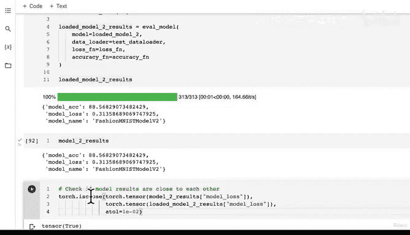

# 129：保存与加载最优性能模型 💾


在本节课中，我们将学习如何保存训练好的PyTorch模型，并在之后重新加载它进行验证和使用。这是将模型部署到实际应用中的关键一步。

## 概述

上一节我们利用`torch.metrics`创建了漂亮的混淆矩阵来评估模型性能。本节中，我们将学习如何保存表现最佳的模型，以便在其他地方使用，并验证保存和加载过程是否正确。

## 创建模型保存路径

首先，我们需要为模型文件创建一个保存目录。以下是具体步骤：

*   从`pathlib`导入`Path`模块，用于处理文件路径。
*   创建一个名为`models`的目录路径。
*   使用`.mkdir()`方法创建目录，设置`parents=True`和`exist_ok=True`参数确保目录存在且不会因重复创建而报错。

```python
from pathlib import Path

# 创建模型保存目录
MODEL_PATH = Path("models")
MODEL_PATH.mkdir(parents=True, exist_ok=True)

# 定义模型保存的文件名和完整路径
MODEL_NAME = "03_pytorch_computer_vision_model_2.pth"
MODEL_SAVE_PATH = MODEL_PATH / MODEL_NAME
```

## 保存模型状态字典

我们保存的是模型的`state_dict()`，它包含了模型从数据中学到的所有参数（如权重和偏置）。这些参数最初是随机初始化的，经过训练后已更新为能代表训练图像的特征。

以下是保存模型的代码：

```python
print(f"Saving model to: {MODEL_SAVE_PATH}")
torch.save(obj=model_2.state_dict(), f=MODEL_SAVE_PATH)
```

运行此代码后，模型文件将被保存到指定的`models`目录中。

## 加载已保存的模型

由于我们只保存了模型的`state_dict`，要重新加载它，需要先创建一个与原始模型结构完全相同的新实例。

以下是加载模型的步骤：

1.  设置随机种子，确保新模型实例的初始随机状态一致。
2.  使用与原始模型相同的类（`FashionMNISTModelV2`）和参数（输入形状、隐藏单元数、输出形状）实例化一个新模型。
3.  使用`torch.load()`加载保存的`state_dict`文件。
4.  将加载的`state_dict`载入到新模型实例中。
5.  将模型发送到目标设备（如GPU）。

```python
# 设置随机种子
torch.manual_seed(42)

# 实例化一个结构相同的新模型
loaded_model_2 = FashionMNISTModelV2(input_shape=1,
                                     hidden_units=10,
                                     output_shape=len(class_names))

# 加载保存的状态字典
loaded_model_2.load_state_dict(torch.load(f=MODEL_SAVE_PATH))

# 将模型发送到设备
loaded_model_2.to(device)
```

## 评估加载的模型

评估加载的模型与评估训练后的模型同样重要。这能确保模型被正确保存，在部署前验证其性能。

我们将使用之前定义的`eval_model`函数，在相同的测试数据集上评估加载的模型。

```python
# 评估加载的模型
loaded_model_2_results = eval_model(model=loaded_model_2,
                                    data_loader=test_dataloader,
                                    loss_fn=loss_fn,
                                    accuracy_fn=accuracy_fn)

loaded_model_2_results
```

加载模型的评估结果（如测试损失和准确率）应该与原始模型`model_2`的结果非常接近。

## 验证结果一致性

我们可以通过编程方式检查两个模型的结果是否足够接近，而不仅仅是肉眼观察。

使用`torch.isclose()`函数可以比较两个张量在指定容差范围内是否接近。

```python
# 检查原始模型与加载模型的损失值是否接近
torch.isclose(torch.tensor(model_2_results["model_loss"]),
              torch.tensor(loaded_model_2_results["model_loss"]),
              atol=1e-08) # 绝对容差
```

如果返回`True`，说明结果在容差范围内一致。如果结果差异较大（例如超过小数点后两三位），则应检查代码，确保模型保存正确且随机种子设置无误。可以调整`atol`（绝对容差）参数来定义“足够接近”的标准。

## 总结



本节课中，我们一起学习了PyTorch模型保存与加载的完整流程。我们首先创建了模型保存路径，然后保存了模型的状态字典。接着，我们实例化了一个结构相同的新模型并加载了保存的参数。最后，我们评估了加载的模型，并通过比较结果验证了保存和加载过程的正确性。这是将训练好的模型投入实际应用的关键步骤。