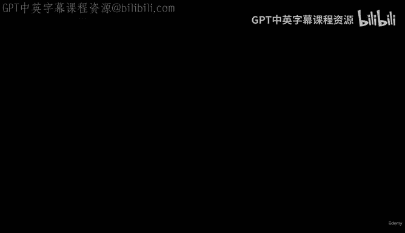
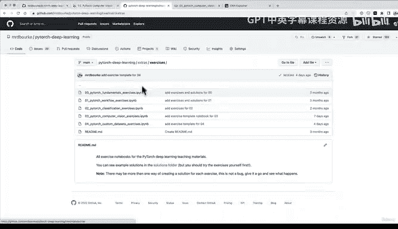

#  130：PyTorch 计算机视觉内容回顾与练习拓展 📚

在本节课中，我们将回顾在 PyTorch 计算机视觉部分共同完成的所有工作，并为你提供一系列练习和拓展资源，以巩固所学知识。

---

## 内容回顾

上一节我们完成了卷积神经网络的构建与评估。现在，让我们系统地回顾整个计算机视觉学习路径。

我们共同编写了大量的 PyTorch 计算机视觉代码。

我们从最顶部开始。我们查看了参考笔记本和在线书籍。

我们查看了 PyTorch 中的计算机视觉库，最主要的是 TorchVision。

然后我们获取了一个数据集，即 Fashion MNIST 数据集。实际上还有更多数据集可供查看。

我鼓励你尝试 `torchvision.datasets` 中的其他数据集，并使用我们在此完成的所有步骤在另一个数据集上进行尝试。

我们准备了数据加载器，将数据转换为批次。

我们构建了一个基线模型，这是机器学习中的重要一步。基线模型通常相对简单，它将作为一个基准，你可以通过各种实验尝试改进它。

我们随后使用模型零进行了预测，并对其进行了评估。

我们为预测计时，以查看在 GPU 上运行模型是否更快。我们了解到，对于相对较小的数据集，由于数据从 CPU 复制到 GPU 的开销，GPU 不一定会加速代码。

我们尝试了一个带有非线性的模型，发现它并没有真正改进我们的基线模型。

但随后我们引入了“重型武器”——一个复制了 CNN Explainer 网站的卷积神经网络。我们在这里花费了大量时间。

我鼓励你作为课外学习，反复回顾这部分内容。我自己在制作本节视频和代码材料时也经常参考它。

因此，请务必返回并查看 CNN Explainer 网站，以了解更多关于 CNN 幕后工作的信息。

我们使用纯 PyTorch 编写了一个卷积神经网络，这非常棒。

我们比较了不同实验的模型结果。

我们发现我们的卷积神经网络表现最佳，尽管训练时间稍长一些。我们还了解到，训练时间值肯定会因你使用的硬件而异，这是需要记住的一点。

我们使用最佳模型进行了评估并做出了随机预测。这是可视化模型预测的重要步骤，因为你可以获得评估指标，但直到你开始实际可视化正在发生的事情，你才能真正理解模型的想法。

我们使用两个不同的库（TorchMetrics 和 MLxtend）看到了混淆矩阵，这是评估分类模型的绝佳方式。

我们看到了如何将性能最佳的模型保存并加载到文件中，并确保保存模型的结果与我们在笔记本中训练的模型没有太大差异。

---

## 练习与实践

现在是时候了，我希望你练习所学的内容。这实际上非常令人兴奋，因为你已经完成了一个端到端的计算机视觉问题。

我准备了一些练习。如果你访问 LearnPyTorch.io 网站的第 03 节并向下滚动，你可以阅读所有这些内容。这些是我们刚刚用纯代码涵盖的所有材料。

这个笔记本中有很多有助于理解内容的注释。

以下是练习内容。所有练习都侧重于练习上述部分的代码。

我们有两个资源，我还整理了一些课外学习材料。

如果你想深入了解卷积神经网络幕后的工作原理，因为我们重点讲了很多代码，我强烈推荐 MIT 的深度学习计算机视觉入门讲座。

你可以花 10 分钟浏览 PyTorch Vision 库 TorchVision 中的不同选项。

在 TorchVision 模型库中查找最常见的卷积神经网络。

对于大量预训练的 PyTorch 计算机视觉模型，如果你更深入地研究计算机视觉，你可能会遇到 Torch Image Models 库，也称为 `timm`。但我会将其作为课外学习内容。

我将再次链接这个练习部分，它在 learnpytorch.io 的练习部分。

这里还有一个资源：一个练习模板笔记本。

以下是计算机视觉目前在工业中应用的三个领域。

这是在 PyTorch 深度学习仓库的 `extras/exercises` 中的第 3 号练习。我在这里为你提供了一些模板代码，供你填写这些不同的部分。

其中一些与代码相关，一些只是基于文本的，但它们都应该能够通过参考我们在这个笔记本中所学的内容来完成。

还有一个资源，如果我们回到 PyTorch 深度学习仓库，这里可能会在你看到时更新。

你总是可以通过访问“计算机视觉” -> “练习与课外学习”找到练习和课外学习材料。或者，如果我们进入 `extras` 文件夹，然后进入 `solutions`，我现在也开始为每个解决方案添加视频讲解。

这是我亲自完成每个练习并编写代码的过程。你会看到这些是未经编辑的视频，它们是一次长的直播录像。

我已经为 02、03 和 04 节录制了一些，当你观看此视频时，这里会有更多内容。

但如果你想了解我如何找出练习的解决方案，你可以观看这些视频并自己学习。但首先，我强烈建议你先自己尝试练习。

如果你遇到困难，可以参考这里的笔记本，参考 PyTorch 文档。最后，你可以查看我编写的可能解决方案。

所以，这里是第 3 号计算机视觉练习解决方案。

---

## 总结

恭喜你完成了 PyTorch 计算机视觉部分的学习。

我们共同回顾了从数据准备、模型构建、训练、评估到可视化的完整流程。通过练习和课外资源，你可以进一步巩固这些技能，并探索更广阔的计算机视觉世界。

我们将在下一节见面，我们将学习 PyTorch 自定义数据集。但先不剧透，我们很快再见。