#  131：自定义数据集概念与内容规划 🗂️

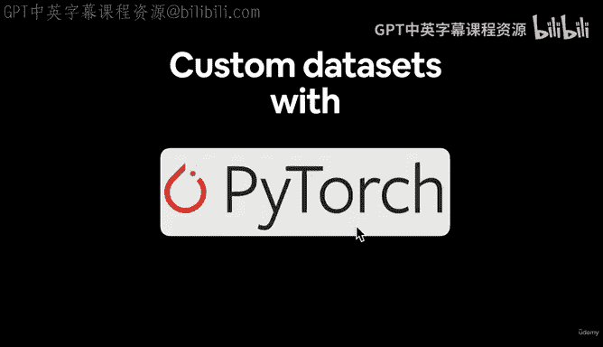

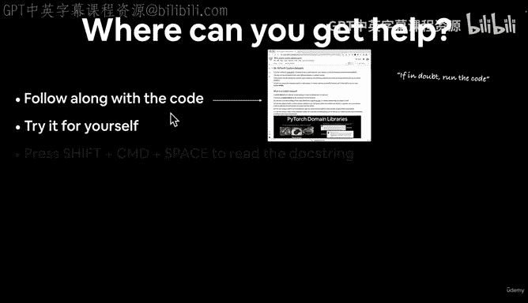

在本节课中，我们将学习如何使用 PyTorch 处理自定义数据集。我们将了解如何将你自己的数据（例如图像）加载到 PyTorch 中，以便构建和训练深度学习模型。

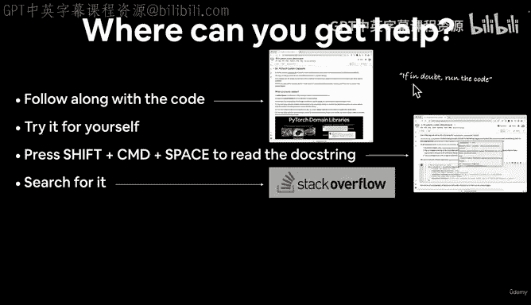

## 概述

到目前为止，我们已经使用过多个 PyTorch 内置的数据集（如 Fashion MNIST）来构建神经网络。然而，你可能会想：“我拥有自己的数据集，或者正在处理自己的问题，能否用 PyTorch 构建模型来预测这个数据集？”答案是肯定的。但你需要完成一些预处理步骤，以使你的数据集与 PyTorch 兼容。这正是我们本节课程要涵盖的内容。

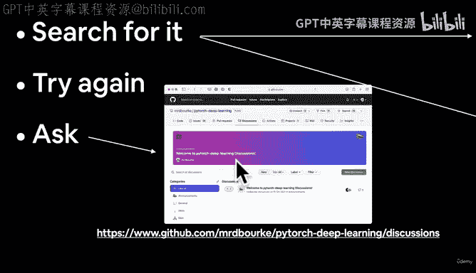

## 获取帮助的途径

在学习过程中，遇到问题是很正常的。以下是几个获取帮助的有效途径：

*   **跟随代码**：尽可能跟随课程代码一起编写。
*   **尝试运行**：如果遇到疑问，尝试运行代码。记住我们的格言：“如果存疑，运行代码”。
*   **查阅文档**：在 Google Colab 中，你可以按 `Shift + Command + Space`（Windows 系统可能是 `Control`）来查看函数文档字符串。
*   **搜索资源**：如果仍然困惑，可以搜索相关资源。你可能会经常用到 **Stack Overflow** 或优秀的 **PyTorch 官方文档**。
*   **回顾代码**：当然，你也可以回头检查自己的代码。
*   **发起讨论**：如果以上方法都无法解决问题，你可以在课程的 GitHub 讨论页面提问。你可以选择类别（如“Q&A”），注明视频编号，描述问题并附上相关代码。

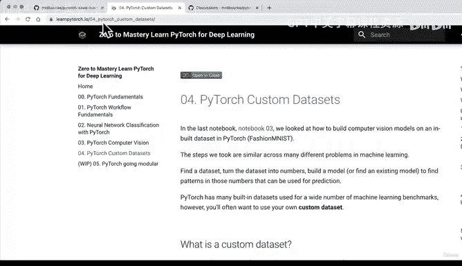

本课程的所有资源都可以在 `learnpytorch.io` 找到。我们目前处于第 4 节。该网站提供了本节所有材料的在线书籍版本。此外，GitHub 仓库中也提供了相同的 Jupyter Notebook（例如 `pytorch_custom_datasets.ipynb`），如果你遇到困难，可以将其作为参考。

## 什么是自定义数据集？

我们已经使用 PyTorch 在多个数据集上构建了不少深度学习神经网络。但当你拥有自己的数据时，就需要创建一个自定义数据集。这涉及到一系列预处理步骤，以使你的数据能够被 PyTorch 的模型使用。

## PyTorch 领域库简介

为了高效处理不同类型的数据，PyTorch 提供了多个领域特定的库。了解这些库有助于你根据数据类型选择合适的工具。

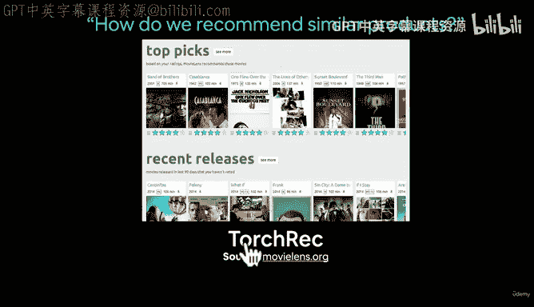

*   **`torchvision`**：用于计算机视觉任务，例如图像分类（如区分披萨、牛排或寿司）。
*   **`torchtext`**：用于自然语言处理任务，例如情感分析（判断评论是正面还是负面）。
*   **`torchaudio`**：用于音频处理任务，例如歌曲分类。
*   **`torchrec`**：用于推荐系统任务。

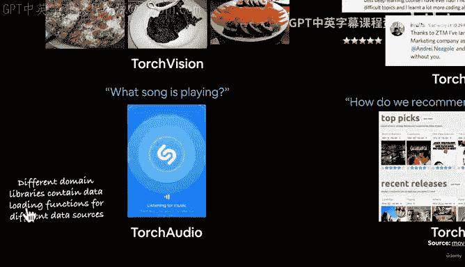

每个领域库都包含一个 `datasets` 模块，它既提供了加载预构建数据集（如 Fashion MNIST）的功能，也提供了加载你自己数据集的函数。例如，对于视觉数据，你应该查看 `torchvision.datasets`；对于文本数据，则查看 `torchtext.datasets`。

此外，还有一个处于测试阶段的 `torchdata` 库，它包含了许多用于加载数据的高级辅助函数，未来会不断更新以支持更多数据源。

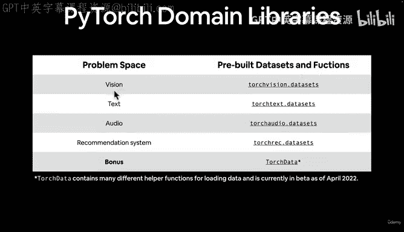

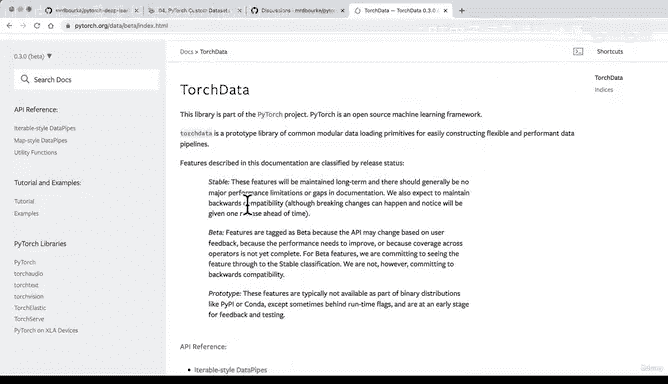

## 本节目标：构建 Food Vision Mini 🍕🥩🍣

我们将通过一个具体项目来学习如何处理自定义数据。我们的目标是构建一个名为 **Food Vision Mini** 的图像分类模型。

我们将从 Food 101 数据集中加载披萨、寿司和牛排的图片，构建一个能够对这些食物图像进行分类的模型。这类似于一个食物识别应用（例如 `nutrifai.app`）背后的核心模型。

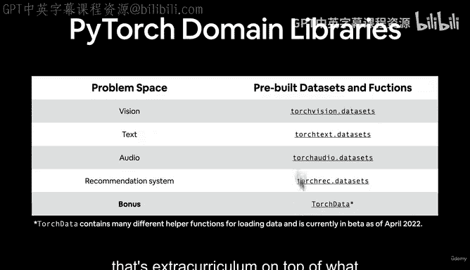

具体来说，我们需要编写代码来加载这些食物图像，从而创建我们自己的自定义数据集，用于训练 Food Vision Mini 模型。

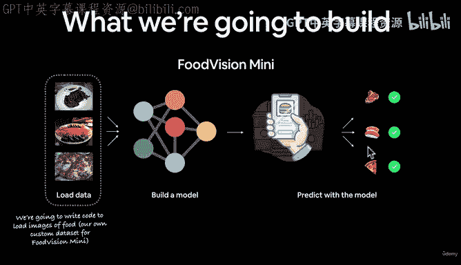

## 遵循 PyTorch 工作流

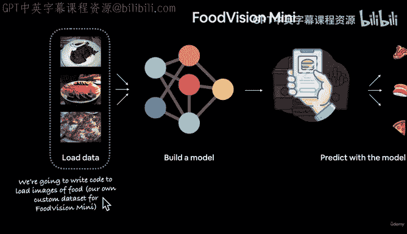

我们将遵循之前多次使用的 PyTorch 标准工作流来构建这个项目：

1.  **获取数据**：学习如何加载自定义数据集，而非 PyTorch 内置数据集。
2.  **构建模型**：构建一个适用于我们自定义数据的模型。
3.  **训练模型**：完成训练所需的所有步骤，包括选择损失函数和优化器，编写训练循环。
4.  **评估模型**：评估模型的性能。
5.  **实验改进**：通过实验（例如数据增强）来提升模型效果。
6.  **保存与加载**：保存训练好的模型并重新加载。
7.  **进行预测**：使用训练好的模型对我们自己的自定义数据（即不在训练集或测试集中的新数据）进行预测，这是模型部署中非常关键的一步。

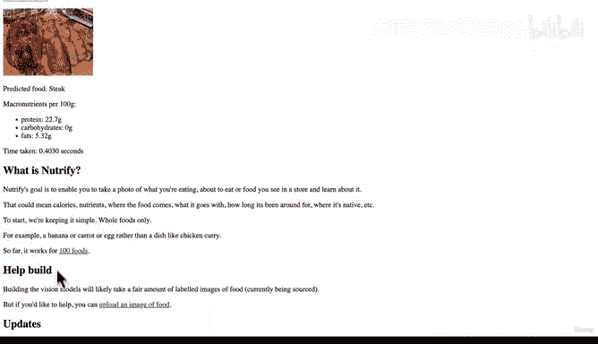

## 本节涵盖内容

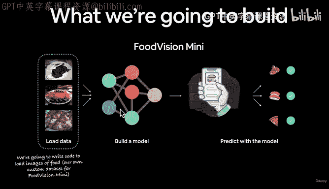

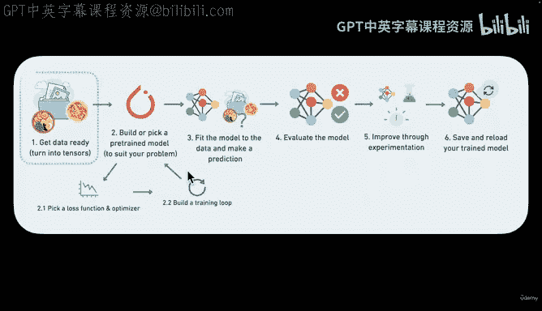

以下是本节课程将详细讲解的要点：

*   **获取 PyTorch 自定义数据集**：学习数据加载的基础。
*   **熟悉数据**：准备和可视化数据，做到“与数据融为一体”。
*   **数据转换**：学习如何对数据进行转换，使其适用于模型训练。
*   **加载自定义数据**：使用 PyTorch 内置函数和我们自己编写的自定义函数来加载数据。
*   **构建计算机视觉模型**：构建 Food Vision Mini 模型，实现对披萨、牛排和寿司图像的多类别分类。
*   **对比实验**：比较使用数据增强和不使用数据增强的模型性能。
*   **自定义预测**：学习如何对全新的自定义数据进行预测。

我们将通过编写大量代码来实践这些概念。现在，让我们进入 Google Colab，开始编码吧！

## 总结

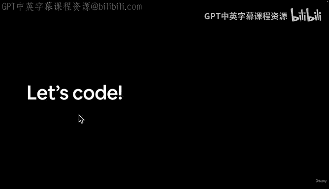

在本节课中，我们一起学习了自定义数据集的核心概念。我们了解了在 PyTorch 中处理自己数据的重要性，介绍了 PyTorch 的不同领域库（如 `torchvision`, `torchtext`），并明确了本节课程的目标：构建一个 Food Vision Mini 图像分类模型。我们还回顾了将遵循的 PyTorch 工作流以及本节要涵盖的具体知识点。接下来，我们将动手实践，学习如何将自定义图像数据加载到 PyTorch 中。