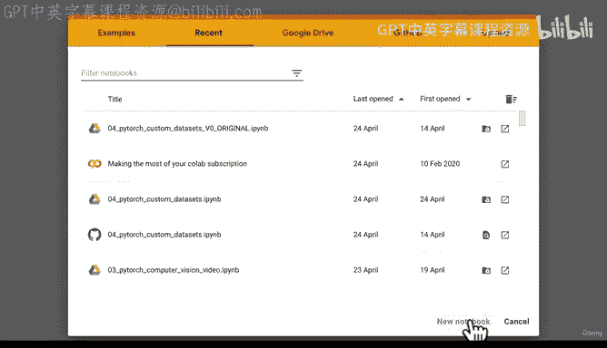
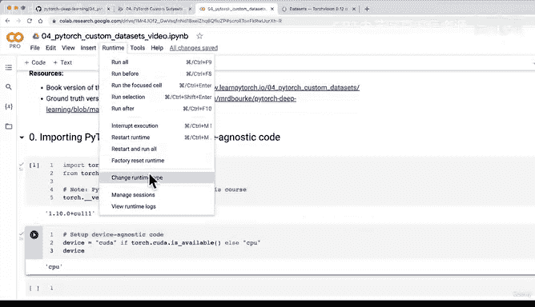
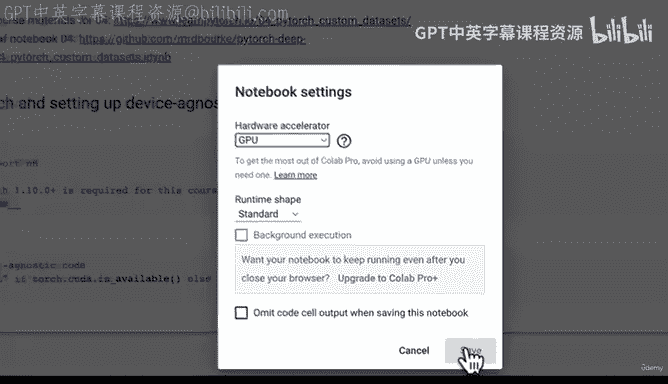
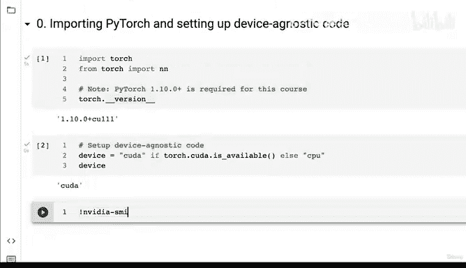

# 132：自定义数据集 🍲




在本节课中，我们将学习如何将你自己的数据导入PyTorch，以便构建模型来解决你感兴趣的问题。我们将重点介绍如何创建自定义数据集，这是处理非标准数据的关键步骤。

---

上一节我们介绍了课程概述，本节中我们来看看如何设置开发环境并导入必要的库。

## 导入PyTorch与配置设备无关代码 ⚙️

我们将从导入PyTorch核心库开始，并设置设备无关的代码。这是一种最佳实践，它能让我们的代码自动在GPU（如果可用）或CPU上运行，从而提升灵活性和性能。

首先，我们导入`torch`和`nn`模块。

```python
import torch
from torch import nn
```

接下来，我们检查当前使用的PyTorch版本。本课程要求PyTorch版本为1.10.0或更高。

```python
print(torch.__version__)
```

然后，我们配置设备无关的代码。其核心思想是：如果系统有可用的CUDA（GPU），则使用它；否则，回退到CPU。

以下是实现此功能的代码公式：

```python
device = "cuda" if torch.cuda.is_available() else "cpu"
```

在Google Colab等环境中，默认运行时可能不使用GPU。因此，我们需要手动启用GPU加速。

操作步骤如下：
1.  点击顶部菜单栏的 **Runtime**（运行时）。
2.  选择 **Change runtime type**（更改运行时类型）。
3.  在 **Hardware accelerator**（硬件加速器）下拉菜单中，选择 **GPU**。
4.  点击 **Save**（保存）。



完成设置后，我们可以验证GPU是否可用及其型号。

```python
print(f"Using device: {device}")
if device == "cuda":
    print(f"GPU型号: {torch.cuda.get_device_name(0)}")
```





---

本节课中我们一起学习了如何导入PyTorch并设置设备无关的代码。这是构建任何PyTorch项目的标准起点，它确保了我们的模型和数据能够利用最佳的可用硬件资源进行计算。在下一节，我们将获取一些数据，正式开始构建我们的自定义数据集。