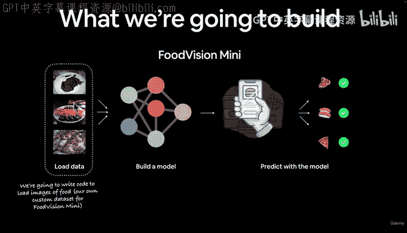
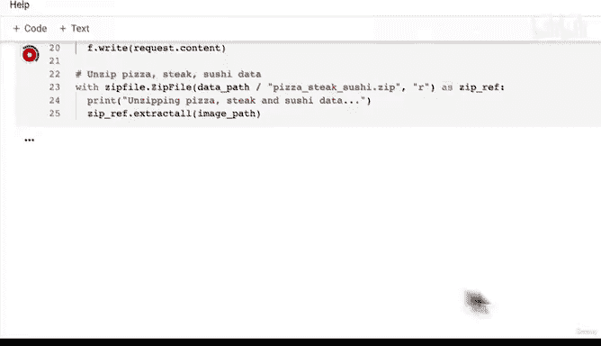

# 133：下载披萨牛排寿司图像自定义数据集 🍕🥩🍣




在本节课中，我们将学习如何下载一个自定义的图像数据集，为后续构建计算机视觉模型做准备。我们将使用一个包含披萨、牛排和寿司三类食物图像的子集，该子集源自Food 101数据集。

## 概述

上一节我们介绍了自定义数据集的概念。本节中，我们来看看如何实际获取数据。我们将编写代码从GitHub下载一个压缩文件，其中包含我们需要的三类食物图像，并将其解压到本地目录中。

## 获取数据

正如上一视频所述，没有数据就无法处理自定义数据集。因此，我们需要获取一些数据。我们计划构建一个名为“Food Vision Mini”的模型，所以需要获取食物图像。

TorchVision数据集包含许多内置数据集，其中之一就是Food 101数据集。Food 101数据集包含101个不同食物类别，共有101,000张图像，是一个相当大的数据集。每个类别提供250张经过人工审核的测试图像，以及750张训练图像。

为了便于练习，我创建了该数据集的一个较小子集。我建议你在处理自己的问题时也采用相同策略：从小规模开始，必要时再扩大。我将类别数量减少到三个，图像数量减少到原数据集的10%。你可以任意缩减规模，但我认为三个类别和10%的数据量足以开始。如果模型运行良好，你可以自行扩大规模。

我想展示一下用于创建此数据集的笔记本。作为课外学习，你可以查看这个笔记本。在`extras/04_custom_data_creation`中，记录了我如何创建这个数据子集。我以自定义图像数据集或图像分类的风格创建了它。我们有一个顶级文件夹`pizza_steak_sushi`，其中包含带有披萨、牛排和寿司图像的训练目录和测试目录。你可以查看该笔记本了解其创建过程。

现在，我们将编写一些代码来获取这个数据集。我创建的较小版本位于PyTorch深度学习代码库的`data`目录下，文件名为`pizza_steak_sushi.zip`。

## 编写下载代码

我们的数据是Food 101数据集的子集。Food 101数据集始于101个不同的食物类别。我们当然可以为101个类别构建计算机视觉模型，但我们将从小规模开始。我们的数据集始于三类食物，且仅包含10%的图像。每个类别大约有75张训练图像和25张测试图像。

这样做是因为在开始机器学习项目时，先在小规模上尝试，必要时再扩大规模，这一点很重要。其核心目的是**加速实验迭代速度**。如果一开始就尝试在100,000张图像上训练，模型每次训练可能需要半小时。在开始时，我们希望提高实验速率。

以下是下载数据的步骤：

首先，导入必要的库。我们将使用`requests`从GitHub请求数据，使用`zipfile`处理压缩文件，并使用`pathlib`处理文件路径。

```python
import requests
import zipfile
from pathlib import Path
```

接下来，设置数据文件夹的路径。我通常喜欢创建一个名为`data`的文件夹来存储项目中的所有数据。

```python
data_path = Path("data")
image_path = data_path / "pizza_steak_sushi"
```

然后，检查图像文件夹是否存在。如果不存在，则创建它并下载数据。

```python
if image_path.is_dir():
    print(f"{image_path} 目录已存在，跳过下载。")
else:
    print(f"{image_path} 不存在，正在创建...")
    image_path.mkdir(parents=True, exist_ok=True)
```

现在，下载披萨、牛排和寿司数据。我们将使用`requests.get`从GitHub获取压缩文件，并将其写入本地。

```python
with open(data_path / "pizza_steak_sushi.zip", "wb") as f:
    print("正在下载披萨、牛排、寿司数据...")
    request = requests.get("https://github.com/mrdbourke/pytorch-deep-learning/raw/main/data/pizza_steak_sushi.zip")
    f.write(request.content)
```

下载完成后，我们需要解压这个ZIP文件。

```python
with zipfile.ZipFile(data_path / "pizza_steak_sushi.zip", "r") as zip_ref:
    print("正在解压披萨、牛排、寿司数据...")
    zip_ref.extractall(image_path)
```

请注意，从GitHub下载文件时，必须使用原始文件链接（URL中包含`raw`），而不是`blob`链接，否则会导致下载错误。



运行上述代码后，数据将被下载并解压到`data/pizza_steak_sushi`目录中。该目录下应包含`train`和`test`子文件夹，每个子文件夹中又包含`pizza`、`steak`和`sushi`三个类别的图像。

## 总结

本节课中我们一起学习了如何下载自定义图像数据集。我们编写了代码从GitHub获取一个包含披萨、牛排和寿司图像的压缩文件，并将其解压到本地目录。这个过程的核心步骤——设置路径、检查目录、下载文件和解压——是处理自定义数据时的通用模式。无论你的数据存储在何处，编写代码将其加载到PyTorch中的思路都是相似的。在下一节中，我们将探索刚刚下载的数据。