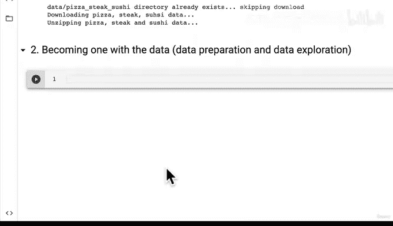
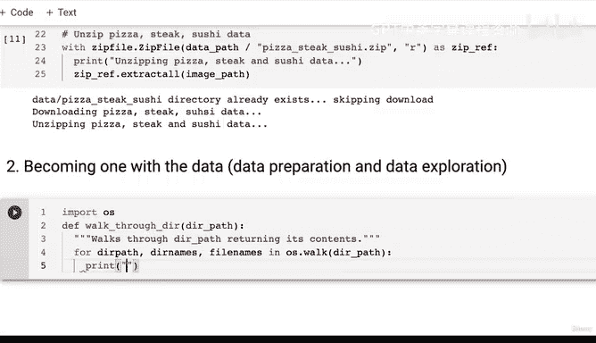
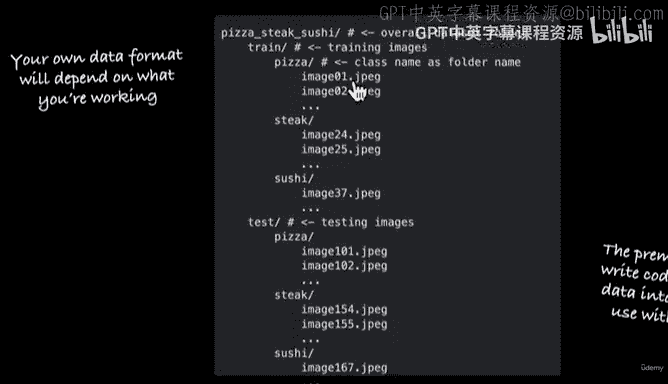
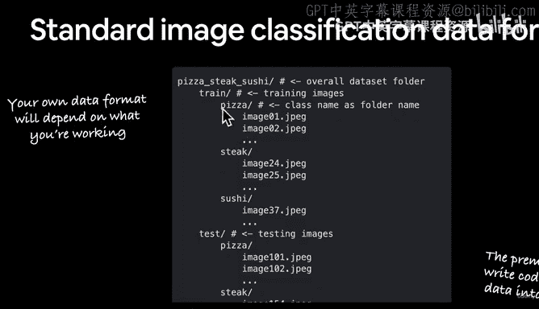
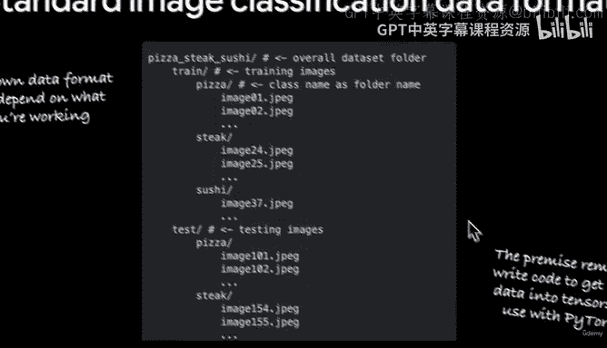
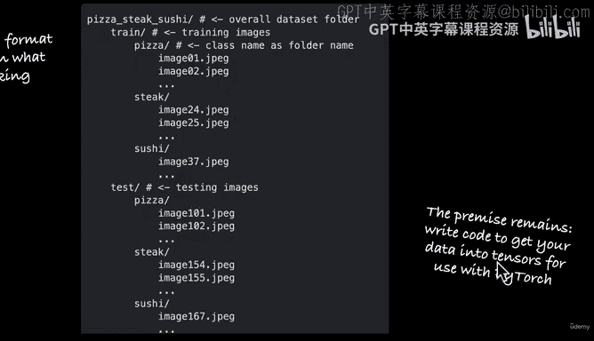
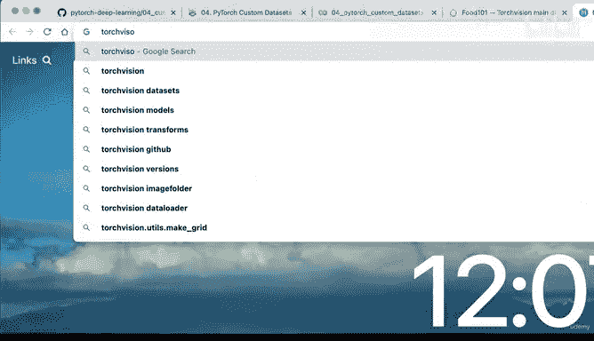
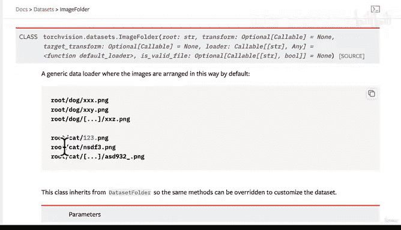

# 134：数据探索（第一部分）：数据格式解析 📊


在本节课中，我们将学习如何探索和分析已下载的自定义数据集。我们将通过编写代码来遍历目录结构，理解数据的组织格式，并了解标准图像分类数据集的常见布局。

---

在上一节中，我们编写了代码来下载一个自定义数据集。现在，让我们开始探索这些数据。

## 与数据融为一体



数据准备和探索是机器学习项目中至关重要的一步。正如一句名言所说：“如果我有八个小时来构建一个机器学习模型，我会花前六个小时准备我的数据集。” 这正是我们现在要做的。


既然我们已经下载了一些数据，让我们开始探索它。我们将编写一些代码来遍历每个目录。

以下是遍历目录并返回其内容的辅助函数：

```python
import os

def walk_through_dir(dir_path):
    """
    遍历目录路径，返回其内容。
    """
    for dirpath, dirnames, filenames in os.walk(dir_path):
        print(f"在 `{dirpath}` 中有 {len(dirnames)} 个目录和 {len(filenames)} 个图像。")
```

现在，让我们使用这个函数来探索我们的数据目录：



```python
image_path = "data/pizza_steak_sushi"
walk_through_dir(image_path)
```

运行上述代码后，我们将看到类似以下的输出：

```
在 `data/pizza_steak_sushi` 中有 2 个目录和 0 个图像。
在 `data/pizza_steak_sushi/test` 中有 3 个目录和 0 个图像。
在 `data/pizza_steak_sushi/test/steak` 中有 0 个目录和 19 个图像。
...
在 `data/pizza_steak_sushi/train` 中有 3 个目录和 0 个图像。
在 `data/pizza_steak_sushi/train/steak` 中有 0 个目录和 75 个图像。
...
```

这个输出告诉我们，数据被组织在 `train` 和 `test` 文件夹中，每个文件夹内又包含 `pizza`、`steak` 和 `sushi` 三个子文件夹。每个子文件夹中存放着对应类别的图像。

## 标准图像分类数据格式

我们数据集的这种组织方式并非偶然。它是一种广泛使用的标准图像分类数据格式。

以下是这种格式的典型结构：

```
data/
├── train/
│   ├── class_1/
│   │   ├── image_001.jpg
│   │   └── image_002.jpg
│   └── class_2/
│       ├── image_001.jpg
│       └── image_002.jpg
└── test/
    ├── class_1/
    │   ├── image_003.jpg
    │   └── image_004.jpg
    └── class_2/
        ├── image_003.jpg
        └── image_004.jpg
```

在我们的案例中，`class_1`、`class_2` 等被替换为了 `pizza`、`steak` 和 `sushi`。这种格式的优势在于，图像的标签（即类别）直接由其所在的文件夹名称决定。这使得数据加载过程变得非常直观和高效。



许多深度学习框架（如 PyTorch 的 `torchvision`）都内置了能够自动处理这种格式数据集的加载器。例如，`torchvision.datasets.ImageFolder` 就是为此设计的。



为了后续处理，我们可以定义训练和测试数据的路径：





```python
train_dir = "data/pizza_steak_sushi/train"
test_dir = "data/pizza_steak_sushi/test"
```



## 可视化数据

对于计算机视觉问题，除了查看文件结构，另一个重要的探索步骤是可视化图像本身。我们之前可以通过点击文件来查看，但让我们用代码来实现它，这样更便于自动化处理。

我们将在下一节中详细学习如何用代码加载和显示图像。



---

本节课中，我们一起学习了如何探索数据集的目录结构，并理解了标准图像分类数据格式的组织方式。我们编写了遍历目录的代码，并明确了训练和测试数据的路径。在下一节，我们将进一步学习如何可视化这些图像数据。