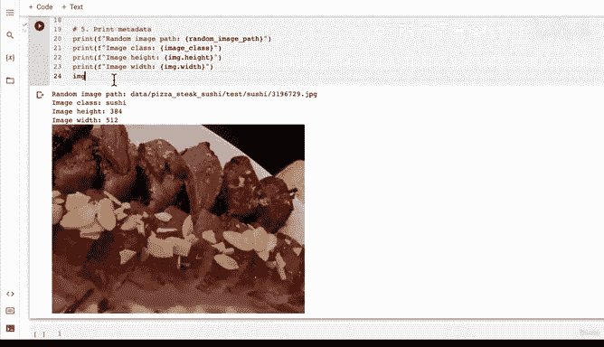
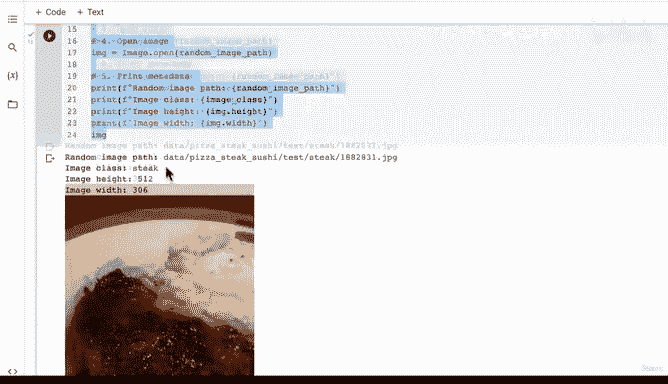
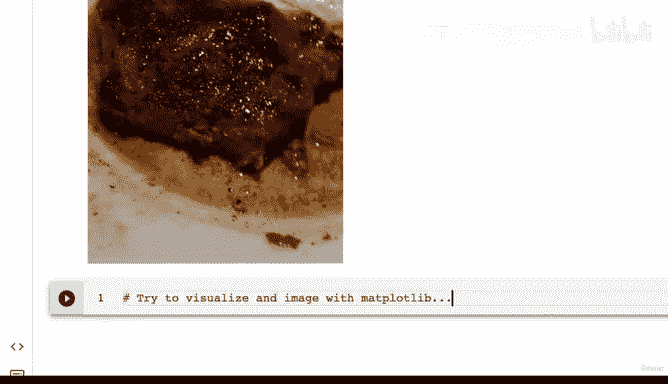
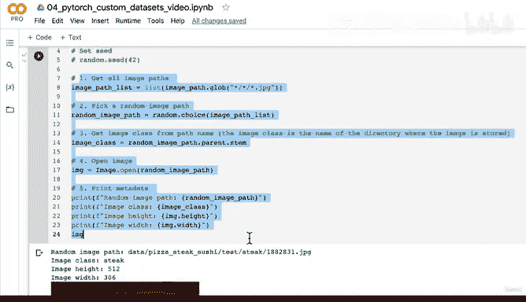
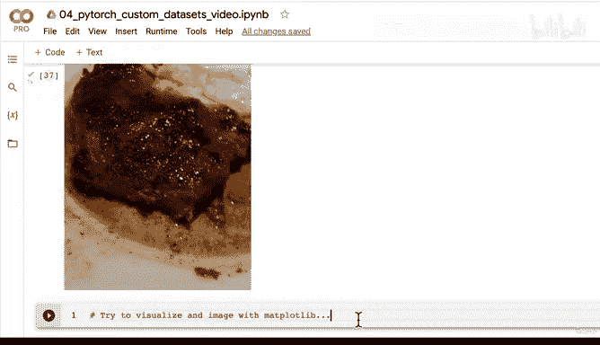
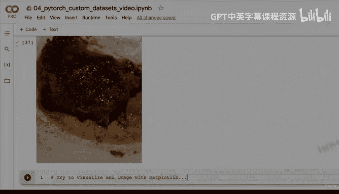

# 135：数据探索（第二部分）随机图像可视化 🖼️


## 概述

在本节课中，我们将继续探索数据，学习如何从数据集中随机选择并可视化图像。我们将使用Python的`random`模块和`PIL`（Python Imaging Library）库来实现这一目标，并了解标准图像分类数据集的目录结构。

---

## 标准图像分类数据结构

上一节我们介绍了数据的基本情况，本节中我们来看看如何通过代码探索具体的图像样本。

标准的图像分类数据集通常按以下结构组织：
```
data/
├── train/
│   ├── class_1/
│   │   ├── image1.jpg
│   │   └── image2.jpg
│   └── class_2/
│       ├── image1.jpg
│       └── image2.jpg
└── test/
    ├── class_1/
    └── class_2/
```

例如，如果你想创建一个猫狗分类数据集，可以这样组织：
*   `train/dog/` - 存放所有训练用的狗图片
*   `train/cat/` - 存放所有训练用的猫图片
*   `test/dog/` - 存放所有测试用的狗图片
*   `test/cat/ - 存放所有测试用的猫图片

我们的核心目标是将这些文件中的数据转换为PyTorch能够处理的**张量（tensor）**。但在转换之前，我们需要先熟悉数据本身。

---

## 随机可视化图像步骤

为了更深入地了解数据，我们将编写代码随机选择并显示一张图像。以下是实现此功能的主要步骤：

1.  **获取所有图像路径**：使用`pathlib`库收集数据集中所有图像的路径。
2.  **随机选择图像路径**：使用Python的`random.choice()`函数从路径列表中随机选取一个。
3.  **提取图像类别名称**：从图像路径中提取其所在目录的名称，该名称即为图像的类别标签（例如“pizza”）。
4.  **打开图像**：使用`PIL`（或称为`Pillow`）库打开选中的图像文件。
5.  **显示图像与元数据**：打印图像的路径、类别以及尺寸（高度和宽度）等信息，并显示图像本身。

---

## 代码实现详解

现在，让我们按照上述步骤编写代码。首先导入必要的库。

```python
import random
from pathlib import Path
from PIL import Image

# 设置随机种子以确保结果可复现
random.seed(42)
```

### 1. 获取所有图像路径

我们使用`pathlib.Path`对象的`glob`方法来匹配并收集所有符合特定模式的文件路径。模式`*/ *.jpg`表示：匹配任意一级子目录下的任意名称的`.jpg`文件。

```python
# 定义数据路径（请根据你的实际路径修改）
data_path = Path("data/pizza_steak_sushi")

# 使用glob获取所有图像路径
image_path_list = list(data_path.glob("*/*/*.jpg"))
print(f"找到 {len(image_path_list)} 张图像。")
```

### 2. 随机选择图像路径

利用`random.choice`函数从路径列表中随机选取一个。

```python
# 随机选择一个图像路径
random_image_path = random.choice(image_path_list)
print(f"随机选择的图像路径: {random_image_path}")
```

### 3. 提取图像类别名称

图像所在的父目录名称就是其类别。我们可以使用`Path`对象的`.parent`属性获取父目录，再用`.stem`属性获取目录名（不含后缀）。

```python
# 从路径中提取类别名称
image_class = random_image_path.parent.stem
print(f"图像类别: {image_class}")
```

### 4. 打开图像并获取元数据

使用`PIL.Image.open()`打开图像，然后可以访问其尺寸等属性。

```python
# 使用PIL打开图像
img = Image.open(random_image_path)

# 打印图像元数据
print(f"图像高度: {img.height}")
print(f"图像宽度: {img.width}")

# 显示图像
img.show()
```

---

## 运行示例

运行上述代码，你可能会看到类似以下的输出，并且会弹出一个图像窗口：
```
找到 225 张图像。
随机选择的图像路径: data/pizza_steak_sushi/test/sushi/592799.jpg
图像类别: sushi
图像高度: 512
图像宽度: 512
```

每次运行（在固定随机种子的情况下）都会看到同一张寿司图片。如果注释掉`random.seed(42)`这一行，则每次都会随机显示不同的图片，例如披萨或牛排。

通过多次随机可视化图像，你可以对数据集的多样性、图像质量以及可能存在的标签错误有一个直观的感受。这是构建可靠机器学习模型前的重要一步。

---

## 挑战任务

在下一节课之前，尝试完成一个小挑战：

**使用Matplotlib库来可视化随机图像。**

你的任务是编写一段类似的代码，但最终使用`matplotlib.pyplot`（通常导入为`plt`）来显示图像，而不是使用`PIL`的`.show()`方法。这将是下一节课我们将要一起完成的内容。



---



## 总结

本节课中我们一起学习了：
1.  回顾了标准图像分类数据集的目录结构。
2.  掌握了使用`pathlib`和`glob`模式获取所有文件路径的方法。
3.  实践了利用`random`模块进行随机抽样以探索数据。
4.  学会了使用`PIL`库打开图像、读取基本元数据并显示。
5.  理解了在建模前随机检查数据样本的重要性。









通过手动或编码方式浏览数据，能帮助你建立对数据的直觉，并为后续将数据转换为张量并输入模型做好准备。