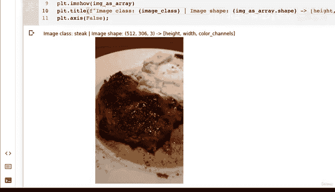
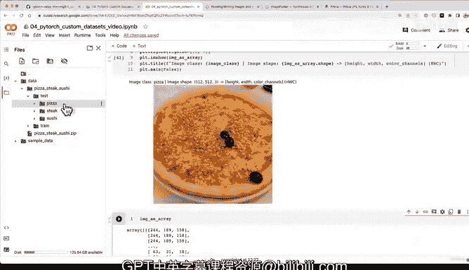

#  136：数据探索（第三部分）：Matplotlib图像可视化 📊


在本节课中，我们将学习如何使用Matplotlib库来可视化图像数据。我们将把PIL库打开的图像转换为NumPy数组，并使用Matplotlib进行显示，同时关注图像的形状信息，为后续转换为PyTorch张量做准备。

---


上一节我们介绍了使用PIL库查看图像。本节中，我们来看看如何使用Matplotlib进行图像可视化。

Matplotlib是数据科学中最基础的库之一，掌握其图像绘制方法非常重要。为了使用Matplotlib，我们需要先将图像转换为NumPy数组。

以下是使用Matplotlib绘制图像的步骤：

1.  **导入必要的库**：我们需要导入Matplotlib和NumPy。
2.  **将图像转换为数组**：使用NumPy的`asarray`方法。
3.  **绘制图像**：使用Matplotlib的`imshow`函数。
4.  **添加信息**：为图像添加标题，显示其类别和形状。

让我们通过代码来实现这个过程。

```python
import matplotlib.pyplot as plt
import numpy as np

# 假设 `image` 是一个已经用PIL打开的Image对象
image_as_array = np.asarray(image)

plt.figure(figsize=(10, 7))
plt.imshow(image_as_array)
plt.title(f"{image_class} | Shape: {image_as_array.shape}")
plt.axis('off')
plt.show()
```



运行上述代码后，我们可以看到图像被成功显示。标题中包含了图像的类别和形状。例如，一个图像的形状可能是 `(512, 306, 3)`。


这个形状信息非常关键。它表示图像的高度是512像素，宽度是306像素，并且有3个颜色通道（红、绿、蓝）。这种格式被称为 **“通道在后”**（channels-last），即形状为 `(高度, 宽度, 通道数)`。

然而，PyTorch的默认张量格式是 **“通道在前”**（channels-first），即 `(通道数, 高度, 宽度)`。了解数据形状与框架要求之间的差异，是避免后续机器学习模型出现形状不匹配错误的重要一步。

---

现在，让我们将这个方法应用到另一张图像上，以巩固理解。

遵循相同的步骤，我们可以可视化数据集中不同的图像。例如，另一张披萨图像的形状可能是 `(512, 512, 3)`。通过随机查看多个样本，我们能更好地理解数据集的多样性，例如注意到图像的高度和宽度可能各不相同，但颜色通道数通常都是3。

这种探索方式不仅适用于图像，也适用于其他类型的数据，如查看文本样本或聆听音频片段。

---

本节课中，我们一起学习了使用Matplotlib可视化图像数据。我们掌握了将PIL图像转换为NumPy数组并用Matplotlib显示的方法，并重点理解了图像形状 `(高度, 宽度, 通道数)` 的含义及其与PyTorch默认格式 `(通道数, 高度, 宽度)` 的区别。



现在我们已经对数据有了直观的认识。在下一节视频中，我们将开始编写代码，把文件夹中的所有图像都转换为PyTorch张量，为构建自定义数据集做准备。