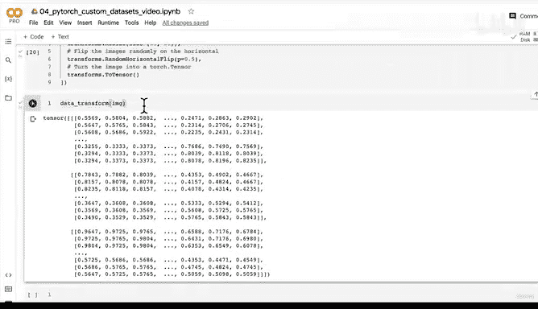

# 137：数据转换（第一部分）🎨


## 概述

在本节课中，我们将学习如何将图像数据转换为PyTorch能够处理的张量格式。我们将使用`torchvision.transforms`模块来创建数据转换流程，为后续构建自定义数据集和数据加载器做准备。

---

## 数据转换的必要性

上一节我们介绍了如何将图像转换为NumPy数组。本节中我们来看看如何将自定义数据集中的图像转换为PyTorch张量。

在使用PyTorch处理图像数据之前，我们需要完成两个关键步骤：
1.  将目标数据转换为张量格式。
2.  将其转换为`torch.utils.data.Dataset`。

回忆之前的课程，我们使用`Dataset`来容纳所有张量格式的数据，然后将其转换为`torch.utils.data.DataLoader`。数据加载器会创建我们数据集的迭代器或批处理版本。

简而言之，我们将使用**数据集**和**数据加载器**。

在PyTorch文档中，无论是`torchvision`、`torchaudio`还是`torchtext`，创建数据集的方法都类似。它们通常提供一个`transform`参数，允许我们在加载数据时对数据样本应用转换。

---

## 使用torchvision.transforms转换数据

为了更好地理解，我们将通过实例来学习。首先，重新导入我们将要使用的主要库。

```python
from torch.utils.data import DataLoader
from torchvision import datasets, transforms
```

接下来，创建一个图像转换流程。主要目标是将JPEG图像转换为张量表示。

以下是创建组合转换的方法：

```python
data_transform = transforms.Compose([
    transforms.Resize((64, 64)),
    transforms.RandomHorizontalFlip(p=0.5),
    transforms.ToTensor()
])
```

以下是每个转换步骤的说明：

1.  **调整大小 (`Resize((64, 64))`)**: 将图像尺寸统一调整为64x64像素。这有助于后续使用特定的计算机视觉模型（如之前章节提到的Tiny VGG架构）。
2.  **随机水平翻转 (`RandomHorizontalFlip(p=0.5)`)**: 这是一种数据增强技术，以50%的概率随机水平翻转图像，可以人工增加数据集的多样性。
3.  **转换为张量 (`ToTensor()`)**: 这是核心转换。它将PIL图像或NumPy数组（数值范围0-255）转换为一个形状为`(颜色通道, 高度, 宽度)`、数值范围在0到1之间的`torch.FloatTensor`。

现在，我们可以将单张图像通过这个转换流程：

```python
transformed_image = data_transform(original_pil_image)
print(transformed_image.shape)  # 输出: torch.Size([3, 64, 64])
print(transformed_image.dtype)  # 输出: torch.float32
```

可以看到，我们成功地将单张图像转换为了一个形状为`[3, 64, 64]`的`torch.float32`张量。通过修改`Resize`的参数，我们可以轻松地将图像调整为任何模型所需的输入尺寸，例如常见的224x224。

---

## 总结

本节课我们一起学习了数据转换的基础知识。我们介绍了使用`torchvision.transforms.Compose`创建转换流水线的方法，并实现了调整图像大小、数据增强以及最终转换为PyTorch张量的关键步骤。现在，我们已经掌握了将单张图像转换为模型可读格式的方法。



在下一节中，我们将编写可视化代码，对比原始图像与转换后图像的效果，并进一步学习如何将转换流程应用到整个数据文件夹中的所有图像上。