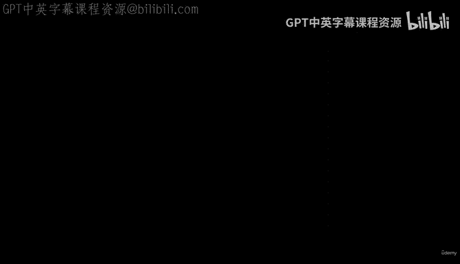
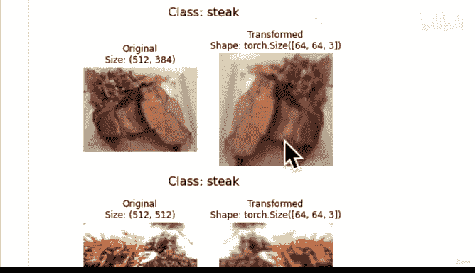
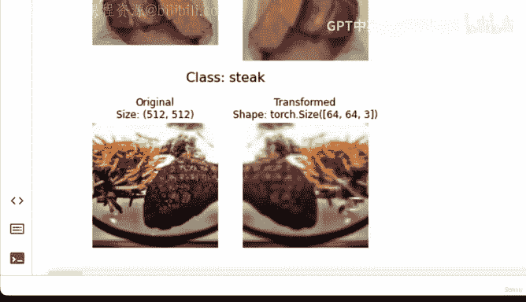
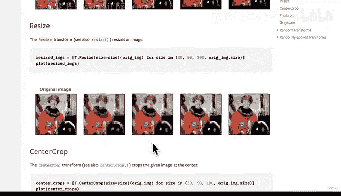
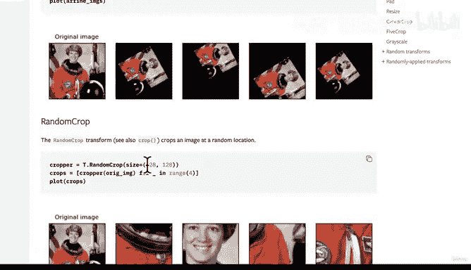
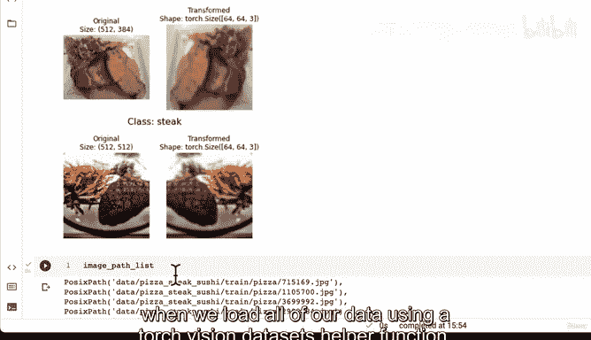
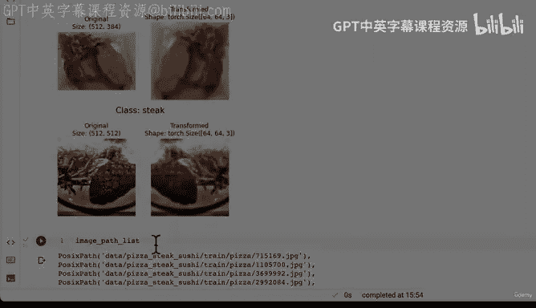

# 138：数据转换（第二部分）可视化转换后的图像 📊



在本节课中，我们将学习如何可视化经过数据转换（`transforms`）处理后的图像。我们将编写一个函数，用于随机选择图像，应用我们之前定义的转换流程，并并排对比原始图像与转换后的图像，以直观理解转换的效果。

---

## 概述

上一节我们介绍了如何使用 `torchvision.transforms` 创建数据转换流程。本节中，我们来看看如何将这些转换应用到图像上并进行可视化，这是数据探索过程中的关键一步。

## 探索 `torchvision.transforms` 文档

如果你想查找关于 `torchvision.transforms` 的更多文档，可以访问其官方文档页面。该模块提供了大量常见的图像转换和增强方法。

以下是 `torchvision.transforms` 的核心作用：
*   **功能**：提供一系列常见的图像变换。
*   **组合方式**：可以使用 `Compose` 将它们链式组合在一起，这正是我们之前所做的。

文档中包含了许多不同的转换，包括一些数据增强（Data Augmentation）方法。如果你想直观地查看这些转换的效果，建议查阅“转换图示”部分。不过，让我们先编写代码来可视化我们自己的转换流程。

## 编写可视化函数

我们将创建一个函数，用于随机选择图像路径，加载图像，应用转换，并绘制原始图像与转换后图像的对比图。

以下是该函数的核心步骤：

1.  **设置随机种子**：为了结果可复现，可以设置随机种子。
2.  **随机采样图像路径**：从所有图像路径列表中随机选择指定数量的路径。
3.  **循环处理每个图像**：
    *   使用 PIL 库打开原始图像。
    *   应用转换流程得到转换后的图像张量。
    *   使用 Matplotlib 创建子图，左侧显示原始图像，右侧显示转换后图像。
    *   注意调整张量的维度顺序以适配 Matplotlib 的显示要求。

以下是实现该功能的代码：

```python
import random
from pathlib import Path
import matplotlib.pyplot as plt
from PIL import Image
import torch

def plot_transformed_images(image_paths: list,
                            transform,
                            n: int = 3,
                            seed: int = None):
    """
    从图像路径列表中随机选择图像，加载并转换它们，然后绘制原始图像与转换后版本的对比图。

    参数:
        image_paths (list): 图像文件路径的列表。
        transform (torchvision.transforms): 要应用的 PyTorch 图像转换流程。
        n (int): 要绘制的图像数量。
        seed (int): 随机种子，用于结果可复现。
    """
    # 设置随机种子
    if seed:
        random.seed(seed)

    # 随机选择图像路径
    random_image_paths = random.sample(image_paths, k=n)

    # 遍历每个选中的图像路径
    for image_path in random_image_paths:
        # 使用 PIL 打开原始图像
        with Image.open(image_path) as f:
            # 应用转换。注意：transform 会将图像转换为 PyTorch 张量。
            transformed_image = transform(f).permute(1, 2, 0) # 注意维度重排

            # 创建对比图
            fig, ax = plt.subplots(1, 2)
            # 绘制原始图像
            ax[0].imshow(f)
            ax[0].set_title(f"Original\nSize: {f.size}")
            ax[0].axis("off")

            # 绘制转换后的图像
            ax[1].imshow(transformed_image) # transformed_image 现在是 (H, W, C)
            ax[1].set_title(f"Transformed\nShape: {transformed_image.shape}")
            ax[1].axis("off")

            # 设置整个图的标题为图像类别
            fig.suptitle(f"Class: {Path(image_path).parent.stem}", fontsize=16)

    plt.show()
```

**代码关键点说明**：
*   `transform(f)`：将 PIL 图像 `f` 送入我们定义的转换流程（如 `data_transform`），输出是一个 PyTorch 张量。
*   `.permute(1, 2, 0)`：这是至关重要的步骤。`torchvision.transforms` 通常输出形状为 `(C, H, W)`（通道在前）的张量，但 Matplotlib 的 `imshow()` 函数期望输入形状为 `(H, W, C)`（通道在后）。`.permute(1, 2, 0)` 将维度顺序从 `(0, 1, 2)` 调整为 `(1, 2, 0)`，即把通道维度移到最后。

## 运行可视化函数

现在，让我们使用之前创建的 `image_path_list` 和 `data_transform` 来运行这个函数。

```python
# 假设 image_path_list 和 data_transform 已定义
plot_transformed_images(image_paths=image_path_list,
                        transform=data_transform,
                        n=3,
                        seed=42)
```

运行上述代码后，你将看到类似下图的输出：



## 分析可视化结果

观察生成的对比图，我们可以得出以下结论：

1.  **图像尺寸变化**：原始图像尺寸较大（例如 512x512），经过 `Resize((64, 64))` 转换后，图像变为 64x64 像素。这会导致图像看起来更像素化，因为信息量减少了。
    *   **为何这样做？**：较小的图像意味着数据量更少，模型训练和推理速度会更快。但这也可能因为信息丢失而影响模型性能。图像尺寸是一个可以调整的超参数。

2.  **数据增强效果**：由于转换流程中包含了 `RandomHorizontalFlip(p=0.5)`，部分图像（如示例中的牛排和寿司）被水平翻转了。这是一种数据增强技术，可以人为增加训练数据的多样性，帮助模型学习更通用的特征，而不是记忆特定的图像方向。

3.  **张量格式**：转换后的图像已经是 PyTorch 张量格式（`torch.Tensor`），这是模型直接需要的输入格式。

## 更多转换与数据增强

`torchvision.transforms` 提供了丰富的转换选项，远不止我们使用的 `Resize` 和 `RandomHorizontalFlip`。

以下是你可以探索的其他转换类型：
*   **裁剪**：`CenterCrop`, `RandomCrop`, `FiveCrop`
*   **颜色变换**：`ColorJitter`, `Grayscale`, `RandomAdjustSharpness`
*   **几何变换**：`RandomRotation`, `RandomAffine`
*   **模糊与噪声**：`GaussianBlur`

建议查阅 `torchvision.transforms` 的官方文档和“转换图示”，以直观了解每种转换的效果。这将是你本节课的延伸学习内容。

## 本节总结




本节课中我们一起学习了如何可视化经过 `torchvision.transforms` 处理后的图像。

我们主要完成了以下工作：
1.  回顾了 `torchvision.transforms` 的作用和文档资源。
2.  编写了 `plot_transformed_images` 函数，用于并排对比原始图像与转换后图像。
3.  理解了转换中关键的张量维度重排操作（`.permute`），以适配 Matplotlib 的显示。
4.  通过可视化结果，分析了 `Resize` 和 `RandomHorizontalFlip` 转换的具体效果及其对模型训练的意义。
5.  简要介绍了其他可用的图像转换与数据增强方法。





现在，我们已经确认了数据转换流程能按预期工作。在下一节中，我们将使用这个 `data_transform`，借助 `torchvision.datasets.ImageFolder` 来一次性加载整个数据集，为模型训练做好准备。

---





**核心概念公式/代码回顾**：
*   转换流程定义：`data_transform = transforms.Compose([...])`
*   维度重排（通道后置）：`transformed_image.permute(1, 2, 0)`
*   可视化函数调用：`plot_transformed_images(image_paths, transform, n=3, seed=42)`